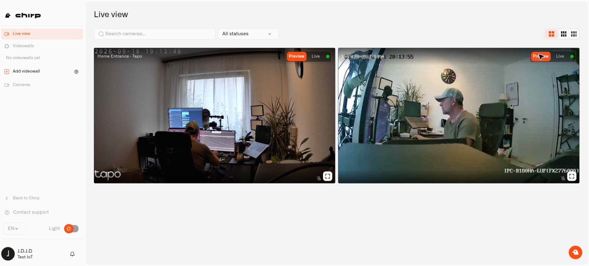
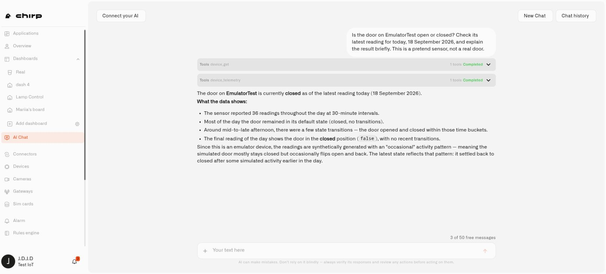

# Chirp — Home Automation Platform

**Chirp is a home automation platform** that brings compatible sensors, cameras, and connected devices together. Check what is happening at home, understand a changing reading, and arrange for the right response when something needs attention.

Start with a household problem: a cold room, a possible leak, an entrance you want to watch, or a garden that needs closer attention while you are away. Chirp lets you build the view and automation around that need instead of treating every gadget as a separate system.

You can begin with a single sensor and grow from there. Existing compatible cameras can join through **Lens**, and devices from different manufacturers can work through supported connections. The AI assistant helps with setup and questions, while the visual editors let you inspect how the result works.

## Why Chirp

### Bring useful equipment together

A home often collects devices one at a time. The temperature sensor may come from one manufacturer, a camera from another, and a controller from a third. Chirp gives supported equipment a common place for readings, views, and automation.

Each device has a digital model that describes the measurements or states it supplies. That is how a number becomes a temperature with a unit, or a reading becomes an open-or-closed state that you can use in a rule. The same information can appear in more than one useful view without needing to set up another physical sensor.

Choose the connection that matches the device. [LoRaWAN](connectors/lns-connector/what-is-lorawan.md) is useful for supported wireless sensors, while [MQTT](connectors/mqtt/what-is-mqtt.md) and other integrations offer different routes. A LoRaWAN setup requires a compatible Basics Station gateway; other connection types have their own requirements.

If you want to explore before buying equipment, use [Pretend Sensors](devices/pretend-sensors.md). Their emulated readings let you learn how dashboards and rules fit together.

### Keep your cameras and see more with Lens

[Lens](lens/README.md) is Chirp's cloud camera feature. It brings compatible RTSP IP cameras into the platform so you can look after your main home, holiday property, or apartment without replacing all the cameras with one brand. Save a [videowall](lens/videowalls.md) for each property, or group views more closely around an entrance, floor, or garden.

A small local component called **Twin** connects each camera. Its name comes from *digital twin*: it represents that camera at your premises and runs in a Docker container on a suitable computer. There is one container per camera—two cameras need two Twins, and twenty cameras need twenty.

Lens gives an existing camera another useful role. If the picture includes the pavement and your front steps, you can draw a motion area around the door in Twin. Movement there can supply a reading to a Chirp rule, while ordinary activity outside the area is excluded from detection. The camera does not need its own AI feature to do this.

Use live video when you want to look in, then configure a [camera rule and alert](lens/camera-rules-and-alerts.md) for the activity you want to hear about. Optional local recording in Twin lets you keep and review clips at the property.

[Start with Twin installation](lens/installing-twin.md), then connect the camera and test its view.

<figure><figcaption>
Check cameras together in one household workspace, including cameras at more than one property.
</figcaption></figure>

### Make your home easy to understand at a glance

A [dashboard](dashboards/README.md) is a view you arrange for your household. It might show room temperatures, a door state, and a recent humidity trend. A garden dashboard might emphasize soil readings and supported irrigation controls instead.

Choose widgets for the question you want to answer. A current value tells you what the latest reading says. A chart shows how it changed. A control gives you a way to operate a supported device. The dashboard becomes more useful when the names and arrangement match the way you think about the home.

You can also [show your home in 3D](dashboards/adding-widgets/digital-building-twin/README.md). Link readings to rooms or objects and use colors to show their conditions. This makes it easier to locate a sensor's information: the room itself provides context, rather than leaving you to recognize a device code.

[Applications](applications/README.md) help keep the related parts together. A Home Watch application can bring its dashboard, devices, rules, and alarm definitions into one place without changing what those resources do.

### Let a rule handle the repeatable part

A rule describes what should happen when a reading or trigger meets your conditions. You can inspect it as a diagram: where it starts, which route it follows, and what action it performs.

For a possible leak, the useful outcome may be an urgent notification. For a temperature problem, you may want the condition to last for a while before it counts. For a supported controllable device, the outcome can also include a saved device command.

The [Rules Engine](rules-engine/README.md) provides the tools to build and test that behavior. Saved versions and the build-and-deploy workflow help you review a change before running it. You can stop a rule and revise it when your household needs change.

[Alarm definitions](alarm/set-up-a-home-alert.md) handle the notification side: the message, recipients, channels, and relevant timing. The [alarm inbox](alarm/check-and-clear-alerts.md) helps you inspect and respond to incidents. A good setup tells you what happened and what to check, rather than repeatedly sending an unexplained value.

### Ask for help with your actual setup

The [AI Assistant](ai-assistant/README.md) can explain connection choices, help prepare supported configuration, and investigate available device information. You can describe a household outcome in ordinary language and then review the resulting settings or automation in the platform.

Try a focused request such as “Help me monitor the basement temperature” or “Which of my sensors have stopped reporting?” Supply the relevant home or device context so the answer addresses the right equipment. Confirm consequential actions when prompted and inspect the result before relying on a new automation.

The assistant is also a way to learn the platform as you use it. You do not need to memorize every menu before asking what a reading means or which part of a rule needs changing.

<figure><figcaption>
Ask about a household reading and get an explanation tied to the device. This demonstration uses a pretend sensor.
</figcaption></figure>

## Share the setup with your household

Your selected organization is the working context for devices, dashboards, and other resources. Give household members appropriate access through the [organization settings](settings/README.md), rather than sharing one account password. Their permissions determine what they can see and change. Lens currently requires camera-management access to open its workspace.

More technical users can connect other software through the [API](api/README.md). Interface preferences and plan details are available in the settings and account guides; you can explore them when you need those options.

## Access the Platform

Open [Chirp](https://app.chirpwireless.io/).

## Let's get started

- **Connect your first sensor:** follow [First Steps](first-steps/README.md).
- **Use a camera you already own:** start with [Lens](lens/README.md).
- **Explore without hardware:** create a [Pretend Sensor](devices/pretend-sensors.md).
- **Give a home setup a name:** [create an application](applications/creating-an-application.md) and bring its useful parts together.
