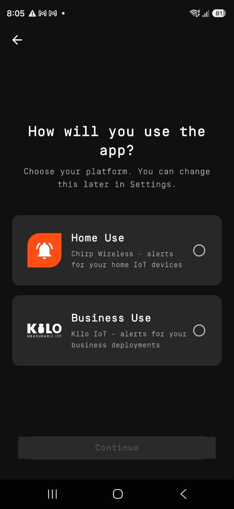
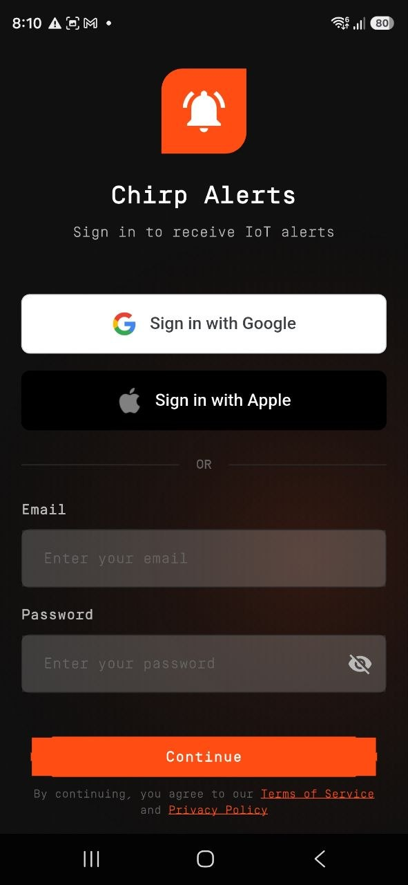

# Getting Started

**IoT Alerts** is the phone app for receiving and responding to Chirp alarms. This guide connects the app to your Chirp account and enables push notifications, so an alert configured for your home can reach you away from the dashboard.

Have your Chirp login ready. You also need a [home alert](../set-up-a-home-alert.md) with your account selected as a recipient and push delivery enabled. Each household member who needs alerts should sign in on their own phone and check the required permissions.

## Step 1 — Install the app

- **iPhone:** [App Store](https://apps.apple.com/us/app/chirp-alerts/id6756504956)
- **Android:** [Google Play](https://play.google.com/store/apps/details?id=io.chirpwireless.alarm)

If the store still shows the name **Chirp Alerts**, that's fine — it's the same app while the new name rolls out.

## Step 2 — Choose Home Use

The first time you open the app, it asks **"How will you use the app?"** Tap **Home Use** — the option labeled *Chirp Wireless — alerts for your home IoT devices* — then tap **Continue**. This sets the app up for your Chirp home.

<figure><figcaption></figcaption></figure>

You can change this later under **Settings → Platform**, but switching to Business mode signs you out, so there's no reason to touch it for your home setup.

## Step 3 — Sign in

Sign in with the same Chirp account you use on the web — there's no new account to create:

- **Email and password** — the same login you use at [app.chirpwireless.io](https://app.chirpwireless.io)
- **Google** or **Apple** — if you linked your Chirp account to one of them

Once you're in, you'll see the same homes you belong to on the web.

<figure><figcaption></figcaption></figure>

## Step 4 — Say yes to notifications (and Critical Alerts)

The app will ask for two things, and you want to allow both:

- **Notifications** — without this, the app simply can't reach your phone.
- **Critical Alerts** — this is the special permission that lets an emergency alarm ring through even when your phone is on silent or Do Not Disturb. If you skip it, your critical alarms will be held quiet by your phone just like any other notification.

Tapped the wrong button by accident? You can turn them back on later:

- **iPhone:** Settings → Notifications → IoT Alerts → turn on Allow Notifications and Critical Alerts
- **Android:** Settings → Apps → IoT Alerts → Notifications → turn on

## Step 5 — Flip on push on the web

One last switch on the web tells Chirp it's allowed to send alerts to your phone:

1. Open [app.chirpwireless.io](https://app.chirpwireless.io) and go to the **Alarm** page.
2. Open the **Settings** tab.
3. Find the **Push** section — it becomes available once Chirp notices your phone is signed in — and turn it **On**.

That's it. From now on, push is one of the channels you can pick when you set up [escalation steps](../escalation-chains.md), right alongside email and text. For more on choosing channels, see [Manage Contact Methods](../manage-contact-methods.md).

## Got more than one home?

Tap the menu icon in the top-left and pick a home from the list. The Inbox and Alert Definitions switch to show that home's alerts.

## Languages

The app speaks English, German, Spanish, French, and Portuguese, following your phone's language.
