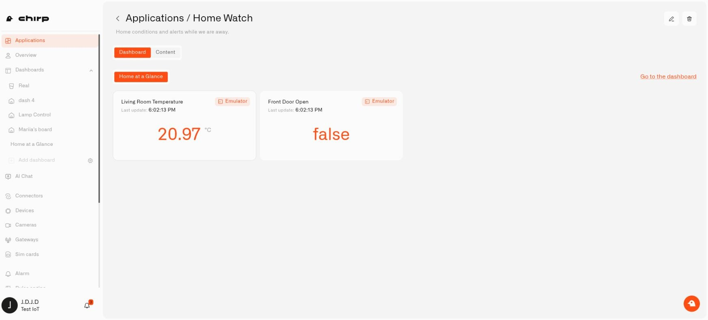

# Applications

An **application** is a complete setup for a household need, with its devices, dashboards, rules, and alarms brought together in Chirp. A **Home Leak Monitoring** application, for example, could include water sensors under the sinks, a dashboard showing their readings, and a rule that sends an alert when a sensor detects a leak.

A dealer is a business that supplies and sets up equipment for customers, such as home security or leak-monitoring systems. The dealer knows which devices are needed and can configure the dashboards, widgets, rules, and alerts that make them useful. Applications brings those parts together as a complete household solution.

**The planned next step is for the dealer to save that prepared solution as a reusable template.** You would choose the solution you need and apply it to create your own digital devices, dashboards, widgets, rules, and alarms, already configured to work together. Then you would connect your real sensors or other equipment to the prepared setup, replacing simulated inputs where needed. The views and automation would use your devices' readings without you having to build every dashboard and rule yourself. The dealer does the configuration work once, making it easier for each household to get started.

You can create an application and assemble its contents yourself today. Dealer-provided templates and the ability to apply them are planned capabilities.

<figure><figcaption>
Open an application's Dashboard tab to see the views associated with that household setup.
</figcaption></figure>

## What is inside a home application?

A sensor is one part of a working home setup. The other parts make its readings useful:

| Part | Example in Home Leak Monitoring |
|---|---|
| Devices | The digital devices receiving readings from your water sensors. |
| Dashboards | A view of the sensors and whether they report a leak. |
| Rules | The conditions that recognize a leak and start the response you configure. |
| Alarms | The message and notification settings used to tell you about it. |

The application keeps those parts associated with the same household task. Another application might bring together the door sensors, views, and notifications you use while away from a holiday home.

You can also name an application **Home Watch** and build it up around the readings and automations you want to check together. Its **Dashboard** tab is the place to use its views. **Content** shows the devices, dashboards, rules, and alarm definitions that make the setup work.

## How a prepared template would help

An **application** is your own household setup inside Chirp. A **template** is the planned reusable setup that a dealer would prepare for households with a similar need.

For example, a leak-monitoring dealer could prepare the sensor configurations, a dashboard with useful widgets, a rule that responds to water detection, and the alarm definition it uses. After applying the template, you would connect the prepared digital devices to the real sensors in your home and set installation-specific details such as notification recipients. The dashboard and rules would already be connected to those digital devices, so you could use the setup without rebuilding them.

This is the direction for Applications. Template publishing and installation are planned; selecting a ready-made template is not part of the current creation process.

## Build and use an application today

Applications lets you assemble your own solution and keep its parts together. Creating an application starts an empty setup: it does not automatically add sensors, build dashboards, or configure notifications.

1. [Create an application](creating-an-application.md), such as Home Watch, and describe what you use it for.
2. Set up the devices, dashboard, rules, and alarm definitions you need.
3. [Assign the resources](organizing-content.md) through their **Application** fields. Configure the rule to use the intended device and alarm definition; assigning them to the same application does not create that behavior automatically.
4. Choose **Applications → My applications**, open the application, and use **Dashboard** to view its dashboards or **Content** to find its resources.

You can start with one device and a useful view, then add automations and notifications as you configure them. See [Using Application Dashboards](using-application-dashboards.md) when you want to open or change the associated views.

Your application belongs to the selected organization. Family members need the relevant permissions to see or change its devices, dashboards, rules, and alarms; the application does not grant extra access.

If you later retire the setup, [check what deletion removes](deleting-an-application.md). Deleting an application also removes associated resources, so move the pieces you still use to another application or **Default** first.
