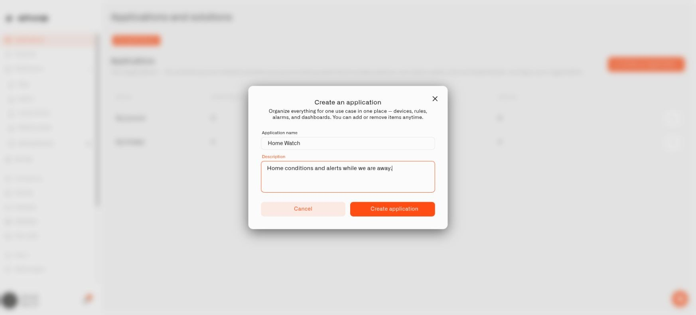

# Creating an Application

Use this guide when you are assembling your own household solution in Chirp. First create the application, then set up and assign the devices, dashboards, rules, and alarms it needs. The planned option to apply a provider's prepared template is explained in [Applications](README.md). A name such as **Home Watch** identifies the purpose of the setup.

Before starting, check the organization shown in the sidebar. You need to belong to that organization. There is no separate Applications permission; the permissions for devices, dashboards, rules, and alarms still determine what you can see or change inside the setup.

<figure><figcaption>
Give the application a recognizable name and describe its purpose.
</figcaption></figure>

## Make Home Watch

1. Choose **Applications** from the sidebar.
2. In **My applications**, select **Create an application**.
3. Fill in **Application name** with `Home Watch`.
4. Optionally enter a **Description**, such as `Home conditions and alerts while we are away.`
5. Select **Create application** and open the application.

The description is a note for the people using the setup. It does not instruct Chirp to create sensors or automations. Open **Content** to begin checking which resources you have assigned.

## Change the name later

Use the edit action inside the application to update its name or description, then save. Give each application a recognizable name so that you can tell them apart when assigning a sensor or dashboard.

An **Application** field elsewhere in Chirp can also offer **Add new application**. This lets you create the grouping while working on a resource. Select the new application and finish saving that resource.

Continue with [Organizing Content](organizing-content.md) to bring your household setup together.
