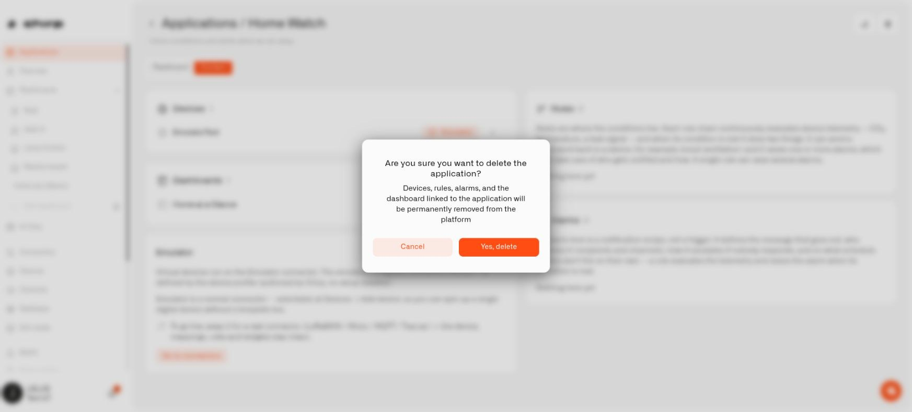

# Deleting an Application

You might stop using an application after changing a household setup. Before deleting it, decide which sensors, dashboards, automations, and alerts you still want to keep.


Deleting an application also removes its associated devices, dashboards, and alarm definitions. Associated rules are stopped and moved to Trash. To keep a resource, assign it to another application or **Default** first.


<figure><figcaption>
Review the consequences before confirming application deletion.
</figcaption></figure>

## Keep the useful parts

Open the application and choose **Content**. Review all four sections. For each item you want to keep, open its settings and change the **Application** field. Save your change where needed, then check that the item has left the old application's content list.

For example, if you no longer want Home Watch but still use its temperature dashboard, move both the dashboard and any devices it depends on before deleting the application.

## Remove the application

Use the application's delete action. Read the confirmation and confirm only after checking the remaining contents. The application should disappear from **My applications** once deletion succeeds.

If Chirp reports an error, reopen the application and inspect what remains before trying again. Some resources may already have been removed. If a rule is being edited, finish and close that editing session before retrying.

Restoring a rule from Trash does not recreate deleted sensors, dashboards, or alarm definitions. The rule recovery workflow is explained in [Trash and Restore](../rules-engine/managing-automations/trash-and-restore.md).

## If access is missing

Removing an application needs **Read** access to all four kinds of content and **Write** access to each kind that it contains. A message about missing permission means nothing has been removed by that attempt. An organization administrator can help you obtain the required access.

There is one dashboard-folder consequence to check as well: if the deleted dashboards all came from the same folder and nothing is left in it, Chirp removes that empty folder. Folders containing other items are kept. When the dashboards came from different folders, those folders remain.
