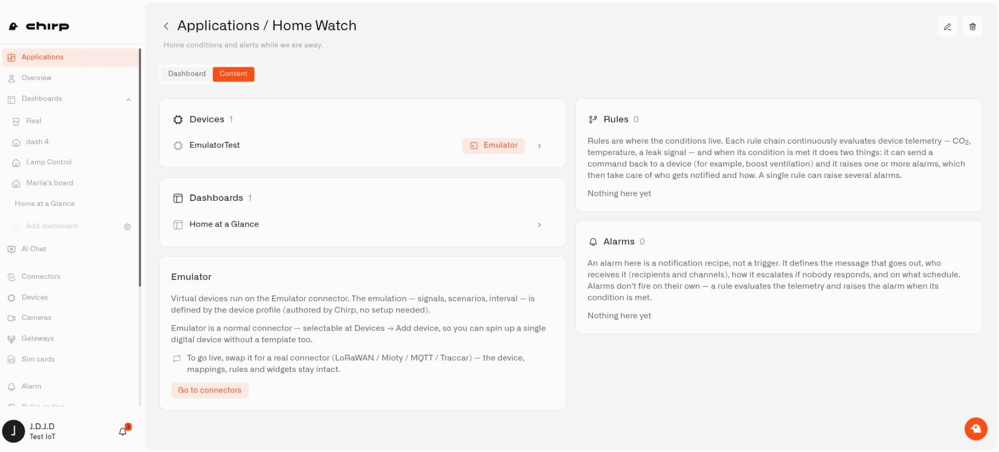

# Organizing Content

Your application's **Content** tab brings its working parts together. For Home Watch, that could mean a door sensor, a home dashboard, a rule that checks the door reading, and an alarm definition for the notification.

Use each resource's **Application** field to choose where it belongs. The resource must already exist or be created through its usual setup screen.

<figure><figcaption>
The Content tab groups the application’s devices, dashboards, rules, and alarms.
</figcaption></figure>

## Add the parts of Home Watch

1. Open a device's details. On **Device Info**, choose `Home Watch` in **Application** and select **Next** to apply the change.
2. Create or edit the dashboard you want to use, choose `Home Watch` in its **Application** field, and select **Next** to apply the change.
3. In the rules list, set the rule's **Application** selector to `Home Watch`.
4. Create or edit the alarm definition, choose the same application, and save it.
5. Return to **Applications → My applications → Home Watch → Content**.

Each item appears under its own heading: **Devices**, **Dashboards**, **Rules**, or **Alarms**. You need editing access to a resource to change its assignment.

## A grouping does not make an automation

The pieces still need to be connected through their settings. For a door alert, the rule needs to check the correct sensor and use the intended alarm definition. Simply placing both items in Home Watch does not cause notifications. Follow [Set Up a Home Alert](../alarm/set-up-a-home-alert.md) to configure that behavior.

## Move an item or leave it ungrouped

A resource can be assigned to one application. Change its **Application** field to move it. Choose **Default** when you want to keep the resource without assigning it to a named application.

Content counts show how many resources are associated with a category you can access. **0** means none have been added. A dash means the number could not be obtained, which can happen when access is missing or the content cannot be loaded. It is not the same as an empty category.

If you are tidying up an old application, move the useful parts first. [Deleting an application](deleting-an-application.md) also removes associated resources.

## Find an item in a larger application

When a setup has many items, scroll within its resource list instead of losing the other sections down the page. A search field appears for larger lists. Physical sensors show their connection state, while pretend sensors are labeled Emulator. The return navigation from an opened resource takes you back to the application you came from.

## Remembered choices and practice devices

New resource forms begin with **Default** until you create a resource using another application. Chirp then remembers your last successful choice separately for each organization. Check the selection before saving a device, view, or alert. If you use **Add new application** and then cancel the surrounding resource form, the application you just created still exists.

Devices marked **Emulator** use simulated readings. Their application includes an **Emulator** explanation and **Go to connectors** shortcut. You can learn the setup before connecting the actual equipment; the [Emulator Connector](../connectors/emulator-connector.md) guide explains how simulated devices work and how to switch their input. A real device's status depends on its connection and recent readings, rather than simply being assigned to an application.

Changing a rule's Application selection is allowed even while its flow is open in an editor. Removing the application is different: an active editor lock can interrupt deletion.

For a large setup, the Rules and Alarms panels show up to 200 entries each. Disabled alarm definitions are included. Use the full **Rules engine** and **Alarm** lists to work with larger collections or check resources that do not appear in the preview.
