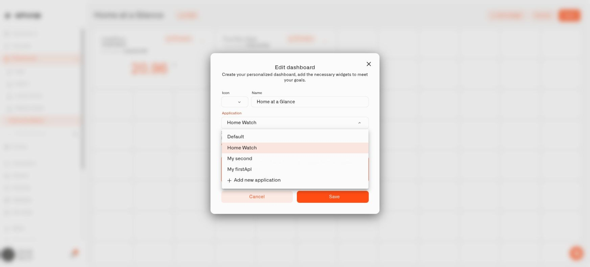

# Using Application Dashboards

An application's **Dashboard** tab is a convenient way to check the views that belong to a household setup. For example, Home Watch might offer a general home view and a separate view of the garden's sensors.

These are your existing dashboards, grouped with the application. Their widgets continue to use the devices and settings you configured.

<figure><figcaption>
Choose the application in the dashboard editor.
</figcaption></figure>

## Check your home

1. Select **Applications**, then open the application from **My applications**.
2. Choose **Dashboard**.
3. Select the dashboard you want if more than one is associated.
4. Read the widgets or use the controls available to your account.

Use **Content** when you want to find the sensors or automations behind the view.

## Adjust what the dashboard shows

Select **Go to the dashboard** to open the original dashboard. Make layout or widget changes there and save them. When you return to the application, it uses the updated dashboard rather than a separate copy.

For detailed instructions, see [Building a Dashboard](../dashboards/building-a-dashboard.md).

## An empty Dashboard tab

Open **Content** and look under **Dashboards**. If no dashboard is associated, edit the one you want to use and choose this application in its **Application** field. You can also make a new dashboard and assign it during setup. If a dashboard exists but is not available to you, check your access with the organization's owner.

## Show the resources behind the view

Use a [Text widget](../dashboards/adding-widgets/text-widget.md) to list selected devices, rules, or alarms alongside the dashboard readings. A home dashboard can show the sensors and alerts that belong to the household task.
