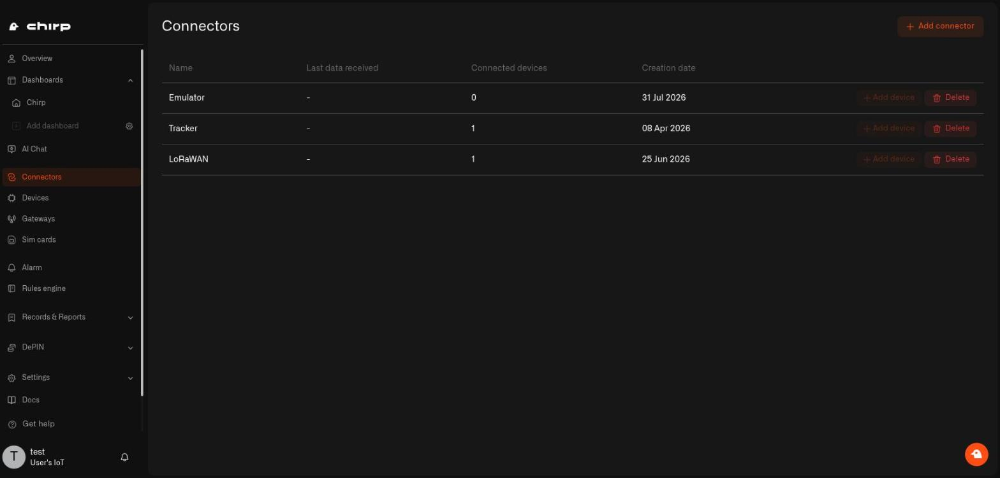

# Emulator Connector

You have ordered a leak sensor. It arrives on Thursday. Until now there was nothing to do until then — no dashboard to arrange, no alert to set up, nothing to look at.

The Emulator fixes that. It gives you **pretend sensors that invent their own readings**, so you can lay out your dashboard, write your alerts, and watch them actually go off — days before anything turns up in the post. And when the real sensor does arrive, you point that same device at it and keep everything you set up.

<figure><figcaption></figcaption></figure>

## Why you would use it

* **To try Chirp properly before buying anything.** Set up the home you are thinking about and see whether it works the way you want.
* **To get everything ready while you wait for delivery.** The fiddly part of a new sensor is not sticking it to the wall — it is deciding what should happen when it reads something. Do that first.
* **To test an alert without ruining a Sunday.** Want to know your leak alert really reaches your phone? You do not have to pour water on the floor. Type the number and watch it fire.

## Setting it up

Go to **Connectors → Add connector** and pick **Emulator**. That's it — there is nothing to fill in, no account to link, no code to copy. One per home.

## Then make a pretend sensor

Everything else happens on the sensor itself, not here. Once the connection exists you add a sensor, point it at the Emulator, choose what it measures, and drive its readings from its own **Emulator** tab.

**See [Pretend Sensors](../devices/pretend-sensors.md)** for the whole thing: making one, picking a real sensor model, sending a reading to test an alert, and switching it over to the real sensor when it turns up.

## See also

* [Pretend Sensors](../devices/pretend-sensors.md) — make one, and make it send something
* [Adding Sensors](../devices/adding-sensors.md) — the normal way, once your hardware is here
* [Rules Engine](../rules-engine/README.md) — the automations you can now build early
* [Alarms](../alarm/README.md) — and the alerts you can finally test properly
