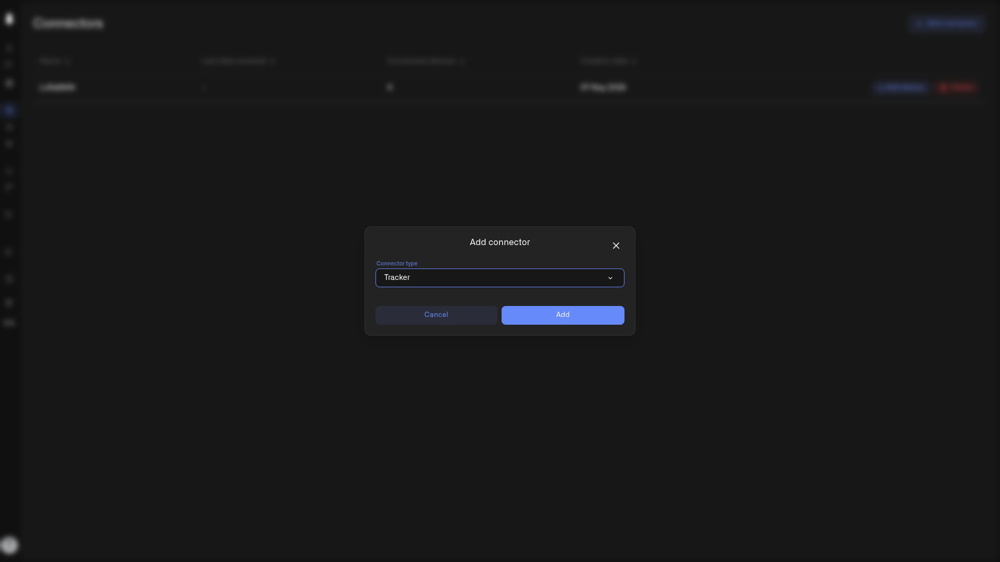

# Tracker Connector

Chirp goes beyond the walls of your home. The **Tracker connector** lets you bring a **vehicle GPS tracker** into Chirp, so your car, motorcycle, or camper shows up on the same dashboards and alerts as your sensors — live location, route history, speed, and whatever else the tracker reports.

<figure><figcaption></figcaption></figure>

## What it's for

The Tracker connector is for **cellular (GSM) vehicle trackers** — devices that send their location over the mobile network:

- **OBD2** plug-in trackers (into a car's diagnostics port)
- **CAN bus** trackers wired into the vehicle
- **Standalone GPS** vehicle trackers

Chirp ships with preconfigured profiles for **over 2,000 tracker models**, so most popular trackers work out of the box.

These trackers almost always need an external power source or a vehicle connection (OBD2/CAN), which makes them a great fit for **cars, motorcycles, campers, trailers with a battery, boats, ATVs**, and similar — not for tiny battery-only room sensors.

> **Cellular trackers only — not LoRaWAN.** Some GPS trackers and tags use LoRaWAN instead of a mobile network. Those do **not** go through the Tracker connector — a LoRaWAN tracker connects through the [LNS Connector](lns-connector/README.md), just like your other LoRaWAN sensors. Use the Tracker connector for cellular/GSM vehicle trackers.

## Adding the Tracker connector

1. Click **Connectors** in the sidebar.
2. Click **Add connector**.
3. Choose **Tracker** from the **Connector type** dropdown.
4. Click **Add**.

That's it — the connector is created in one step. Each home can have **one Tracker connector**. (See [Setting Up a Connection](setting-up-a-connection.md) for the connection basics.)

## Connecting your tracker

When you register a tracker through this connector, its **Connection** details include three tracker-specific fields:

- **Unique ID** — your tracker's identifier
- **Device model** — pick your tracker from the model list
- **Url for GPS tracker** — the endpoint Chirp gives you; configure your tracker (in its own app or SMS settings) to send data to this URL

Configure the tracker to send its data to that URL; once it starts reporting, it appears in Chirp. For the full registration walkthrough, see [Adding Sensors](../devices/adding-sensors.md).

## Seeing where it's been

With a tracker connected, the dashboard side comes alive: put it on a map, watch it live, and replay where it has been. See [Tracking What Matters](../dashboards/tracking-what-matters.md).
