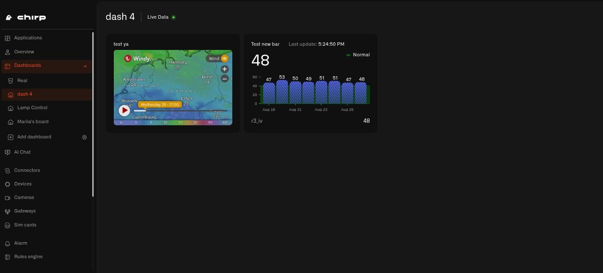

# Chart Widget

<figure><figcaption></figcaption></figure>

The Chart widget draws a reading's history as a graph — a line or bars stretching back over the last hour, day, week, or month — so you can follow how it has moved, not just where it is right now.

One Chart widget puts four things together: the **current value** as a big number at the top, the **graph** of its history as a line or bars, an optional **average line** for the period, and optional **color bands** that mark which ranges are fine and which are not. You see today's reading and the pattern that led to it on a single tile.

Those color bands also tint the **big number** at the top: when the current reading sits inside a band, that number takes the band's color — the line or bars themselves keep the color you gave the metric. So the tile tells you how things are going before you even look at the graph.

A Chart widget follows one reading. If you want to watch several, add a separate Chart widget for each.

## Configure a Chart widget

Let's build a real one — a chart that tracks the living-room humidity through the week, so you can see whether the room stayed comfortable or kept drifting damp. A humidity sensor reports the room as a percentage. This is just an example: a Chart works for any reading whose history you care about — only the sensor and the numbers change.

1. Open your dashboard in edit mode and tap **Chart** in the widget picker. The settings panel opens on the **Datasource** tab, with nothing added yet.
2. Tap **Add datasource**. A **Datasource 1** block appears.
3. In the block, tap **Choose device** and pick the room's humidity sensor.
4. Tap **Add metric**. A metric row appears.
5. In the row, leave **Data type** on **Telemetry**, choose the humidity reading under **Device metric**, and pick a **Color** — this is the color of the line (or bars) on the graph, and the starting color of the big number at the top.

   > **Don't see your sensor reading?** The **Device metric** list only shows number readings. If one is missing, that metric is set up as text (String) or on/off (Boolean) instead of a number. Open **Data Templates** (the **Metrics Templates** button on your connection's Connected Devices list), find the metric on the **Metrics** tab, and switch its **Type** to Integer or Float — as long as the sensor really does send a number. See [Data Templates](../../devices/data-templates.md).

   A Chart widget follows just **one reading** — once that metric is in place, there is no second row to fill in. For another reading, build another Chart widget.
6. Tap **Next** to open the **Appearance** tab.
7. Type a **Widget name** — "Living room humidity" — and a **Description** if you want a subtitle.
8. Under **Widget type**, choose **line** or **bar**. The **line** type draws a flowing curve, which suits a reading that drifts up and down gently like humidity; **bar** draws one bar per reading, handy when you would rather see each report on its own. Pick **line** here.
9. Choose the **Timeframe** — how much history the graph shows: **Last hour**, **Last day**, **Last week**, or **Last month**. For a week's view, pick **Last week**.
10. Under **Set value range**, fill in **From** and **To** — the bottom and top of the up-and-down axis. Choose a window that comfortably holds the readings you expect: **From** 20, **To** 80. (A fresh widget starts at 0–100; change it to fit your reading.)
11. Under **Thresholds**, tap **Add threshold** for each band of meaning. A threshold's **From** and **To** are the lower and upper edge of a color band on that same 20–80 scale; give it a **Label** and a **Color**. For room humidity, add three:
    - "Too dry" — **From** 20, **To** 40 — amber
    - "Comfortable" — **From** 40, **To** 60 — green
    - "Too damp" — **From** 60, **To** 80 — red

    Each threshold has two switches that do different jobs. **Show fill** colors in the whole band as a soft background; **Show line** draws a line along the band's edges. Turn **Show fill** on for "Comfortable" so the happy zone shows as a green stripe behind the graph; turn **Show line** on for "Too damp" so its lower edge at 60% is a clear red line you can watch the trace climb toward.
12. Turn on **Show average value** to add a dashed line at the week's average humidity, marked "Average" in the legend.
13. **Show vertical axis lines** and **Show horizontal axis lines** add a faint grid behind the graph — switch them on if a grid makes it easier to read.
14. Turn on **Display data legend** to list your band labels and the average next to the graph.
15. Tap **Save** to drop the widget onto your dashboard.

Now the tile shows the room's humidity right now as a big number, with the whole week traced behind it — and the green band makes it plain whether the room sat comfortable or kept sliding into the dry or damp zones. The same steps fit any reading with a history worth following; just change the sensor, the value range, and the bands.

## How the big number changes color

The large reading at the top starts in the color you gave the metric. When the current reading falls inside one of your threshold bands, the number switches to that band's color, and goes back to the metric color once the reading leaves every band.

So a humidity chart shows a calm green number while the room is comfortable and turns red the moment the air gets too damp — with no extra setup. The chart makes the problem easy to spot; to get a notification on your phone, pair it with an [alarm](../../alarm/README.md).

## Bands here, conditions elsewhere

The Chart widget uses **threshold bands** — color ranges painted across the graph. The Last Data and Image widgets use the conditions system instead — named color rules with their own priority order. See [Conditions](conditions.md).

## Home examples

**Is the fridge holding its cold?**
Not just "is it 4°C now" — but "did it stay cold all week?" A fridge temperature sensor, **line** chart, **Last week**, value range 0 to 10. A green band 0–5°C and a red band 5–10°C show at a glance whether the fridge held steady or spiked one afternoon when the door was left open.

**Energy use across the week**
A smart meter on a **line** chart, **Last week**. Set the value range to cover your home's draw — for example 0–6 kW — then add a green band over your usual range (say 0–3 kW) and a red band above it (say 4.5–6 kW). The right numbers depend on your home, so set **From** and **To** to what your meter actually reads; an unusually high overnight figure or a weekend peak then stands out the moment the line climbs above the green.

**Bedroom temperature overnight**
A bedroom temperature sensor, **line** chart, **Last day**, value range 10–30 °C. A green band 17–21 °C marks a comfortable sleeping temperature, with a cooler color below it. A glance in the morning tells you whether the room held that comfortable band through the night or dipped in the small hours.

Any reading with a history worth watching fits the Chart widget — soil moisture, a water tank's level, air quality — so treat these as a place to start.

## See also

- [Last Data Widget](last-data-widget.md) — The current reading on its own, when you do not need the history
- [Conditions](conditions.md) — Color rules for the Last Data and Image widgets
- [Adding Widgets](README.md) — How to open edit mode and use the widget picker
