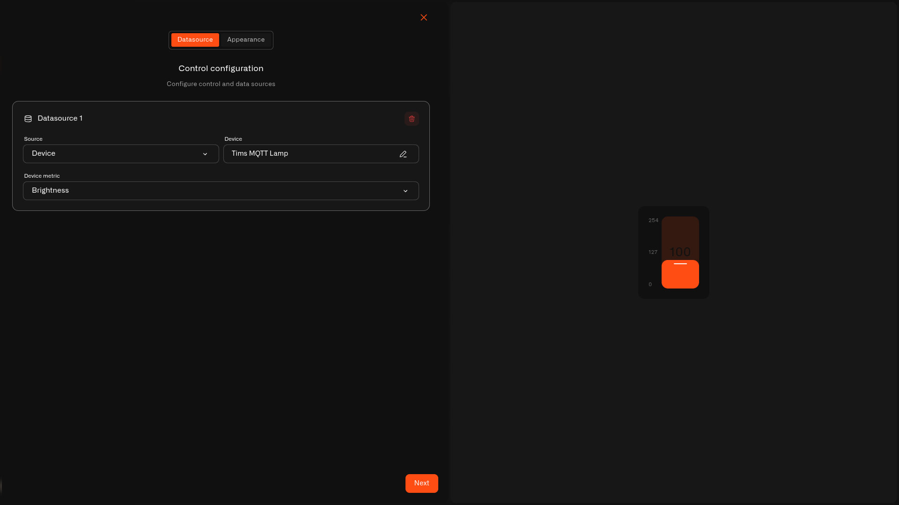

# Control widget

Every other widget *shows* you something. The **Control widget** lets you *do* something. It puts an interactive control on your dashboard — a **switch**, **button**, **slider**, or **input** — bound to one of a device's commands, so you can operate the device without leaving the screen you're already looking at. It's the dashboard version of [Controlling Your Devices](../../devices/commands/): the command does the work, the widget is the switch on the wall.

## First, set up a command

A Control widget runs an action you've already set up on the device — so the device needs at least one command on its **Commands & States** tab. Devices with no commands won't appear to choose from (you'll see *"No controllable devices in this organization"*). Set the command up first — see [Setting up a command](../../devices/commands/creating-commands.md) — then link the widget to it.

## How to add one

Every Control widget is added the same way; only the look-and-feel options differ by type.

1. Open the dashboard in **edit mode** and tap **Add widget** → **Control**.
2. On the **Datasource** tab (*"Control configuration"*), choose the **Source** (Device) and the **Device**, then pick the **Device metric** — the reading that shows the device's current state. Tap **Next**.
3. On the **Appearance** tab, give it a **Widget name** and choose a **Widget type** (below). Fill in that type's options and tap **Save**.

<figure><figcaption></figcaption></figure>

## Pick a control type

| Type | Great for | What it sends |
| --- | --- | --- |
| [Switch](control-widget/switch.md) | A simple on/off you flip back and forth | An on or off command as you toggle |
| [Button](control-widget/button.md) | A one-tap action (run, restart, open) | One command per tap |
| [Slider](control-widget/slider.md) | Sliding to a value, like brightness | A command value as you slide |
| [Input](control-widget/input.md) | Typing an exact number | A command value when you tap **Apply** |

## How it behaves

* **Tap to control.** Using the control sends the command the same way the device's States tab does — same checks, same history.
* **Stays in sync.** It reads the **Device metric** and shows the real state, so it's never just guessing based on your last tap.
* **Greys out when it can't.** If the device is offline or a state isn't fully set up, the control shows as unavailable instead of sending into thin air.

## See also

* [Controlling Your Devices](../../devices/commands/) — set up the commands a Control widget uses
* [Setting up a command](../../devices/commands/creating-commands.md)
* Control types: [Switch](control-widget/switch.md) · [Button](control-widget/button.md) · [Slider](control-widget/slider.md) · [Input](control-widget/input.md)
