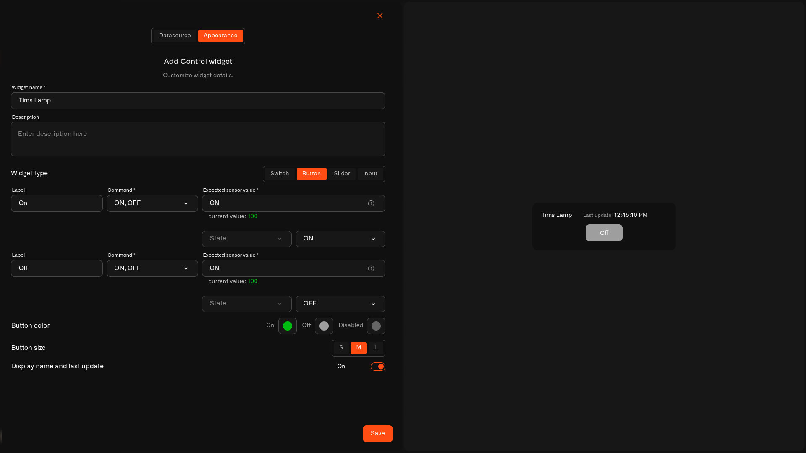

# Button

The **Button** sends a command once when you tap it. Unlike a switch, it doesn't hold an on/off state — it just does something and that's it.

## When to use it

Use a Button for one-tap actions where there's no lasting state to track: **ring a chime**, **restart a device**, **run a scene**, or fire a **momentary relay** (like a pulse to a gate). If it's "do this now" rather than "stay this way," a Button is the one.

## What you need first

* A device with a command set up on its **Commands & States** tab (see [Setting up a command](../../../devices/commands/creating-commands.md)).
* The command you want the button to run.

## How to set it up

1. Open your dashboard in **edit mode** → **Add widget** → **Control**.
2. **Datasource** tab: pick the **Device** and a **Device metric**. Tap **Next**.
3. **Appearance** tab: type a **Widget name**, then under **Widget type** choose **Button**.
4. Set the **Command** the button runs (and any input **Value**s), plus the **Expected sensor value** if the action leaves a state you can check.
5. Choose the **Button color** and a **Button size** — **S**, **M**, or **L** (default M) — and toggle the name/last-update line.
6. Tap **Save**.

<figure><figcaption></figcaption></figure>

## What happens when you tap it

The button sends its command once, and the action shows up in the device's **States** history like any other command. There's no on/off position to keep — it's a trigger.

## Common mistakes

* **Using a Button for something you need to see the state of** — if you want to know whether it's on or off, use a [Switch](switch.md) instead.
* **Waiting for confirmation a quick action can't give** — a one-tap trigger (like "restart") may not leave a reading to verify against, and that's normal.

## See also

* [Control widget](../control-widget.md) — overview and the other control types
* [Controlling Your Devices](../../../devices/commands/) — set up the command this button runs
