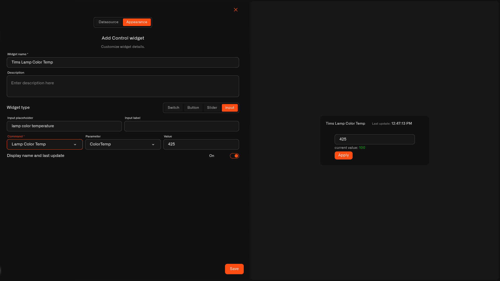

# Input Control

The **Input** lets you type an **exact value** and tap **Apply** to send it — for when a slider is too rough and you want a precise number.

## When to use it

Use an Input when the exact figure matters: a **thermostat target**, a **color temperature**, or a specific **dimming level**. Where a [Slider](slider.md) is for sliding to roughly the right spot, the Input is for entering an exact value.

## What you need first

* A device with a command on its **Commands & States** tab whose **input accepts the value** you'll type (see [Setting up a command](../../../devices/commands/creating-commands.md)).
* A **Device metric** that reports the current value, shown next to the box so you can see where it is now.

## How to set it up

1. Open your dashboard in **edit mode** → **Add widget** → **Control**.
2. **Datasource** tab: pick the **Device** and the **Device metric** for the current value. Tap **Next**.
3. **Appearance** tab: type a **Widget name**, then under **Widget type** choose **Input**.
4. Set an **Input placeholder** (the faint hint in the box) and an optional **Input label**.
5. Choose the **Command** it sends, the **Parameter** it sets, and a default **Value**.
6. Toggle the name/last-update line, then tap **Save**.

<figure><figcaption></figcaption></figure>

## What happens when you use it

You'll see the current value and a box. Type a new number and tap **Apply** to send it — nothing goes out until you tap Apply, so a half-typed number never reaches the device. Whether the value is accepted depends on the command's input (for example any limits set on it), so out-of-range numbers are turned away.

## Common mistakes

* **Expecting it to send as you type** — the Input only sends when you tap **Apply**.
* **Typing a value outside the allowed range** — the command's input sets what's valid; anything outside it won't be accepted.

## See also

* [Control widget](../control-widget.md) — overview and the other control types
* [Controlling Your Devices](../../../devices/commands/) — set up the command this input sends
