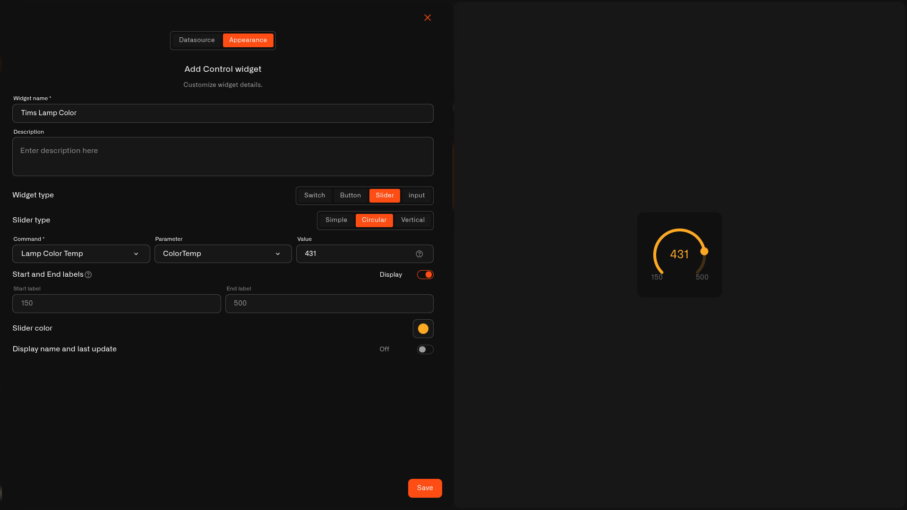

# Circular Slider

The **Circular** slider sets a **value** on a round dial — drag around it and the value follows. It looks like a knob, which makes it a nice centerpiece on a dashboard.

## When to use it

Lovely for a setting you'd reach for like a dial — a lamp's **color temperature**, **volume**, or any single value you want front and center. For a slim in-row control use the [Simple Slider](slider-simple.md); for a tall one use the [Vertical Slider](slider-vertical.md).

## What you need first

* A device with a command on its **Commands & States** tab whose **input takes a number** (see [Setting up a command](../../../devices/commands/creating-commands.md)).
* A **Device metric** that reports the current value, so the dial shows where it's set.

## How to set it up

1. Open your dashboard in **edit mode** → **Add widget** → **Control**.
2. **Datasource** tab: pick the **Device** and the **Device metric** for the live value. Tap **Next**.
3. **Appearance** tab: type a **Widget name**, choose **Widget type → Slider**, then **Slider type → Circular**.
4. Set the **Command** it controls, the **Parameter** it sets, and a starting **Value**.
5. Add **Start and End labels** for the range (say `150` and `500`) with **Display** on, pick a **Slider color**, and toggle the name/last-update line.
6. Tap **Save**.

<figure><figcaption></figcaption></figure>

## What happens when you use it

Turning the dial sends the command with the new value, the same way the device's States tab does. The dial follows the **Device metric**, so it shows the value the device is actually reporting.

## Common mistakes

* **Mixing it up with the round gauge** — the Circular slider *sets* a value (you can turn it); the Last Data [Radial Gauge](../last-data-widget/radial-gauge.md) just *shows* one.
* **Choosing an on/off command** — a slider needs a number input; for on/off use a [Switch](switch.md).

## See also

* [Control widget](../control-widget.md) — overview and the other control types
* Other slider looks: [Simple Slider](slider-simple.md) · [Vertical Slider](slider-vertical.md)
* [Controlling Your Devices](../../../devices/commands/) — set up the command this dial controls
