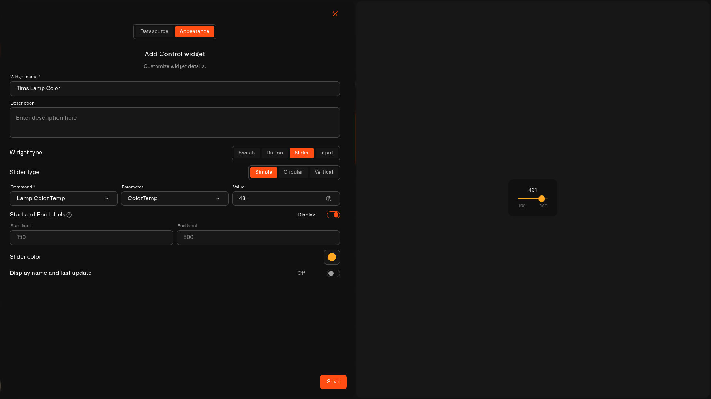

# Simple Slider

The **Simple** slider is a horizontal bar you slide to set a **value**. It's the neatest of the three slider looks and tucks easily into a row of tiles.

## When to use it

Great for anything you set by amount where a side-to-side slider feels natural — a lamp's **brightness**, a dimmer **level**, or **volume**. Prefer a tall slider or a dial? See the [Vertical Slider](slider-vertical.md) or [Circular Slider](slider-circular.md).

## What you need first

* A device with a command on its **Commands & States** tab whose **input takes a number** (see [Setting up a command](../../../devices/commands/creating-commands.md)).
* A **Device metric** that reports the current value, so the slider shows where it's set.

## How to set it up

1. Open your dashboard in **edit mode** → **Add widget** → **Control**.
2. **Datasource** tab: pick the **Device** and the **Device metric** for the live value. Tap **Next**.
3. **Appearance** tab: type a **Widget name**, choose **Widget type → Slider**, then **Slider type → Simple**.
4. Set the **Command** it controls, the **Parameter** it sets, and a starting **Value**.
5. Add **Start and End labels** for the range (say `150` and `500`) and turn **Display** on; pick a **Slider color** and toggle the name/last-update line.
6. Tap **Save**.

<figure><figcaption></figcaption></figure>

## What happens when you use it

Sliding sends the command with the new value, the same way the device's States tab does. The handle follows the **Device metric**, so it shows the value the device is actually reporting.

## Common mistakes

* **Choosing a command that's only on/off** — a slider needs an input it can set to a number; for on/off use a [Switch](switch.md).
* **The range doesn't match the device** — set Start and End to the real lowest and highest values so the whole bar maps to values the device accepts.

## See also

* [Control widget](../control-widget.md) — overview and the other control types
* Other slider looks: [Circular Slider](slider-circular.md) · [Vertical Slider](slider-vertical.md)
* [Controlling Your Devices](../../../devices/commands/) — set up the command this slider controls
