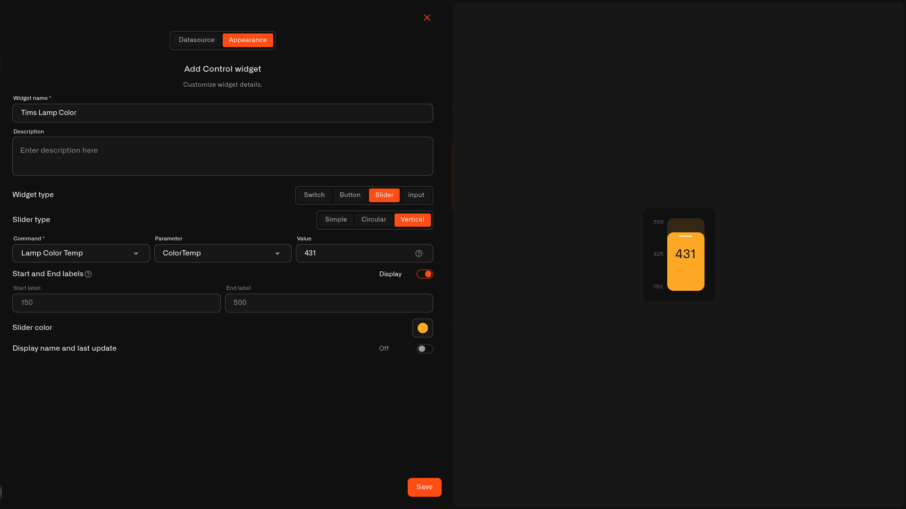

# Vertical Slider

The **Vertical** slider sets a **value** on an upright bar — up for more, down for less. It reads like a level, so it suits things you picture going up and down.

## When to use it

Nice where an upright control fits the idea — a **brightness** level, **blinds** position, or anything you raise and lower. For a side-to-side control use the [Simple Slider](slider-simple.md); for a dial use the [Circular Slider](slider-circular.md).

## What you need first

* A device with a command on its **Commands & States** tab whose **input takes a number** (see [Setting up a command](../../../devices/commands/creating-commands.md)).
* A **Device metric** that reports the current value, so the slider shows where it's set.

## How to set it up

1. Open your dashboard in **edit mode** → **Add widget** → **Control**.
2. **Datasource** tab: pick the **Device** and the **Device metric** for the live value. Tap **Next**.
3. **Appearance** tab: type a **Widget name**, choose **Widget type → Slider**, then **Slider type → Vertical**.
4. Set the **Command** it controls, the **Parameter** it sets, and a starting **Value**.
5. Add **Start and End labels** for the range (say `0` and `254`) with **Display** on, pick a **Slider color**, and toggle the name/last-update line.
6. Tap **Save**.

<figure><figcaption></figcaption></figure>

## What happens when you use it

Sliding up or down sends the command with the new value, the same way the device's States tab does. The handle follows the **Device metric**, so it shows the value the device is actually reporting.

## Common mistakes

* **Choosing an on/off command** — a slider needs a number input; for on/off use a [Switch](switch.md).
* **The range doesn't match the device** — set Start and End to the real lowest and highest values so the whole bar maps to values the device accepts.

## See also

* [Control widget](../control-widget.md) — overview and the other control types
* Other slider looks: [Simple Slider](slider-simple.md) · [Circular Slider](slider-circular.md)
* [Controlling Your Devices](../../../devices/commands/) — set up the command this slider controls
