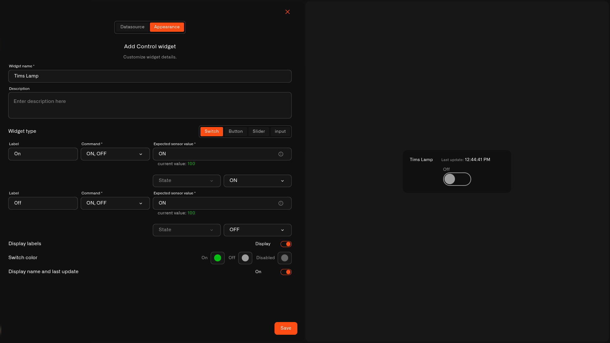

# Switch

The **Switch** is a simple on/off toggle. It's for things that stay in a state — on or off, open or closed — where you flip between the two and the dashboard shows which one is active right now.

## When to use it

A Switch is perfect for everyday home devices you turn on and off: a **lamp**, a **smart plug**, a **garage relay**, a fan, or any simple two-state device. Connect it to a state reading and the toggle shows whether the device is really on, not just what you last tapped.

## What you need first

* A device with a command set up on its **Commands & States** tab (see [Setting up a command](../../../devices/commands/creating-commands.md)).
* A command for each state — one command that takes an on/off value, or two separate commands.
* A **Device metric** that reports the device's current state, so the switch shows on or off correctly.

## How to set it up

1. Open your dashboard in **edit mode** → **Add widget** → **Control**.
2. **Datasource** tab: pick the **Device** and the **Device metric** that shows its state. Tap **Next**.
3. **Appearance** tab: type a **Widget name**, then under **Widget type** choose **Switch**.
4. Set up the two states — the **On** row and the **Off** row. For each:
   * **Label** — what to call it ("On" / "Off").
   * **Command** — the command that state sends.
   * **Expected sensor value** — what the device reports when it's in that state (filled in for you where possible).
   * If the command has inputs, set each **Value**.
5. Choose the **Switch color** for **On**, **Off**, and **Disabled**, toggle **Display labels**, and toggle the name/last-update line.
6. Tap **Save**.

<figure><figcaption></figcaption></figure>

## What happens when you tap it

Flipping the switch sends the command for that state, the same way the device's States tab does. The switch flips straight away, then settles to the real state once the device reports back — so if it didn't actually change, the switch returns to where it was.

## Common mistakes

* **No state reading chosen** — without a Device metric, the switch can send commands but can't show the true state. Pick the reading that says on or off.
* **The "on" value doesn't match** — if the Expected sensor value isn't what the device actually reports, the switch looks stuck. Check it against the current value shown.

## See also

* [Control widget](../control-widget.md) — overview and the other control types
* [Controlling Your Devices](../../../devices/commands/) — set up the command this switch uses
