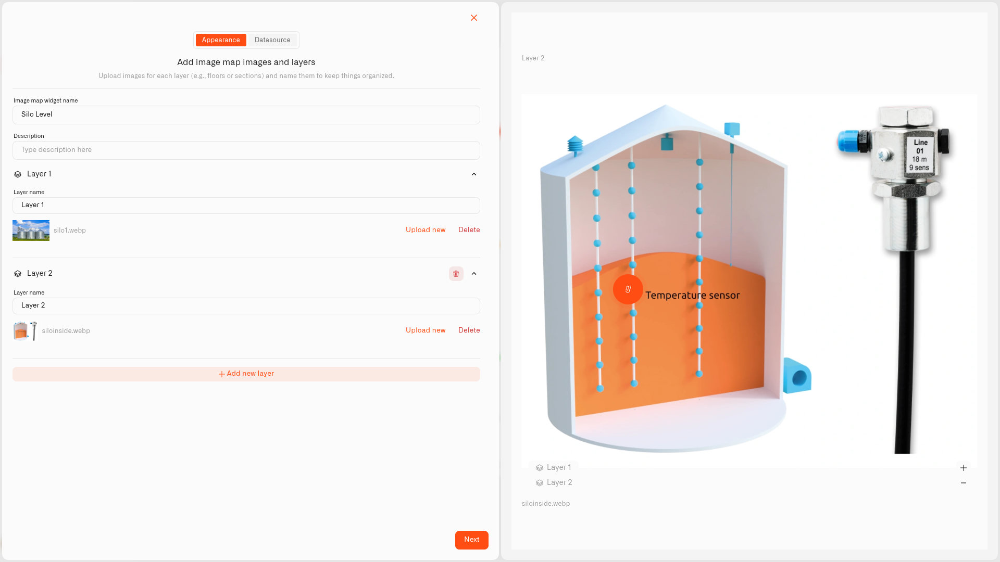

# Image Widget

<figure><figcaption></figcaption></figure>

The Image Widget lets you put your sensor readings straight onto a picture. Upload an image — and it really can be **any image**: a floor plan of your home, a photo of a room, a picture of the basement, a snapshot of the garden, a diagram of a piece of equipment — then drop live readings onto it, each one where its sensor actually sits.

Instead of scanning a list of device names and trying to remember which is which, you look at the real space and see what every part of it is doing. Glance at the floor plan and a cold room stands out; glance at a photo of the basement and you see the water softener is running low on salt.

Upload a supported image file — a PNG or JPG — of any place, object, or thing you want to keep an eye on. Each reading you place shows its current value, its unit, and an icon, and changes color as your conditions say, so the whole picture tells you the story at a glance.

## Configure an Image Widget

Let's build a real one — keeping an eye on the basement using a photo of the utility area. A level sensor watches the water-softener salt tank, and a sump-pit water-level sensor watches for rising water. This is just an example: the image can be anything, and the steps don't change.

1. Open your dashboard in edit mode and tap **Image Widget** in the widget picker. The settings panel opens — and unlike the other widgets, the **Appearance** tab comes first, because you upload the picture before you can place anything on it.
2. Type a name for the widget — something like "Basement".
3. The widget already has one layer, **Layer 1**. Give it a **Layer name** ("Utility area") and upload the image — your photo of the basement. PNG and JPG files work.
4. Tap **Next** to move to the **Datasource** tab.
5. Under the layer, tap **Add datasource** — this adds an empty datasource block. In the block, tap **Choose device** and pick the salt-tank level sensor.
6. Tap **Add metric**. Leave **Data type** on **Telemetry**, choose the salt-level reading under **Device metric**, and pick an **Icon**.

   > **Don't see your sensor reading?** The Image Widget only pins number readings. If one is missing, that metric is set up as text (String) or on/off (Boolean) instead of a number. Open **Devices → Metrics**, find it, and switch it to a number type — as long as the sensor really does send a number. See [Data Templates](../../devices/data-templates.md).
7. Tap **Conditions: N** to open the Conditions window. Choose a **Default color**, then for each band tap **Add condition** and fill in the row — a **Condition name**, **Data type** set to **Number**, the **From** and **To** values, and a **Color**. The pin takes its color entirely from these. For the salt level as a percentage, add four:
   - "Empty" — **From** 0, **To** 10 — burgundy (a deep red)
   - "Add salt now" — **From** 10, **To** 30 — red
   - "Getting low" — **From** 30, **To** 60 — yellow
   - "Full" — **From** 60, **To** 100 — green

   Tap **Save** to close the window. The salt pin now glows green while the tank is full and slides through yellow and red to a thin burgundy strip as it empties — one look at the basement photo tells you when to buy a bag.
8. The pin appears on the image. **Drag it** onto the salt tank in the photo. The zoom controls (+ / −) on the preview help you place it exactly.
9. Add the second sensor the same way — **Add datasource**, choose the sump-pit water-level sensor, then **Add metric**. Open **Conditions: N** and set the bands in centimeters — 0–30 cm "Normal" green, 30–60 cm "Rising" yellow, 60–100 cm "Critical — check pump" red. A sump pit normally holds a little water, so the low band is "Normal" rather than empty. Drag its pin onto the sump pit in the photo.
10. Tap **Save** to drop the widget onto your dashboard.

Now the basement photo carries two live pins — the salt level and the sump-pit water level — each colored by its conditions. The same steps work for any picture; just change the photo, the sensors, and the bands.

## What layers are

<figure><figcaption></figcaption></figure>

A **layer** is one image view inside a single Image Widget — not a see-through overlay on one picture. Every layer has its own image and its own pins. As soon as a widget has more than one layer, a **layer switcher** appears on it, and tapping it moves you between the views — so one widget can hold several pictures and several sets of readings.

Layers earn their place when one picture cannot show everything. A whole house is the easy example — one layer per floor:

- **Layer 1 — "Ground floor".** Upload the ground-floor plan and pin a reading in each room.
- **Layer 2 — "Upstairs".** Upload the upstairs plan and pin its rooms.

On the dashboard you tap the layer switcher to move from the ground floor to upstairs, all in one widget. Add the basement and the attic the same way — as many layers as the home needs, each with its own picture and its own pins.

The plans themselves are nothing fancy: a flat 2D floor plan is just an image you upload. A quick sketch does the job, and so does the plan an estate agent or builder handed you — there is no building to draw or model. That is what separates this widget from the [Digital Building Twin](digital-building-twin/README.md): reach for the **Image Widget** when you already have flat 2D plans and only want live readings pinned onto them; reach for the **Digital Building Twin** when you want to draw and manage a full 3D model of your home.

**Layers or separate widgets?** Use layers when the pictures are different views of the same place. Use separate Image Widgets when the pictures belong in different parts of the dashboard or cover unrelated things.

Working with layers: **Layer 1** is already there — rename it and upload its image. Tap **Add new layer** only when you want another picture in the same widget. **Every layer needs its own image** — add a layer and leave it empty and **Next** won't let you continue. On the **Datasource** tab, add each datasource and metric under the right layer, and drag each pin on that layer's own picture.

## Home examples

**House floor plan — a reading per room**
Upload your floor plan and pin a temperature sensor in each room: green 18–24°C "Comfortable", yellow 15–18°C "Cool", red below 15°C "Cold". Add an upstairs layer the same way and switch between floors.

**Garden layout — soil and watering**
Upload a photo or sketch of the garden and pin soil-moisture sensors on the beds and pots — green 40–80%, yellow 20–40%, red below 20% — so you can see at a glance which corner needs watering.

**Basement or utility room — a photo, not a plan**
Upload a straight photo of the space and pin whatever you watch there: the water-softener salt level, the sump-pit water level, the temperature, the humidity. The image does not have to be a floor plan — any photo where you want readings shown in place works.

Any picture you can take or draw can become an Image Widget, so treat these as a place to start. Wherever a reading makes more sense once you can see where it is, this widget puts it there.

## What the widget shows

On the dashboard, each layer shows its picture with a colored round pin at every spot you placed. Each pin carries the sensor's icon, its live value, and the unit, and updates as new readings come in.

**A pin's color comes entirely from its conditions.** The first matching condition wins; if none matches, the pin uses the Default color from the Conditions window. The Image Widget shows you the situation — to get a notification on your phone when a reading crosses a line, pair it with an [alarm](../../alarm/README.md).

When a widget has two or more layers, the **layer switcher** moves between them. If a layer has no picture yet, or the widget has no sensors set up, that area shows a short placeholder message.

## See also

- [Conditions](conditions.md) — The color rules behind every pin
- [Maps and Device Placement](../maps-and-device-placement.md) — Placing sensors on an outdoor map (a different feature)
- [Adding Widgets](README.md) — How to open edit mode and use the widget picker
