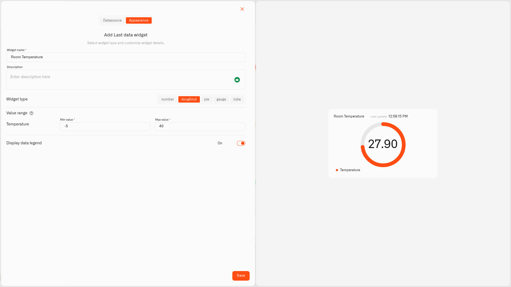

# Doughnut Display

<figure><figcaption></figcaption></figure>

The Doughnut display shows a reading as a ring that fills up between a low and a high value you choose, with the number in the middle. One look tells you how full something is — you don't have to read the figure to know it's nearly empty or almost maxed out.

It's a great fit for anything with a sensible range — a water tank, a battery, a humidity level. As the reading climbs, more of the ring fills in.

## When to choose it

- A reading with a clear low and high — water-tank level, battery percentage, room humidity.
- A tile where you just want to sense "getting full" or "getting low" at a glance.
- A value that feels like a proportion of something rather than a bare number.

Anything in your home that has a meaningful "empty" and "full" can become a Doughnut — your own sensors will suggest plenty of uses.

## Configure a Doughnut display

Let's build a real one — a ring that shows the living-room temperature and whether it's comfortable. A temperature sensor reports the room in °C. A temperature isn't like a tank — it has no real "empty" or "full", so there's no obvious 0 and 100. The ring still needs a bottom and a top, so you pick a window wide enough to cover any temperature the room could realistically reach: for a house, about -5 °C to +40 °C. This is just an example: a Doughnut suits any reading you'd like to see as a share of a range, so only the sensor and the numbers change.

1. Open your dashboard in edit mode and tap **Last data** in the widget picker. The **Datasource** tab opens with nothing added yet.
2. Tap **Add datasource**. A **Datasource 1** block appears.
3. In the block, tap **Choose device** and pick the room's temperature sensor.
4. Tap **Add metric**. A metric row appears.
5. In the row, leave **Data type** on **Telemetry**, choose the temperature reading under **Device metric**, and pick an **Icon**.

   > **Don't see your sensor reading?** The **Device metric** list only shows number readings. If one is missing, that metric is set up as text (String) or on/off (Boolean) instead of a number. Open **Data Templates** (the **Metrics Templates** button on your connection's Connected Devices list), find the metric on the **Metrics** tab, and switch its **Type** to Integer or Float — as long as the sensor really does send a number. See [Data Templates](../../../devices/data-templates.md).
6. Tap **Conditions: N** to open the Conditions window. Choose a **Default color** — the color the reading uses whenever none of your bands match the current value — then for each band tap **Add condition** and fill in the row — a **Condition name**, **Data type** set to **Number** (the condition's own Data type, not the metric's), the band's **From** and **To** — a living room realistically sits between -5 °C and 40 °C, so those run from **-5** to **40** — and a **Color**. Then you set the colour levels — for example:

   Starting at the coldest:
   - "Too cold" — **From** -5, **To** 15 — blue
   - "Cool" — **From** 15, **To** 18 — yellow
   - "Comfortable" — **From** 18, **To** 24 — green
   - "Warm" — **From** 24, **To** 28 — yellow
   - "Too hot" — **From** 28, **To** 40 — red

   Tap **Save** to close the window.
7. Tap **Next** to open the **Appearance** tab.
8. Type a **Widget name** — "Living room" — and a **Description** if you want one.
9. Under **Widget type**, pick **Doughnut**.
10. In **Value range**, set **Min value** to **-5** and **Max value** to **40** — the window you picked for a house room. The ring fills to show where the temperature sits across that -5–40 °C span, and the matching condition colors it.
11. Turn on **Display data legend** if you'd like, then tap **Save**.

The ring shows the temperature as a spot in the range and goes green only while the room is comfortable. The same steps fit anything with a sensible low and high — just change the sensor, the **Min value**/**Max value**, and the conditions. One honest note: a temperature is often easier to read on a Number tile or a Gauge — the Doughnut is shown here because it makes the next example easy to see.

## Worked examples

**The same sensor, set up completely differently — the fridge**
Your fridge uses the very same kind of temperature sensor as the living room above — but a comfortable fridge and a comfortable room are nothing alike. A fridge stays cold, so its safe range is only about 0–5 °C — set the scale a little wider than that band so a fridge that fails and warms up still shows on the ring: **Min value** **-5**, **Max value** **15**. Then build three conditions: "Too cold" — From -5, To 0 — blue; "Safe" — From 0, To 5 — green; "Too warm" — From 5, To 15 — red. Same sensor, same steps — only the numbers move, because you decide what "good" means for each spot in your home. That's the whole idea behind conditions.

**How full is the water tank?**
A Doughnut is a natural fit for a tank. A level sensor in a 500-litre tank reports the contents in litres, so 0 is empty and 500 is full — **Min value** 0, **Max value** 500 — with conditions green From 300 To 500, yellow From 100 To 300, red From 0 To 100. The ring empties before your eyes as the tank is used.

## See also

- [Last Data Widget](../last-data-widget.md) — The full widget setup and all five display types
- [Conditions](../conditions.md) — Setting the From/To color rules
- Other display types: [Number](number.md) · [Pie](pie.md) · [Gauge](gauge.md) · [Tube](tube.md)
