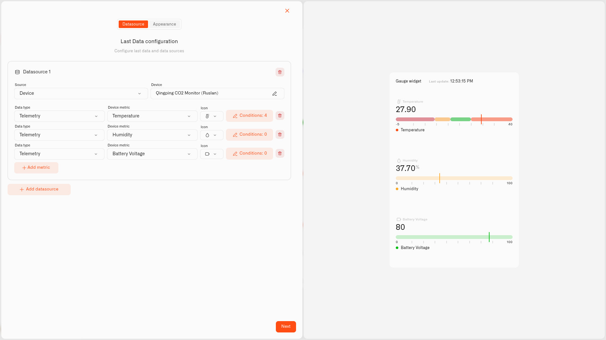

# Gauge Display

<figure><figcaption></figcaption></figure>

The Gauge display puts a reading on a horizontal track with a marker that slides along it, and the color rules you set show up as bands across that track. The number sits above. So you see two things at once — the value, and whether it's sitting in a good stretch or a worrying one.

## When to choose it

- A reading where it matters *where* it sits — a comfortable room temperature, a healthy battery level — and the colored bands tell you instantly.
- A "running low" warning — set the low end red so the marker sliding down toward it catches your eye.
- A "too high" warning — set the high end red, so a level creeping up (a basement sump filling, say) shows as the marker climbs.

A Gauge has no built-in good or bad end — the bands you choose decide that. Wherever a reading has a "fine" zone and a "not fine" zone, the Gauge makes the line easy to see.

## Configure a Gauge display

Let's build a real one — a gauge that warns you if a basement sump pump fails before the floor floods. The pump's job is to keep the water in its pit low; the pit is about 100 cm deep, and a level sensor reports the water level in centimeters — so the reading runs from 0 (a dry pit floor) up to 100 (water at the overflow). That 0–100 is the gauge's track, and each color band is one stretch of it. This is just an example — a Gauge works for any reading you measure against limits, so only the sensor and the band numbers change.

1. Open your dashboard in edit mode and tap **Last data** in the widget picker. The **Datasource** tab opens with nothing added yet.
2. Tap **Add datasource**. A **Datasource 1** block appears.
3. In the block, tap **Choose device** and pick the pit's level sensor.
4. Tap **Add metric**. A metric row appears.
5. In the row, leave **Data type** on **Telemetry**, choose the water-level reading under **Device metric**, and add an **Icon**.

   > **Don't see your sensor reading?** The **Device metric** list only shows number readings. If one is missing, that metric is set up as text (String) or on/off (Boolean) instead of a number. Open **Data Templates** (the **Metrics Templates** button on your connection's Connected Devices list), find the metric on the **Metrics** tab, and switch its **Type** to Integer or Float — as long as the sensor really does send a number. See [Data Templates](../../../devices/data-templates.md).
6. Tap **Conditions: N** to open the Conditions window. Choose a **Default color** — the color the reading uses whenever none of your bands match the current value — then for each band tap **Add condition** and fill in the row — a **Condition name**, **Data type** set to **Number** (the condition's own Data type, not the metric's), the band's **From** and **To** — because the pit is 100 cm deep, those run from **0** (the dry floor) to **100** (the overflow) — and a **Color**. Then you set the color levels — for example:

   Starting at the dry floor:
   - "Normal" — **From** 0, **To** 30 — green
   - "Water rising" — **From** 30, **To** 60 — yellow
   - "Pump may have failed" — **From** 60, **To** 100 — red

   On a Gauge these bands appear as colored stretches along the track. Tap **Save**.
7. Tap **Next** to open the **Appearance** tab.
8. Type a **Widget name** — "Basement sump" works well — and a **Description** if you want one.
9. Under **Widget type**, choose **Gauge**.
10. In **Value range**, set **Min value** to **0** (a dry pit) and **Max value** to **100** (water at the overflow) — the two ends of the track, the same 0–100 your bands use — and set **Tick marks** to **10**.
11. Flip on **Display data legend** if you'd like, then tap **Save**.

Now the marker sits low in the green while the pump is doing its job. If the pump ever fails, the water rises and the marker slides along the track and crosses into the red — that crossing is your warning that something is wrong downstairs. One thing to get right: a level sensor reads higher as the water rises, but a sensor fixed above the water reads lower — so put the red band on whichever value means "high water" for your sensor. The Gauge makes the problem visible on your dashboard; to get a notification on your phone, pair it with an [alarm](../../../alarm/README.md). The same banded track suits anything with limits — just change the sensor and the numbers.

## Worked examples

**Don't let something run out**
When the worry is at the *low* end, flip the colors around. To watch a water softener's salt on a Gauge, use a sensor that reports it as a percentage — 0 % is an empty tank, 100 % is full — so set **Min value** 0 and **Max value** 100, with three conditions: "Top up now" — From 0, To 15 — red; "Getting low" — From 15, To 40 — yellow; "Plenty" — From 40, To 100 — green. The marker rides high and green when the tank is full and slides down toward the red as the salt is used — your cue to buy another bag.

**Keeping a room comfortable**
Some readings should stay *between* two numbers. For a living-room temperature, the track needs to cover every temperature the room could realistically reach — for a house that is roughly -5 °C to 40 °C, so set **Min value** -5 and **Max value** 40. Then add: "Too cold" — From -5, To 18 — blue; "Comfortable" — From 18, To 24 — green; "Too warm" — From 24, To 40 — red. A marker in the green middle means the room is just right; drift toward either end shows before anyone reaches for a jumper or opens a window.

## See also

- [Last Data Widget](../last-data-widget.md) — The full widget setup and all five display types
- [Conditions](../conditions.md) — The color rules that become the track bands
- Other display types: [Number](number.md) · [Doughnut](doughnut.md) · [Pie](pie.md) · [Tube](tube.md)
