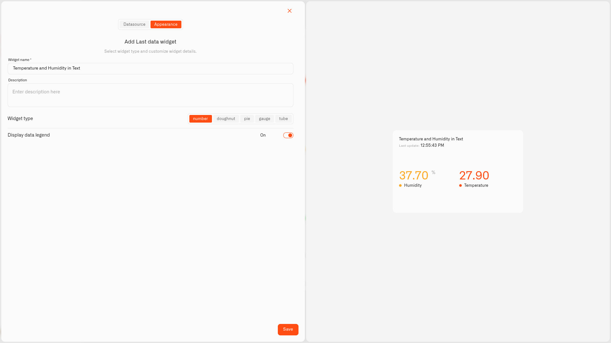

# Value Display

<figure><figcaption></figcaption></figure>

The Value display shows a reading's latest value just as it comes in — no dial, no bar, just the value. It works for **any** kind of reading: a number with its unit, a bit of **text** shown as-is, or an on/off (**Boolean**) value shown as `true` or `false`. As the screenshot shows, several readings can share one tile, sitting side by side, each in its own color — handy for showing a room's temperature and humidity together.

Pick Value when the reading itself is what you want to see, and there's nothing to "fill up" — the actual temperature, the actual battery percentage, a text status, an open/closed state. It's also the neatest way to fit two or three related readings into one small tile.

Value is the only display type with no value range, because there's no scale to fill against.

## When to choose it

- The exact reading is the point — "the bedroom is 21°C," "the battery is at 64%."
- A compact tile carrying two or three readings for one room or device.
- A simple on/off or open/closed value where the plain number says it all.

Those are just ideas — any reading that's clearest as a plain figure is a good fit for the Value display.

## Configure a Value display

Let's build a real one — a tile that tells you at a glance whether the front door is open. The door's contact sensor reports just two values — `1` when it's open and `0` when it's shut. Because the reading is only ever 0 or 1, there's nothing to fill or scale, so a Value tile is the right pick and each condition only needs to match one of those two numbers. This is just an example: a Value tile suits any reading where the figure itself is what you want — only the sensor and the conditions change.

1. Open your dashboard in edit mode and tap **Last data** in the widget picker. The **Datasource** tab opens with nothing added yet.
2. Tap **Add datasource**. A **Datasource 1** block appears.
3. In the block, tap **Choose device** and pick the front-door contact sensor.
4. Tap **Add metric**. A metric row appears.
5. In the row, leave **Data type** on **Telemetry**, choose the open/closed reading under **Device metric**, and add an **Icon**.

   > **About reading types.** The **Device metric** list shows every reading, whatever its type. The Value display shows it as-is — a number, a bit of text, or an on/off value (`true`/`false`) — so you don't need to convert anything here. (The gauge-style displays — Doughnut, Pie, Gauge, Tube, Radial gauge — do need a number: a numeric text reading is read as that number, and anything non-numeric shows as 0. To change a reading's type, use the **Metrics Templates** button on your connection's Connected Devices list — see [Data Templates](../../../devices/data-templates.md).)
6. Tap **Conditions: N** to open the Conditions window. Choose a **Default color** — the color the reading uses whenever none of your bands match the current value — then for each state tap **Add condition** and fill in the row — type a **Condition name**, set **Data type** to **Number** (the condition's own Data type, not the metric's), because the door sensor only ever sends 0 or 1, set **From** and **To** to the same number — the value that condition should match — and pick a **Color**. Then you set the two states — for example:
   - "Open" — **From** 1, **To** 1 — red
   - "Closed" — **From** 0, **To** 0 — green

   Tap **Save** to close the window.
7. Tap **Next** to go to the **Appearance** tab.
8. Type a **Widget name** — "Front door" — and a **Description** if you'd like a subtitle.
9. Under **Widget type**, choose **Value**. There's no **Value range** or **Tick marks** — the Value display has no scale, because an on/off reading has nothing to fill; the value itself is the message.
10. Flip on **Display data legend** if you'd like a label, then tap **Save**.

The tile still shows the number — `1` or `0` — but the condition color turns it red when the door is open and green when it's shut, so you read the state in an instant without thinking about the digit. The same trick works for any on/off sensor — a window contact, a leak detector, a light — just swap the sensor and the two conditions.

## Worked examples

**The exact reading, with a verdict**
When you want the actual figure, the Value tile shows it in full. A Value tile has no scale, so the bedroom temperature just needs conditions — the °C thresholds that matter to you. Add three: "Comfortable" — From 18, To 24 — green; "Cool" — From 15, To 18 — yellow; "Chilly" — From -5, To 15 — blue. You see the real number — `21.4 °C` — and its color tells you how it feels, both at once. The number is never hidden; the color is just extra meaning laid on top. To see how the temperature changed through the day, use the [Chart widget](../chart-widget.md) instead.

**A text or on/off reading**
The Value display isn't just for numbers. A sensor that reports text (like `OPEN`, `CLOSED`, or `MOTION`) or a simple on/off value shows it directly — the text as written, or `true`/`false` — with no conversion. You can still add conditions and colors, so an `OPEN` status can glow red while `CLOSED` stays green.

**One tile for a whole room**
A Value tile can hold several readings together. Add temperature, humidity, and air quality from one multi-sensor and each keeps its own icon and colors, lined up side by side — your "Bedroom" tile in one neat square.

## See also

- [Last Data Widget](../last-data-widget.md) — The full widget setup and the other display types
- [Conditions](../conditions.md) — Setting the From/To color rules
- Other display types: [Doughnut](doughnut.md) · [Pie](pie.md) · [Gauge](gauge.md) · [Tube](tube.md) · [Radial gauge](radial-gauge.md)
