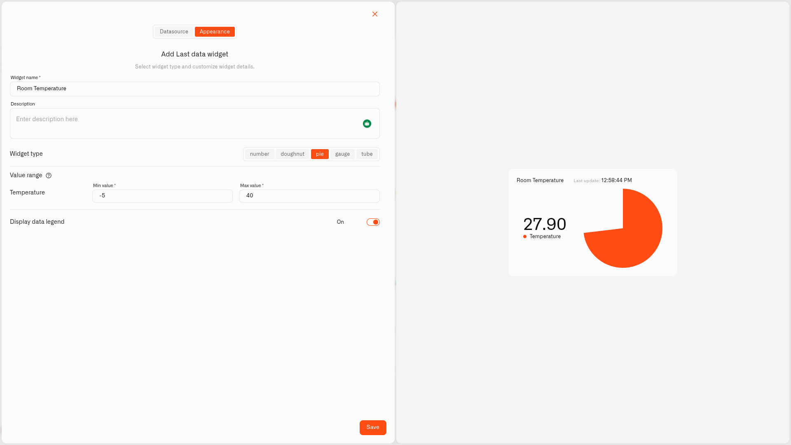

# Pie Display

<figure><figcaption></figcaption></figure>

The Pie display is a solid filled circle rather than a ring — it fills in like a slice of pie and becomes whole when the reading reaches its maximum, with the value shown beside it. It works on exactly the same idea as the Doughnut; it just looks bolder and more solid.

Reach for Pie when you'd like a stronger splash of color on the dashboard instead of a thin ring.

## When to choose it

- The same range-based readings the Doughnut handles — tank level, battery, humidity — when you prefer a chunkier look.
- A tile you want to stand out on a busy dashboard.
- A board you glance at from across the room, where a solid shape reads more easily.

Doughnut and Pie do the same job — choose whichever simply looks better to you on the dashboard.

## Configure a Pie display

Let's build a real one — a bold tile showing how much water is in the garden rain barrel. A level sensor reports the barrel contents in litres, and the barrel holds 200 litres — so the reading is 0 when the barrel is empty and 200 when it's full. That 0–200 is the scale, and each color band is a slice of it. This is just an example: a Pie works for any reading shown as a share of a range, so only the sensor and the numbers change.

1. Open your dashboard in edit mode and tap **Last data** in the widget picker. The **Datasource** tab opens with nothing added yet.
2. Tap **Add datasource**. A **Datasource 1** block appears.
3. In the block, tap **Choose device** and pick the rain barrel's level sensor.
4. Tap **Add metric**. A metric row appears.
5. In the row, leave **Data type** on **Telemetry**, choose the volume reading under **Device metric**, and choose an **Icon**.

   > **Don't see your sensor reading?** The **Device metric** list only shows number readings. If one is missing, that metric is set up as text (String) or on/off (Boolean) instead of a number. Open **Data Templates** (the **Metrics Templates** button on your connection's Connected Devices list), find the metric on the **Metrics** tab, and switch its **Type** to Integer or Float — as long as the sensor really does send a number. See [Data Templates](../../../devices/data-templates.md).
6. Tap **Conditions: N** to open the Conditions window. Choose a **Default color** — the color the reading uses whenever none of your bands match the current value — then for each band tap **Add condition** and fill in the row — a **Condition name**, **Data type** set to **Number** (the condition's own Data type, not the metric's), the band's **From** and **To** — the barrel holds 200 litres, so those run from **0** (empty) to **200** (full) — and a **Color**. Then you set the colour levels — for example:

   Starting from empty:
   - "Plenty" — **From** 120, **To** 200 — green
   - "Getting low" — **From** 40, **To** 120 — yellow
   - "Almost empty" — **From** 0, **To** 40 — red

   Tap **Save** to close the window.
7. Tap **Next** to move to the **Appearance** tab.
8. Type a **Widget name** — "Rain barrel" — and a **Description** if you want a subtitle.
9. Under **Widget type**, choose **Pie**.
10. In **Value range**, set **Min value** to **0** (an empty barrel) and **Max value** to **200** (its full 200-litre capacity) — the same range your bands use. The slice fills the whole circle at 200 litres.
11. Switch on **Display data legend** if you'd like, then tap **Save**.

Now a solid disc shows the barrel at a glance — full and green after rain, shrinking through yellow to red as you water the garden. The same steps fit any "how full" reading at home; change the sensor, the **Min value**/**Max value**, and the bands to suit.

## Worked examples

**Do the houseplants need water?**
A soil-moisture sensor reports a percentage, so the scale is simply **Min value** 0 (bone dry) and **Max value** 100 (soaked), with conditions green From 40 To 80, yellow From 20 To 40, red From 0 To 20. The filled disc makes a thirsty plant impossible to miss.

**A tile you can read from the sofa**
On a dashboard you keep on a wall tablet or a TV, a solid Pie reads more clearly from a distance than a thin ring. Use Pie for the readings you want to catch from across the room, and save the Doughnut for closer-up tiles.

## See also

- [Last Data Widget](../last-data-widget.md) — The full widget setup and all five display types
- [Conditions](../conditions.md) — Setting the From/To color rules
- Other display types: [Number](number.md) · [Doughnut](doughnut.md) · [Gauge](gauge.md) · [Tube](tube.md)
