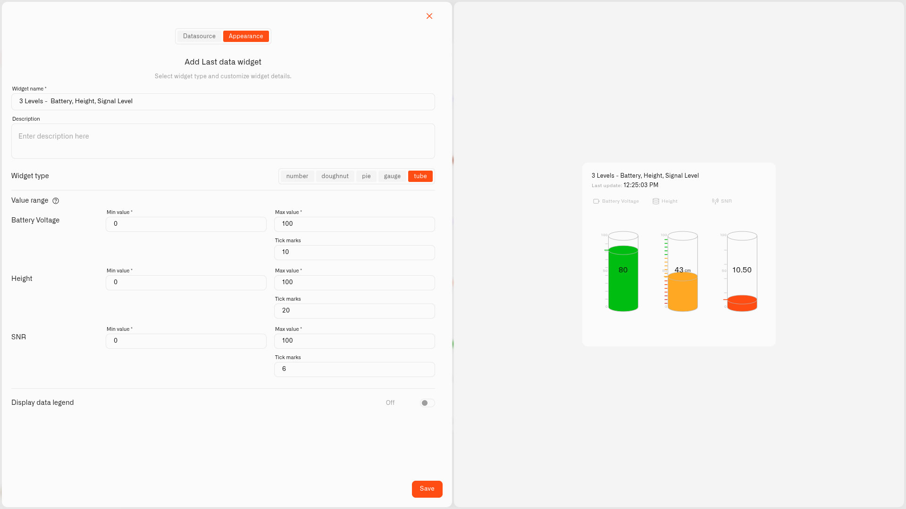

# Tube Display

<figure><figcaption></figcaption></figure>

The Tube display is a tall cylinder that fills up from the bottom as the reading rises — just like looking at the level in a real tank. Tick marks run down the side, and the number shows on the tube itself.

It's the most natural way to show anything that has a level — a rainwater butt, a heating-oil tank, the salt in a water softener. And because the colors are yours to set, it works whether you're watching something fill up or watching it run down.

## Watch it run low, or watch it climb too high

The Tube has no fixed "good" end — you choose which way spells trouble and set the colors to match. That means one widget covers two opposite jobs:

- **Watch something run low.** When the worry is *running out* — the fuel in a tank, the salt in your softener, the water in a rain barrel — the level drops as it's used, so put the warning colors at the **bottom**. The tube is green when there's plenty and turns yellow then red as it empties, so you know to refill in good time.
- **Watch something rise too far.** When the worry is the level *getting too high* — say a sensor in your sump or basement pit, where the pump normally keeps the water down — a pump failure lets the water climb, so put the warning colors at the **top**. The tube stays short and green normally and fills into a red band near the top if something goes wrong, warning you before it floods.

It's exactly the same widget — the only difference is whether you paint the red at the bottom or the top. Both are shown below.

## When to choose it

- A real tank or container — water, fuel, propane, feed.
- A "how much is left" reading, where you want to see the level drop toward the bottom.
- A level that shouldn't climb too high — like a sump or drainage pit — where seeing it rise toward the top is the warning.
- Anything you'd naturally picture as a level rising and falling.

If your instinct is to imagine a reading as a column going up and down, the Tube is the display for it — and the colors then decide which end you're watching.

## Configure a Tube display

Let's build a real one — a tube that watches the salt level in a water softener so you never let it run dry. The softener's salt tank is about 100 cm deep, and a level sensor reports how full it is in centimeters — so the reading is 0 when the tank is empty and 100 when it's filled right up. Those two numbers, 0 and 100, are the scale the whole widget works from, and every color band is just a slice of that 100 cm. This is only an example, though: the very same steps work for a rainwater butt, a heating-oil tank, a feed bin — anything with a level. Only the sensor and the numbers change.

1. Open your dashboard in edit mode and tap **Last data** in the widget picker. The **Datasource** tab opens with nothing added yet.
2. Tap **Add datasource**. A **Datasource 1** block appears.
3. In the block, tap **Choose device** and pick the salt tank's level sensor.
4. Tap **Add metric**. A metric row appears.
5. In the row, leave **Data type** on **Telemetry**, choose the level reading under **Device metric**, and pick an **Icon**.

   > **Don't see your sensor reading?** The **Device metric** list only shows number readings. If one is missing, that metric is set up as text (String) or on/off (Boolean) instead of a number. Open **Data Templates** (the **Metrics Templates** button on your connection's Connected Devices list), find the metric on the **Metrics** tab, and switch its **Type** to Integer or Float — as long as the sensor really does send a number. See [Data Templates](../../../devices/data-templates.md).
6. Tap **Conditions: N** to open the Conditions window. Choose a **Default color** — the color the reading uses whenever none of your bands match the current value — then for each band tap **Add condition** and fill in the row — type a **Condition name**, set **Data type** to **Number** (this is the condition's own Data type, not the metric's), because the salt tank is 100 cm tall, enter **From** 0 cm (the empty bottom) and **To** 100 cm (the full top), and pick a **Color**. Then you set the color levels — for example:

   Starting at the bottom:
   - "Critical" — **From** 0, **To** 10 — burgundy (a deep red, darker than the next band)
   - "Refill now" — **From** 10, **To** 30 — red
   - "Refill soon" — **From** 30, **To** 60 — yellow
   - "Healthy" — **From** 60, **To** 100 — green

   Tap **Save** to close the window.
7. Tap **Next** to open the **Appearance** tab.
8. Type a **Widget name** — something like "Softener salt" — and a **Description** if you want one.
9. Under **Widget type**, choose **Tube**.
10. In **Value range**, set **Min value** to **0** (an empty tank) and **Max value** to **100** (filled to the top) — the very same 0–100 your bands use — and set **Tick marks** to **10** so a line marks every 10 cm.
11. Flip on **Display data legend** if you'd like the reading labeled, then tap **Save**.

Now the tube stands tall and green while there's plenty of salt, slips through yellow and red as it gets used up, and shows a thin burgundy strip when it's almost gone — so you top it up before the softener stops working. Point the same setup at a rainwater butt, a pond top-up reservoir, or an oil tank and it behaves exactly the same; you just change the sensor and the band numbers.

## Worked examples

**Catch a basement flood before it spreads**
A sump pump sits in a pit in the basement and keeps the water low so the floor stays dry. Drop a level sensor into the pit and show it on a Tube. The pit is about 100 cm deep, so 0 is a dry floor and 100 is water right at the overflow — set **Min value** 0 and **Max value** 100, then add three conditions: "Normal" — From 0, To 30 — green; "Water rising" — From 30, To 60 — yellow; "Pump may have failed" — From 60, To 100 — red. Day to day the column is short and green; if the pump quits, the water climbs and the tube fills into the red. A quick note on the sensor: a level sensor reads higher as the water rises, but a sensor fixed above the water (measuring the gap down to it) reads lower — so put the red condition on whichever value means "high water" for the one you have. The Tube makes the danger easy to spot on the dashboard; to get a phone alert as well, pair it with an [alarm](../../../alarm/README.md).

**A rain barrel in the garden**
The same idea for collected rainwater — a level sensor in a 200-liter barrel — **Min value** 0 for an empty barrel and **Max value** 200 because that is how much it holds. The tube rises with every shower and drops as you water the garden, so you always know how much you've saved up.

## See also

- [Last Data Widget](../last-data-widget.md) — The full widget setup and the other display types
- [Conditions](../conditions.md) — Setting the From/To color rules for the fill
- Other display types: [Number](number.md) · [Doughnut](doughnut.md) · [Pie](pie.md) · [Gauge](gauge.md) · [Radial gauge](radial-gauge.md)
