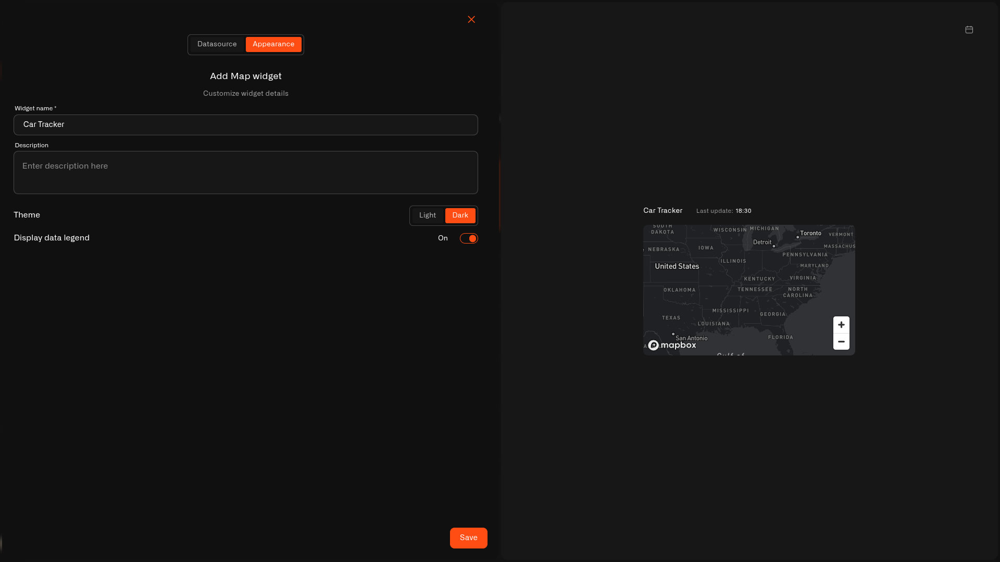

# Map Widget

The Map widget shows where a GPS-reporting device is on a real outdoor interactive map — the same kind of map you use for navigation. The device's current location appears as a marker, and the marker shows one selected sensor reading at a time: current speed, battery level, engine on/off status, or any other value the device transmits.

Any device that reports GPS coordinates works — a family GPS tracker, a pet collar, a cellular vehicle tracker connected via the [Tracker Connector](../../connectors/tracker-connector.md), or a LoRaWAN GPS tag connected via the [LNS Connector](../../connectors/lns-connector/README.md). The widget looks for sensor fields named `lat`/`latitude` and `lon`/`longitude`/`lng`. If those fields exist on the device, it appears on the map automatically.

This is different from the [Image Widget](image-widget.md), which lets you upload your own static image and pin sensors onto it. The Map widget is for devices that move in the real world.

Tap a button to switch to a date range view and see the route the device took over any period.

For placing stationary sensors on a map so you can see where each one is installed, see [Maps and Device Placement](../maps-and-device-placement.md). For full GPS route history on the device detail page, see [Tracking What Matters](../tracking-what-matters.md).

<figure><figcaption></figcaption></figure>

## Setting up a Map widget

### Step 1 — Choose Map from the widget picker

Open dashboard edit mode and tap **Map** in the widget picker. (See [Adding Widgets](README.md) for how to open edit mode.) The settings panel opens with two tabs: **Datasource** and **Appearance**.

### Step 2 — Datasource tab: select a tracker and a metric

The Datasource tab is titled **"Map configuration"** with the subtitle **"Configure last data and data sources."**

1. Tap the device selector to choose a tracker device. The selector does not pre-filter by location capability — you can pick any device.
2. After selecting a device, the widget automatically looks for sensors named `lat` or `latitude` for latitude, and `lon`, `longitude`, or `lng` for longitude. If it finds them, the marker appears on the map. If no matching sensor names are found, no marker is shown.
3. Once a device is selected, non-location sensors from that device become available to add as an **additional metric**. Pick one to display its value on the map marker — speed, battery level, temperature, or any other reading the tracker sends.
4. The Map widget supports **exactly one additional metric**. Once you've added one, the Add metric option disappears.

The marker color reflects any conditions set for the additional metric — the same conditions system used in Last data widgets. If you want the marker to turn red when battery is low or change color based on speed, configure conditions on that metric.

### Step 3 — Appearance tab: name and style the widget

**Widget name** *(required)* — The heading shown above the map. Give it something clear, like "Family Tracker" or "Dog GPS".

**Description** — An optional subtitle under the widget name.

**Theme** — Choose **Light** or **Dark** for the map tile color scheme. This is independent of your dashboard's overall theme — pick whichever is easier to read.

**Display data legend** — Toggle on to show a legend that identifies the metric displayed on the marker.

### Step 4 — Save

Tap **Save** to add the widget to the dashboard.

## What to expect after adding the widget

The map renders with the tracker's last known position. The marker shows the metric value you selected and uses the condition-based color if conditions are configured. As the tracker reports new positions, the map updates automatically.

## Browsing route history

The Map widget has three controls for reviewing past location data:

- **History** — Tap to switch to a date range view.
- **Date range button** — Displays the active period in **DD.MM.YYYY - DD.MM.YYYY** format. Tap to change the range.
- **Clear data range** — Resets the view back to the tracker's current position.

When a date range is active, the widget draws the tracker's recorded positions as a dashed line connecting all the logged locations during that period. Up to 500 GPS points are rendered per date range.

## Troubleshooting

**No marker appears after selecting a device:**
The widget looks for sensors named `lat`/`latitude` and `lon`/`longitude`/`lng` exactly. If your tracker uses different names for its location data, the widget can't find them. Open the device detail page and check the sensor names — they need to match one of those patterns.

**Route is empty for a selected date range:**
The tracker either wasn't transmitting during that period or didn't have a GPS signal. Try widening the date range, or check the device detail page to confirm the tracker was active.

**Metric value not showing on the marker:**
The tracker hasn't transmitted that specific field yet after the widget was configured. Open the device page and check recent readings to confirm the tracker is sending that value.

## Home examples

**Family GPS tracker:**
Keep a Map widget on your home dashboard to see where a family member is on the way home. Add speed as the marker metric — the marker shows the current speed and turns yellow if it exceeds a threshold you set. Tap History to see the route taken.

**Pet GPS collar:**
A Map widget for a dog's GPS collar. During the day it shows the dog's current position. In the evening, tap History and set the day's date range to see where the dog roamed on the walk. Set the metric to battery level to keep an eye on when the collar needs charging.

**Car or camper:**
A family car or camper van with a GPS tracker. Add the Map widget and select speed as the metric — or switch to engine on/off status to see whether the engine is running when the car is parked. After a road trip, use the date range controls to trace the full route.

## See also

- [Tracking What Matters](../tracking-what-matters.md) — Full GPS route history on the device detail page
- [Maps and Device Placement](../maps-and-device-placement.md) — Place stationary sensors on a map
- [Conditions](conditions.md) — Color rules for the marker's additional metric
- [Adding Widgets](README.md) — How to open edit mode and use the widget picker
