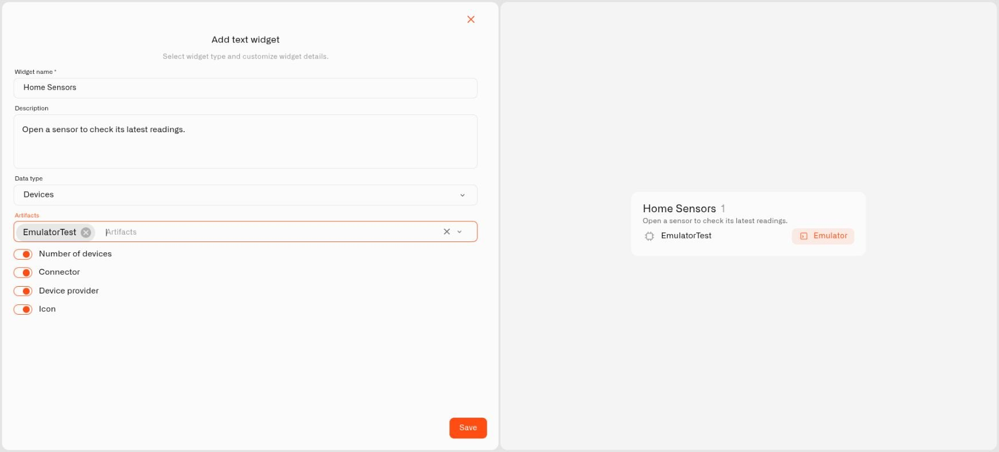
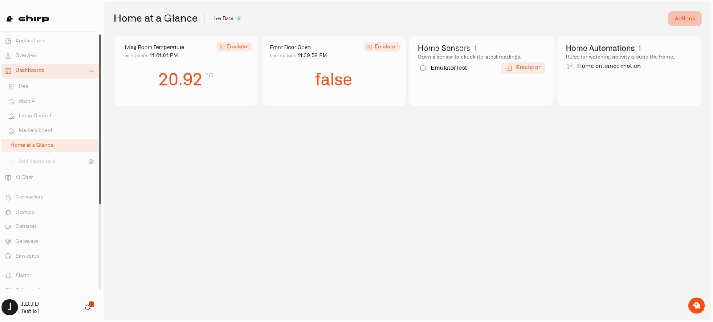

# Text widget

The **Text widget** gives a home dashboard a heading, a useful note, or a list of selected resources. Put a short explanation beside an unfamiliar reading, keep the home's sensors together, or show which rules are part of your monitoring setup.

For example, **Home Sensors** can list the door sensor next to its open/closed reading, while **Home Automations** identifies the rule watching the entrance camera. The list shows the configured resources; the measurement widgets show what those devices are reporting.

## Set up your tile

1. Open your dashboard and select **Actions → Edit dashboard**. You need editing permission and access to the resources you plan to include.
2. Select **Add widget**, then **Text**.
3. Enter a **Widget name**, such as Home Sensors. Add a **Description** if the household needs an explanation beneath the heading.
4. Choose **Data type**: **None** leaves the tile as a heading and note; **Devices**, **Rules**, and **Alarms** provide resource-list controls.
5. For a resource list, choose the entries from **Artifacts**. You can select more than one and remove a selection you no longer need.
6. Adjust the options for that type, review the preview, and select **Save**.
7. Arrange the new tile on the dashboard, then save the dashboard layout.

<figure><figcaption>
Select the resources and display options before saving the tile.
</figcaption></figure>

## Choose what the list shows

| Data type | Available display controls |
|---|---|
| None | The name and description provide a simple household note. |
| Devices | **Number of devices**, **Connector**, **Device provider**, **Icon**. |
| Rules | **Number of rules**, **Icon**. |
| Alarms | **Number of alarms**, **Alarm severity**, **Icon**. |

The number is a count of the selected resources that the widget can currently display. For alarms, it counts definitions, not unresolved incidents. **Alarm severity** refers to a definition's severity. Device connector and provider information appears when those details are available.

<figure><figcaption>
The two Text tiles explain which sensor and camera-motion rule belong with the household readings.
</figcaption></figure>

## Keep the dashboard useful

Select a device row to open that device. Rule and alarm rows display information; use **Rules engine** or **Alarm** to manage those resources. Choosing a resource for a tile neither runs its automation nor assigns it to an Application.

Entries stay in the order you selected. A deleted resource, or one the widget can no longer retrieve, drops out of the displayed list and its count. Edit **Artifacts** when you want to change the selection.

Public/kiosk views hide organization resource lists. Use a plain heading and description when a note needs to appear on a public display.

## If the alarm selector is empty

Choosing **Alarms** can leave **Artifacts** showing **No options**, including when alarm definitions already exist. You can check those definitions through **Alarm → Alarm definitions** and use **Alarm** to follow incidents. The empty selector does not mean your home has no active alarms. You can still add device and rule lists to the dashboard.

## Continue building your view

- [Choosing Widgets](../choosing-widgets.md)
- [Application dashboards](../../applications/using-application-dashboards.md)
