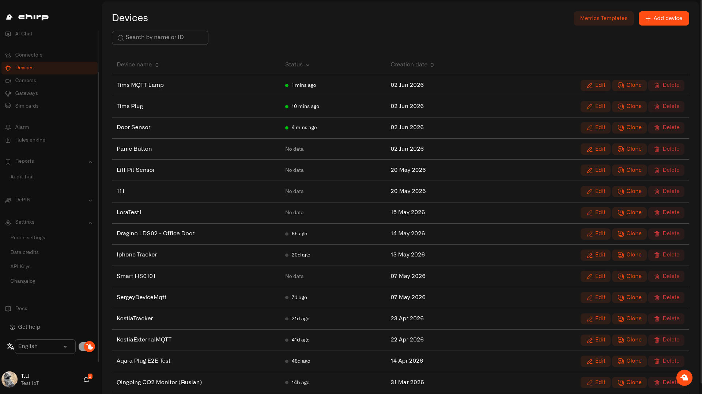

# Sensors

Every sensor you add to Chirp gets its own profile — a complete record of its name, connection, measurements, photos, and full data history. Even when a sensor sleeps between transmissions, its profile keeps everything organized and ready for your dashboards and automations.

<figure><figcaption>The Sensors page lists every device connected to your home</figcaption></figure>

From here you can add new sensors, configure how they report data, organize them into rooms, and manage their details over time.

## What's in this section

* [Adding Sensors](adding-sensors.md) — register a sensor and map what it measures
* [Pretend Sensors](pretend-sensors.md) — get set up before your hardware arrives
* [Data Templates](data-templates.md) — what your readings mean, with the right units
* [Sensor Details](sensor-details.md) — live readings, settings and full history
* [Connection Diagnostics](connection-diagnostics.md) — added a sensor but nothing's showing up?
* [Rooms](rooms.md) — group sensors by where they are
* [Favorite Devices](favorite-devices.md) — star the ones you check most
* [Controlling Your Devices](commands/README.md) — turn things on and off, not just watch them
* [Tested Device Guides](tested-device-guides/README.md) — sensors we've paired end-to-end ourselves
