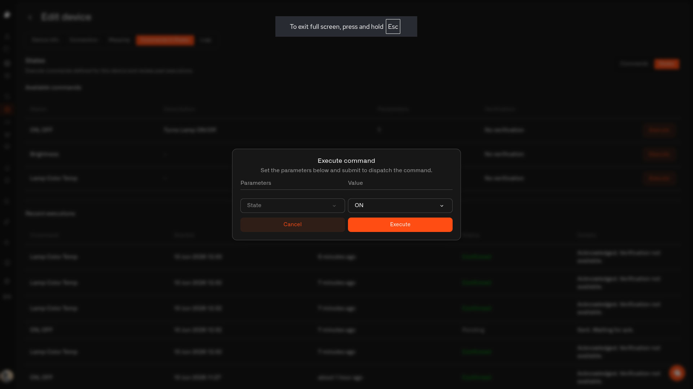

# Sending a command

Once a device has commands set up, the **States** part of the **Commands & States** tab is your remote control. It shows what you can do, lets you do it, and keeps a tidy record of everything you've sent.

<figure><figcaption></figcaption></figure>

## What you can do

The **Available commands** list shows every action set up for the device — its name, what it does, how many inputs it needs, and a **Execute** button to run it. If the list is empty, the device doesn't have any commands yet; pop over to the **Commands** part to set one up (see [Setting up a command](creating-commands.md)).

## Pressing the button

Tap **Execute** next to a command.

* If it doesn't need any inputs, just confirm and it's on its way.
* If it does — say, a brightness level — fill in the **value**. Chirp shows the allowed range (like `Min: 0 - Max: 100`) and won't let you send something the device can't handle.
* Tap **Execute** to send, or **Cancel** to change your mind.

## If the device is offline

If Chirp hasn't heard from the device recently, you'll see a note at the top saying it's offline and when it was last seen. You can't send a command to a sleeping device on the spot — but anything you've queued will be sent automatically the moment it wakes up and reconnects, so nothing gets lost.

## Your activity history

Everything you send is listed in **Recent executions**, so you always have a record of what happened:

* **Command** — what you ran
* **Started** — when you sent it
* **Updated** — when its status last changed
* **Status** — how it turned out
* **Details** — a plain-language note

A command's status will be one of:

* **Pending** — on its way.
* **Confirmed** — done, and the check you set up saw the device's reading match.
* **Delivered** — sent on its way. You didn't set up a check, so Chirp isn't confirming the result — just that the command went out.
* **Soft warning** — it was sent and received, but Chirp couldn't confirm the result in time. Often it worked anyway — just worth a peek.
* **Failed** — it didn't go through. The **Details** note tells you why.

### What the Details note can say

When something needs a second look — a **Soft warning** or a **Failed** — the Details note explains why in plain language. The ones you'll run into most:

| If you see… | It means… |
| --- | --- |
| Device downlink queue is full. | The device has too many messages waiting — give it a moment, then try again. |
| Validation failed. | Something in the command wasn't right — check its settings. |
| Payload too large for the device. | The message is bigger than the device can take — trim it down. |
| Sent, but the device didn't confirm receipt. | It went out, but the device never said "got it." |
| Sent, but the device didn't confirm the expected state in time. | It went out, but the reading you were expecting didn't show up in time. |
| Device offline — command not delivered in time. | The device was asleep or out of reach, so it didn't arrive. |
| No gateway available to reach the device. | No gateway was nearby to pass the message along. |
| Broker authentication failed. | The connection was refused — check your MQTT login details. |
| The command couldn't be sent. Please try again later. | A temporary hiccup — give it another go. |
| Invalid payload — check the command. | The message didn't come out right — take another look at the command. |

These are the common ones — you might occasionally see a different note, since Chirp passes along whatever reason it gets.

## Control from your dashboard

For everyday use, you don't even need to open the device. Add a [Control widget](../../dashboards/adding-widgets/control-widget.md) to a dashboard and you'll have a light switch or button sitting right next to your readings — same actions, same history, one tap away.

## See also

* [Setting up a command](creating-commands.md)
* [Making sure it worked](verification.md)
* [Example: Switching a Lamp](lamp-example.md) — two commands set up and checked, start to finish
* [Control widget](../../dashboards/adding-widgets/control-widget.md)
