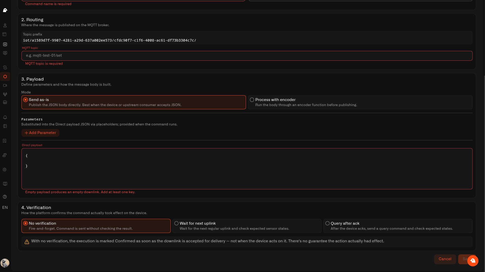

# Making sure it worked

Pressing "Turn on" is satisfying — but did the light actually come on? Sometimes a device is asleep, out of range, or just doesn't get the message. Chirp can check for you, so a command is only marked as done when there's real proof behind it.

You set this up when you create a command, in the fourth step. There are three choices.

<figure><figcaption></figcaption></figure>

## Don't check

Send it and move on. Chirp won't verify anything.

With this option, the command shows as **Delivered** the moment it's sent on its way — *not* when the device actually does something. (Delivered means "sent, but not checked" — it's a step short of **Confirmed**, which only happens when you set up a check.) It's fine for harmless, everyday actions where it doesn't matter much if one tap is missed, but don't rely on it when you really need to know something changed.

## Wait for the next reading

After the command goes out, Chirp waits for the device's next normal update and checks whether it reflects the change you asked for. When the reading matches, the command is confirmed.

This works nicely for devices that report their status as part of their regular updates — like a plug that tells Chirp whether it's currently on.

## Ask the device

The most thorough choice. After the device confirms it received the command, Chirp sends a quick follow-up question and checks the answer.

On a LoRaWAN device, switch **Confirmed downlink** on back in the routing step before you choose this. The follow-up only goes out once the device says it got the command, so there has to be a confirmation to wait for — otherwise the command won't save, and *Wait for the next reading* is the one to use.

* **Follow-up command** — pick a command to use as the question, or create one right there. A follow-up question is a simple kind of command: it just asks the device for its current state, so there's nothing to fill in when it runs, and it needs no checking of its own — the device's answer *is* the check. Once saved, it's kept for reuse with any other command.
* When you create one, you write the short message that asks the device. For sensors on a cloud or external connection, you can send that message exactly as you wrote it, or let Chirp encode it first.
* Chirp matches the device's answer against what you expect to see.

Use this for devices that don't mention their status on their own but will tell you if you ask.

## What "worked" looks like

For both checking options, you tell Chirp what a successful result looks like by adding one or more expected readings. Add at least one — the command won't save without it.

### Which reading to pick

Pick the measurement the command actually changes. For a smart plug that's whatever reports on or off — not its battery or its signal strength.

The list shows the device's measurements under the names you gave them when you set the device up. Those aren't the names hidden inside the device's own messages: a plug that sends `socket_status` might show up here as *Plug status*. To see which is which, open the device's Mapping section — see [What your device is sending](../what-your-device-is-sending.md).

Pick a measurement that's actually set up and getting readings. Ones you haven't mapped yet still show in the list, and a command checked against one of those never gets anything to compare, so it always ends up as *Soft warning*. If nothing is mapped yet, Chirp offers you a link to go and do that first.

### What to type as the expected value

Type what the device should be reporting once the command has done its job — written the same way the device writes it. The quickest way to get that right is to open the device's Mapping section and look at what the measurement says right now.

**If it's a word**, just type it. Capital letters don't matter, so `on` matches a device saying `ON`.

**If it's a number, or an on/off true-or-false**, don't type it — point at one of your inputs instead. Put `{{ inputName }}` in the box and set that input up as a number or a true/false in the previous step. Anything you type in by hand counts as a word, so a typed `1` looks for the word `1` and won't match a device reporting the number 1.

**To follow whatever the person entered**, use that same `{{ inputName }}` — a "set brightness" command can then check the device reports whichever brightness was asked for. The name has to match one of your inputs, and Chirp flags it if it doesn't.

| The device says | Type this |
| --- | --- |
| `on` or `ON` | `on` |
| `open` | `open` |
| `60` (a number) | `{{ level }}`, with **level** set up as a number |
| `true` (true or false) | `{{ state }}`, with **state** set up as true/false |

If a command keeps coming back as *Soft warning* even though the device clearly did the thing, this box is the first place to look — compare what you typed against what the measurement is really reporting.

## How long to wait

Chirp waits a little while for the device to catch up before deciding.

* Leave the wait time empty to use the sensible default (about 1.5 times how often the device normally reports). Make sure that reporting interval is set correctly on the device — where it's missing, the default stretches out to an hour and a half.
* Or set your own wait, up to a day.
* If the time runs out without a match, the command is marked **Soft warning** instead of failed — meaning "we couldn't confirm it," not "it definitely didn't work." Often it did; it's just worth a glance.
* Nothing gets sent a second time. If a command wasn't confirmed, send it again yourself or let an automation do it.

## Quick guide

| Choice | Confirms | Good for |
| --- | --- | --- |
| Don't check | Only that it was sent | Simple, low-stakes taps |
| Wait for the next reading | The device's next normal update | Devices that report their status regularly |
| Ask the device | A direct answer from the device | Devices that respond when asked |

Next: [Sending a command](executing-commands.md).
