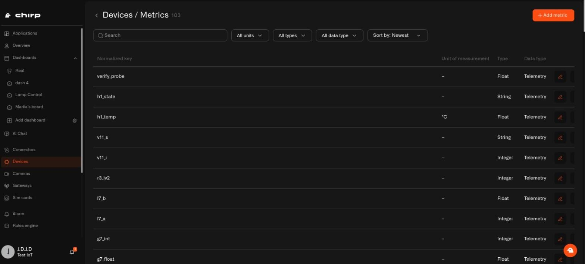
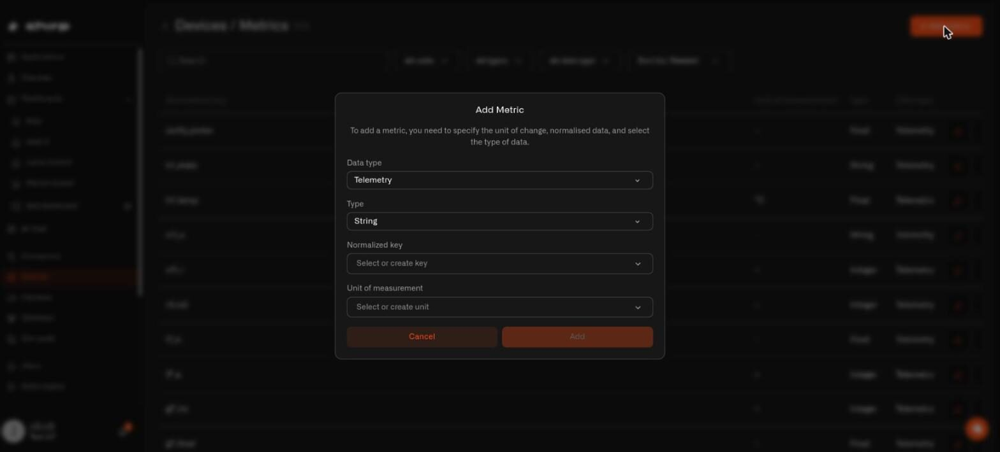

# Data Templates

A data template tells Chirp what a sensor reading means and how to display it. In the app, these definitions are called **metrics**.

The two type fields answer different questions: **Data type** says whether the information is telemetry, device metadata, or a custom attribute; **Type** says whether its value is stored as a Float, Integer, String, or Boolean.

For example, one temperature sensor may send `temp_c` while another sends `t`. Mapping both raw names to a metric called `temperature` lets your dashboards and automations use them in the same way.

Most common sensors already have the metrics they need. Use this page when adding an unusual sensor, correcting a reading, or creating a measurement that does not exist yet.

## Open your metrics

Go to **Devices → Metrics**.

The list shows every metric available in your Chirp account, including its normalized key, unit, value type, and data type.

<figure><figcaption></figcaption></figure>

Use the controls above the list to find a metric:

- **Search** matches the normalized key, which is the standard name of the reading.
- **All units** filters by unit and includes readings without a unit. Select the units and click **Apply**.
- **All types** filters by String, Integer, Float, or Boolean and applies immediately.
- **All data type** filters by Telemetry, Device metadata, or Custom attributes and applies immediately.
- **Sort by** orders metrics by **Newest** or **Oldest**.

The unit, type, and data-type filters accept several values at once.

Metrics you created provide **Edit** and **Delete** actions. Metrics supplied by Chirp do not, because they are shared definitions used by standard sensor setups.

## Add a metric

1. Go to **Devices → Metrics**.
2. Click **Add metric**.
3. Complete the four fields in the **Add Metric** dialog.
4. Click **Add**.

<figure><figcaption></figcaption></figure>

### Data type

Choose what kind of information the metric represents:

| Data type | Use it for | Home examples |
|---|---|---|
| **Telemetry** | Readings that change over time | Temperature, humidity, battery level |
| **Device metadata** | Information the sensor reports about itself | Firmware version, hardware revision |
| **Custom attributes** | Information you add | Room name, installation date, next battery change |

Only Telemetry metrics appear when mapping incoming sensor readings. Device metadata and Custom attributes are not offered as telemetry mappings.

### Type

Choose how Chirp stores the value:

| Type | Use it for | Examples |
|---|---|---|
| **Float** | Numbers with decimals | `22.5`, `67.3` |
| **Integer** | Whole numbers | `85`, `-120` |
| **String** | Text | `"open"`, `"standby"` |
| **Boolean** | True or false | Motion detected, door closed |

Chart widgets and the gauge-style Last Data displays require an Integer or Float metric. The Last Data **Value** display can also show text and yes/no values.

### Normalized key

The normalized key is Chirp's standard name for the reading, regardless of the raw name used by the sensor.

Open **Normalized key** and either select an existing key or choose **Create a new normalized key**. Use a clear name such as `soil_moisture`, not a sensor-specific name such as `sensor_3_value`. Use lowercase words separated by underscores.

Each normalized key can belong to only one metric. If it is already in use, the form reports **A metric with this normalized key already exists**.

Normalized keys are created, renamed, and deleted from this field. Keys supplied by Chirp cannot be renamed or removed.

### Unit of measurement

Select the unit displayed beside the value, such as °C, %, lx, or mV. Choose an existing unit or select **Create a new unit** and enter the symbol exactly as it should appear.

A unit is required for Telemetry. It is optional for Device metadata and Custom attributes, where information such as a firmware version or room name may not have a unit.

Units are created, renamed, and deleted from this field. Units supplied by Chirp cannot be renamed or removed.

## Edit a metric

Metrics apply across your Chirp account, not to one sensor only. Editing a metric changes the definition for every sensor mapped to it.

1. Find the metric under **Devices → Metrics**.
2. Click **Edit**.
3. Update the required fields.
4. Click **Save**.
5. Review the confirmation describing which sensors are affected and confirm the change.

If only one sensor needs a different definition, create a new metric and remap that sensor instead of editing the shared metric.

## Delete a metric

Click **Delete** on a metric you created and confirm the action.

Chirp refuses to delete a metric that is still mapped to a sensor. Remove the mapping from every sensor that uses it, then try again.

## Connect a sensor reading to the metric

Creating a metric does not connect it to a sensor automatically. Open the sensor's **Metrics** tab and map the raw key sent by the sensor to the normalized metric.

Once different sensors map their temperature readings to `temperature`, the same chart or automation can work with all of them.

## Troubleshooting

| Problem | What to check |
|---|---|
| A metric is missing from a chart or gauge-style Last Data display | Confirm its **Type** is Integer or Float and the sensor sends a numeric value. |
| A metric is missing from a sensor mapping | Confirm its **Data type** is Telemetry. |
| A normalized key cannot be selected | Another metric may already use it. Search the list for that key. |
| Edit and Delete are unavailable | The metric, key, or unit was supplied by Chirp and cannot be changed. |
| Delete is refused | Remove the metric from every sensor mapping before deleting it. |

## See also

- [Adding Sensors](adding-sensors.md) — map readings while adding a sensor
- [What Your Device Is Sending](what-your-device-is-sending.md) — identify raw keys in incoming data
- [Sensor Details](sensor-details.md) — change mappings on an existing sensor
