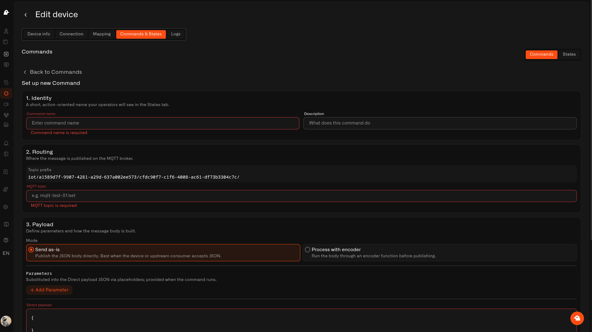

# MQTT Devices

An **MQTT device** supplies readings to Chirp by publishing messages to an MQTT broker. It can be equipment with its own MQTT client or a sensor connected through a bridge. The broker connection carries messages; the device's routing settings associate them with a **digital twin**, and its mapping turns message fields into stored measurements.

For example, a Zigbee temperature sensor can send readings through Zigbee2MQTT to **Living Room Climate**. Chirp keeps the room's measurements together if you later replace the sensor.

## Before you start

- Set up a [Cloud MQTT](../connectors/mqtt/cloud-mqtt.md) connection when Chirp provides the broker, or [External MQTT](../connectors/mqtt/external-mqtt.md) when your equipment already publishes to another broker. Those guides cover broker addresses, credentials and connectivity.
- Have the publisher's exact topic and a sample payload available. Configure the hardware or bridge to publish before completing measurement mapping.
- You need device-create/edit permission and available subscription capacity for a new twin. Read-only access lets you inspect settings without changing them.

For Zigbee hardware, first follow [Setting up Zigbee2MQTT](../connectors/mqtt/zigbee2mqtt.md). Chirp receives the bridge's MQTT messages; the sensor itself still uses Zigbee. Pairing and bridge installation stay in that guide.

## Connect one device

1. Open **Devices → Add device**, or choose **Add device** from your MQTT connector row.
2. Enter **Device name**, such as **Living Room Climate**, optionally add photos, and click **Save**. See [shared registration steps](adding-sensors.md) for profile and Application settings.
3. On **Connection**, select your MQTT connection under **Connector type**. Enter **Device ID** as `LivingRoomSensor` for this example.
4. In **MQTT Topic for device ID**, add a **Text segment** containing `zigbee2mqtt` and a **Device ID** segment. Keep **Where to get the device ID** set to **Topic**. The device-level pattern is `zigbee2mqtt/{{deviceId}}`.
5. Compare **Resolved preview** with the publisher's actual topic. For Cloud MQTT, the preview includes the locked connector prefix, and the publisher must include that prefix too. For External MQTT, use the publisher's full topic without adding a Cloud prefix.
6. Leave **Topic Telemetry** empty for the JSON example below. Set **Data sending interval** to the expected reporting cadence, then click **Save**.
7. Let the publisher send a fresh message. Open **Mapping** and select templates and received keys for the measurements you need. Save, then allow another message to arrive.
8. Open **Logs** and select a date range containing that message. Confirm the mapped measurements have recorded values.

### Example topic and payload

| Setting | Example |
| --- | --- |
| Digital device name | `Living Room Climate` |
| Device ID | `LivingRoomSensor` |
| Device-level topic | `zigbee2mqtt/LivingRoomSensor` |
| Cloud publishing topic | `{Topic prefix}/zigbee2mqtt/LivingRoomSensor` — substitute the prefix supplied by your connector |
| External publishing topic | `zigbee2mqtt/LivingRoomSensor` |

```json
{"temperature": 21.4, "humidity": 58, "battery": 92}
```

Map `temperature` to a Float template in °C, `humidity` to a numeric humidity template in %, and `battery` to a numeric battery template in %, when those match the sensor's actual output. Check the device's exposed fields rather than assuming every sensor publishes the same keys.

## Connection fields and actions

| Control | How to configure it |
| --- | --- |
| **Connector type** | Select the Cloud or External MQTT connection receiving this publisher's messages. **Connector section** opens connection setup if the required connection is missing. |
| **Device ID** | Required, 1–64 characters: ASCII letters, digits, spaces, `.`, `_` or `-`. MQTT identifiers preserve case and spaces. Match the extracted topic segment or payload identifier exactly; `Sensor1` and `sensor1` differ. The identity is locked after binding. A simple whitespace-free name is convenient, but spaces are not automatically removed. |
| **MQTT Topic for device ID** | Build the topic pattern matching the messages you want this device to receive. The Cloud prefix is read-only; do not enter it again as a text segment. |
| **Where to get the device ID** | **Topic** reads the Device ID segment. **Payload** reads a field inside the message; configure its **Payload template** and remove the Device ID segment from the device topic pattern. |
| **Payload template / Payload preview** | In Payload mode, enter a dot-separated path such as `deviceInfo.deviceId`. The preview illustrates the expected JSON shape; it does not publish or validate a message. |
| **Topic Telemetry** | Optional rows for values carried in topic segments. Leave empty for ordinary JSON payloads. See the [routing reference](../connectors/mqtt/topics-and-device-routing.md#topic-telemetry) for every row control, including **Apply all**. |
| **Data sending interval** | Positive whole number and **minute**, **hour**, **day**, **week**, or **month**. Starts at **1 hour**. Match your publisher's expected cadence; this setting does not change the publisher's schedule. For event-driven sensors, consider their heartbeat/reporting behavior when interpreting missing-data diagnostics. |
| **Detach physical device** | Removes the saved binding immediately. Use it to replace a publisher on the same twin, then restore routing and map its incoming fields to the existing measurements. |
| **Save** | Saves the device connection, routing and key assignments. Review any error before assuming new messages follow the edited configuration. **Apply all** and topic previews do not save. |

The [Topics and Device Routing](../connectors/mqtt/topics-and-device-routing.md) reference explains segment editing, validation, nested payloads, topic-value extraction and arrival timestamps.

## Map messages to retained measurements

**Mapping** lists available incoming keys alongside the templates you assign. Click **Add key**, select the **Normalized key**, and choose a **Device data key**. The key dropdown is populated from received messages, so it may be empty until the device publishes after its connection is saved.

You can save the connection first and return to mapping once keys arrive. If you already added template rows, keep them and complete their key assignments. The **Value** and **Last update** columns show received field snapshots; they do not prove that history has been recorded. A blank data-key selection records nothing for that measurement. Save mappings and wait for a fresh publish: earlier messages are not backfilled.

The mapping **Data type** is **Telemetry**, including reported switch states you want to record. The template's **Type** determines how a value is interpreted. For example, `"ON"`/`"OFF"` need String; actual `true`/`false` can use Boolean. An incompatible value is rejected for that measurement rather than saved as a null reading.

See [mapping controls](sensor-details.md#metrics) for Unit, Type, inline metric creation, removal and the effect of replacing a template. Revisit mapping when firmware begins publishing useful additional fields.

## Commands and replacing hardware

A saved MQTT binding can expose **Commands & States**. A receiving device must subscribe to the configured command topic and understand the command payload; receiving telemetry alone does not establish that capability. Use [Creating Commands](commands/creating-commands.md) for topic addressing, JSON parameters, encoders and feedback verification.

When hardware changes, keep **Living Room Climate** and its existing measurements. Follow [device replacement](sensor-details.md), update the physical Device ID and routing, and reconnect the new keys. Review command topics and expected feedback too. History already retained under those measurement identities stays associated with the twin, subject to the retention period.

<figure><figcaption><p>For hardware that accepts commands, configure the outbound topic separately from incoming telemetry routing.</p></figcaption></figure>

## If setup does not work

| Symptom | Next check |
| --- | --- |
| Connection cannot be saved | Non-empty topic, matching identifier mode/path, valid Device ID, required telemetry row fields, permissions and duplicate identifiers. |
| Broker receives messages but no device keys appear | Compare the resolved topic, Cloud prefix, identifier spelling and payload path with a real message. |
| Keys appear but Logs is empty | Check saved mapping, compatible types, a fresh message and the selected history range. |
| Only some readings are missing | Inspect actual payload fields and normalization errors; nested JSON fields use dot-separated names. |
| Old buffered readings appear with a recent time | MQTT measurements use arrival time. A `timestamp` payload field is ordinary data, not an instruction to backdate history. |

See [MQTT Troubleshooting](../connectors/mqtt/troubleshooting.md) and [device diagnostics](connection-diagnostics.md).
