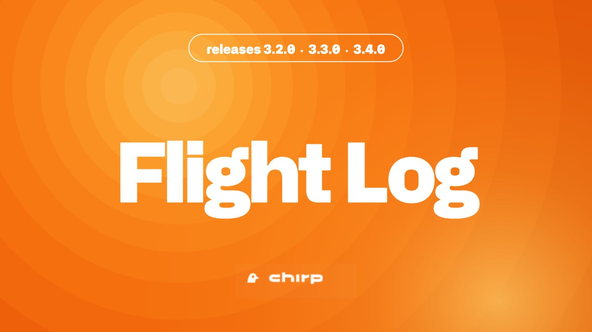
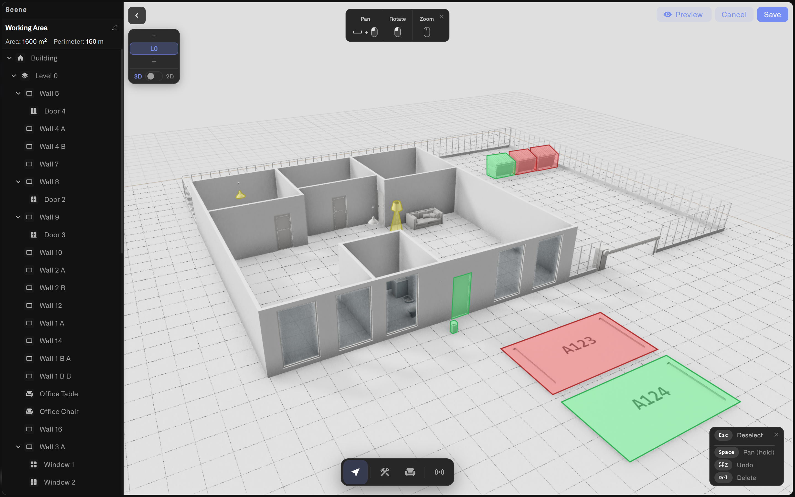
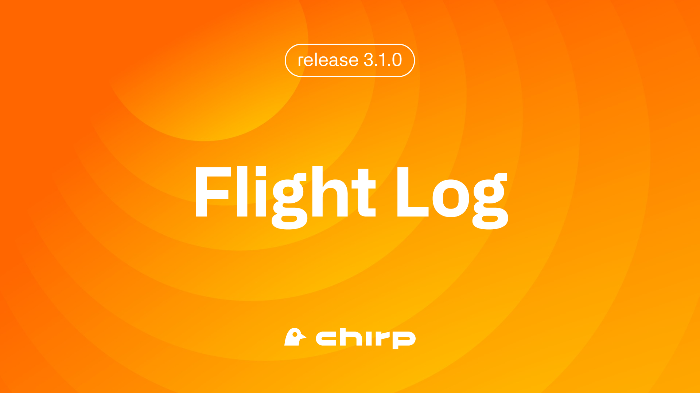
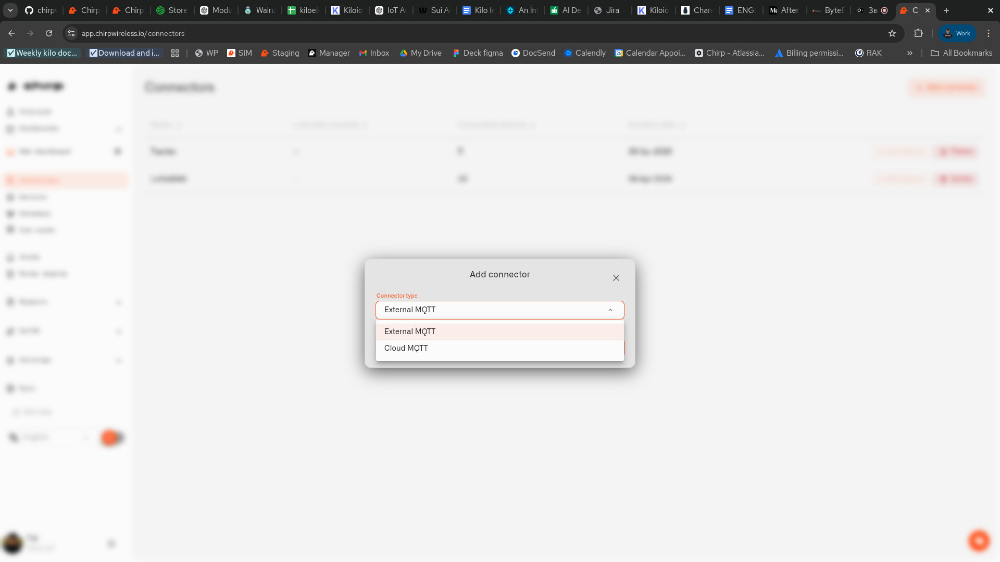
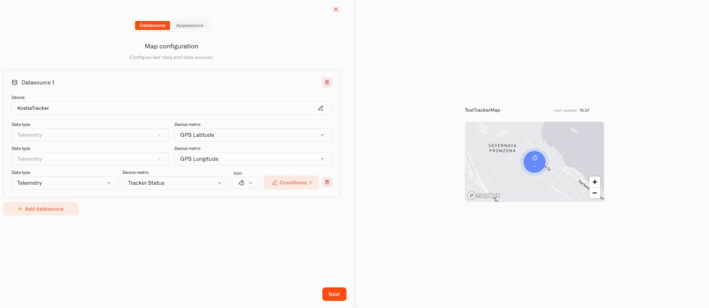
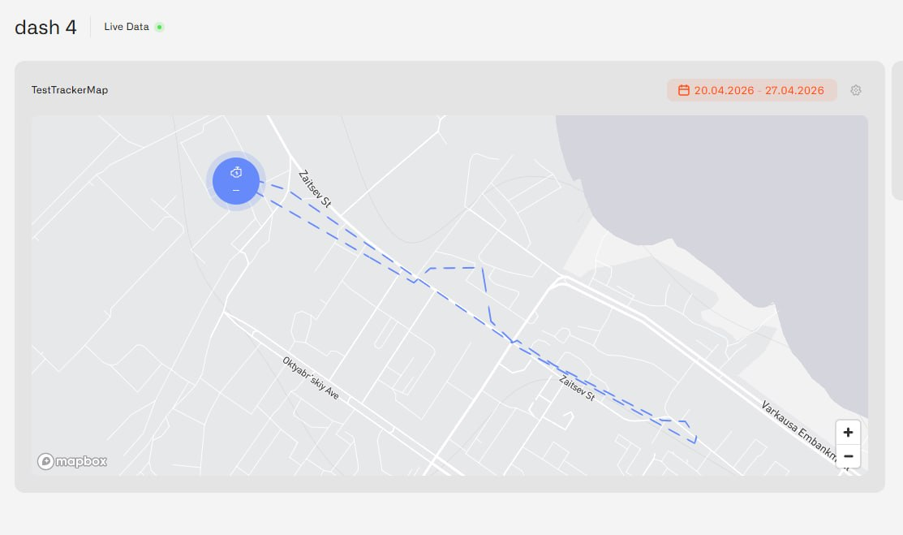
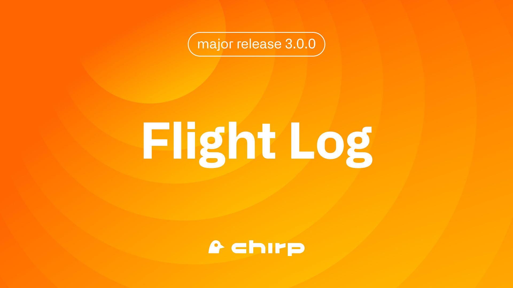

# Changelog

<details>

<summary>Flight Log. Release 3.4.0</summary>

<figure><figcaption></figcaption></figure>

Chirp 3.4.0 is the release we couldn't wait to ship. The **Digital Building Twin** lands at its center: a live IoT digital twin of your home and property, built right inside Chirp. Wire any sensor in your Chirp setup to any object on a 3D model of your place — the front door, the driveway gate or boom barrier, the garage, the parking spot out front, a smart trash bin on collection day, the kitchen smoke detector, the bathtub, a water tank in the cellar — and the scene lights up live as readings come in. House, garden, garage, driveway, and multiple floors all sit in one model. Draw it from scratch in 2D and 3D, import a DXF floor plan from a builder or architect, or trace its outline onto an aerial map and anchor it to its real GPS spot. The release also brings two new single-value displays for the Last Data widget — Tube and Gauge. [app.chirpwireless.io](https://app.chirpwireless.io)

***

#### What's in This Release

* **Digital Building Twin** — Wire any sensor in your Chirp setup to any object on a live 3D model of your home and property — the front door, the driveway gate or boom barrier, the garage door, the parking spot, a smart trash bin, the kitchen smoke detector, the bathtub, a basement leak sensor — and the model recolors live as readings come in. House, garden, garage, driveway, and multiple floors in one model. Draw in 2D and 3D, import a DXF floor plan, or trace from an aerial map and anchor to GPS; 60+ ready-to-place 3D objects, indoors and out.
* **Tube Widget** — A new Last Data widget look that shows a single reading as a filled vertical tube — a level you can read at a glance, for anything that rises and falls
* **Gauge Widget** — A horizontal track gauge for any single reading — temperature, humidity, battery, signal strength — with color bands you set yourself

***

**Digital Building Twin**

<figure><figcaption></figcaption></figure>

With the Digital Building Twin, your home and the property around it become a live, sensor-aware 3D model right inside Chirp. Wire any sensor in your Chirp setup to any object on the scene — house, apartment, garage, garden, driveway, parking spot, even the boom-barrier gate at a shared driveway — and the model lights up as readings come in. Open a dashboard, add the Digital Building Twin widget, switch to edit mode, and you're drawing — no separate app, no CAD program needed.

**Wire any sensor to any object**

This is what makes the Digital Building Twin more than a 3D model viewer. Anything you place on the scene — the couch, the front door, the driveway gate, a boom barrier at the entrance to a shared parking court, the garage door, the parking spot, a smart trash bin out by the curb, the kitchen smoke detector, the bathtub, a basement leak sensor, a water tank in the cellar — can be wired to a sensor in your Chirp setup. Open the Sensors panel, pick the device, pick the metric, then click the object the sensor watches. That's it.

You can bind more than one sensor to one object (the kitchen counter could carry a temperature reading AND a motion sensor's occupancy state), and the same sensor can light up several objects at once (a hallway PIR sensor could color both the hallway floor AND a "downstairs" label).

**Color rules driven by live readings**

Every binding gets a set of **color rules** — the same kind you already use on charts and number widgets:

* **Number ranges** — color when the reading falls in a range (e.g. 18–22°C green for "comfortable", 22–26°C amber for "warm", 26°C+ red; or 0–60% green, 60–85% amber, 85+% red on a trash-bin fill sensor)
* **Match a word** — color when the value equals a specific text (e.g. `occupied` red, `vacant` green for a parking sensor; `up` green, `down` red on a driveway boom barrier)
* **True / false** — color for boolean readings (e.g. front door open red, closed green)

Rules run in order; the first match wins. Set a default color for when nothing matches. The model recolors as readings stream in — at one glance you can see which rooms are too warm, where a door's open, whether the parking spot is taken, whether the trash bin needs to go out, whether the basement is still dry.

**Drop pins with live values**

Sensors can also be **pinned** to a specific point in the scene — a drop pin that shows the current reading right next to where the sensor sits in real life. Toggle pins off for a clean view of the model; toggle them on when you want the numbers.

**Build your home three different ways**

Three ways to start a Digital Building Twin, and they work together:

* **Draw it yourself in 2D or 3D** — Place walls, doors, windows, and fences from scratch. The editor shows a flat 2D top-down view AND a 3D walk-through of the same model — start by sketching the floor plan from above, then jump into 3D to check it from a person's eye level. Undo and redo work the way you'd expect.
* **Import a CAD floor plan** — If you have a DXF file from a builder, architect, or estate agent, drop it in. Chirp parses the line work, previews what the walls will look like, and converts it into a real 3D model.
* **Trace it from a map** — Open the map-trace dialog and draw the outline of your home directly onto an aerial photograph. Chirp builds the walls automatically and anchors your house to its real GPS coordinates.

A model can carry **multiple floors** — ground floor, first floor, basement, attic — switched via the floor selector. One model covers the whole property, indoors and out.

**60+ ready-to-place objects, indoors and out**

Chirp ships with a built-in library of more than 60 3D objects. The outdoor and perimeter pieces are the ones a homeowner reaches for first — parking spots, gates and barriers (handy if you've got a boom-barrier driveway or a swing gate), trash and recycling bins, outdoor AC units, cars — and the interior catalog makes per-room bindings expressive: smoke detectors, AC units, water heaters, water pumps, ceiling lamps, beds, sofas, kitchen and bathroom fixtures, plants.

Full catalog at a glance:

* **Furniture** — sofas, armchairs, dining and office chairs, coffee tables, dining tables, office desks, beds (single, double, bunk), bookshelves, dressers, closets, wall shelves, plants, carpets, trash bins
* **Kitchen** — stove, fridge, counter, microwave
* **Bathroom** — toilet, bathtub, sinks, faucets
* **Appliance** — ceiling, floor, and table lamps, TVs, computers, washing machines, AC units, smoke detectors, water boilers, water heaters, pumps and softeners
* **Outdoor** — trees, bushes, patio umbrellas, **parking spots**, cars, outdoor AC units, gates, barriers, trash and recycling bins

Each one is a properly-scaled 3D model. Many snap to walls or ceilings automatically. Drag from the strip at the bottom, drop into your floor plan, and adjust.

**Anchor your home to the real world**

Your home can be placed on the real-world map and anchored to GPS coordinates — trace its outline on an aerial map and the model carries that real-world position. Individual points inside the model can also be tagged with their own lat/lng manually. Together, these anchors give your home a real-world spatial base that Chirp can build location-aware features on later.

**What this is great for at home**

A few of the everyday checks a Digital Building Twin makes feel obvious:

* **Did anyone leave the front door open?** A door-state sensor wired to the front-door model — red if it's open, green if it's closed.
* **Is the driveway clear?** Parking-spot occupancy sensor wired to the parking-spot model; boom-barrier or gate state wired to the barrier model so you can see both at once.
* **Does the trash bin need to go out?** Fill-level sensor wired to the bin — amber when it's filling, red when it's collection-day ready.
* **Are all the smoke detectors quiet?** Smoke-detector sensors wired to the detector models so the whole house lights up the instant one trips.
* **Is the basement still dry?** Leak sensor wired to the basement floor — red if there's water.
* **How warm is the bedroom right now?** Temperature sensor wired to the room — the room reads green when it's comfortable.

The model shows you what's happening; the rules engine handles automations that should fire from the same sensor data.

**Where to find it**

Add a Digital Building Twin to any dashboard from the standard Add Widget menu, then open the widget's editor to draw, populate, and wire. Like every other Chirp widget, it lives in your folder hierarchy, can be shared with the household, and resizes on the grid.

[→ Digital Building Twin](../dashboards/adding-widgets/digital-building-twin/README.md)

***

**Tube Widget**

A new way to display a single reading on your dashboard: a vertical filled tube. Set a range, pick colors for each section, and watch the level rise and fall as the reading changes.

Things this is great for at home:

* Rainwater tank level
* Heating oil or propane tank
* Pool or hot tub water level
* Pet water dispenser
* Aquarium or fish-tank water level
* Any DIY sensor that reports a 0–100 value

The Tube is a new look for the Last Data widget you already know — same setup, same conditional colors, same legend options.

[→ Last Data Widget](../dashboards/adding-widgets/last-data-widget.md)

***

**Gauge Widget**

A clean, easy-to-read gauge for any reading you want at a glance — a horizontal track with a marker that slides to the live value. Set the min and max, color the bands the way you want, and the marker moves with the sensor.

Things this is great for at home:

* Living-room temperature with a comfortable green zone
* Outdoor humidity with a warning band when it climbs too high
* Battery level on a tracker or pet collar
* Wi-Fi signal strength of a remote sensor
* Energy plug wattage with a "wasteful" red zone
* Solar panel current output

Like the Tube, the Gauge is a new look for the Last Data widget — pick it from the same place you'd pick a number, doughnut, or pie chart.

[→ Last Data Widget](../dashboards/adding-widgets/last-data-widget.md)

</details>

<details>

<summary>Flight Log. Maintenance — Releases 3.2.0 and 3.3.0</summary>

A pair of small releases focused on tightening home access controls and making the Overview page more useful for spotting active alerts.

***

#### What's in This Release

* **Connectors menu access fix** — Household members who don't have access to Connectors no longer see the entry in the menu
* **Overview shows what's going on right now** — The Overview page now surfaces active alerts and links straight to the Alarm app
* **Quieter, more reliable data path** — Background reliability work on how Chirp ingests sensor data; the platform now recovers cleanly when our infrastructure rolls a restart

***

**Connectors Menu Access Fix**

If you've shared your home with a family member or roommate who doesn't have access to Connectors, the **Connectors** menu item used to still show up in their sidebar — even though they couldn't actually do anything with it. That's now fixed: the menu entry only appears for household members who have permission to use it.

[→ Household Members](../account/users-and-permissions.md)

***

**Overview Shows What's Going On Right Now**

The Overview page is your front door into Chirp. With this update, it now also tells you whether your home has any active alerts — at a glance, without leaving the page. Active alerts appear in a dedicated panel, and one click takes you straight into the Alarm app to deal with them.

If your dashboard reports a critical issue while you're on Overview, you'll see it immediately instead of having to navigate to find out.

[→ Check and Clear Alerts](../alarm/check-and-clear-alerts.md)

***

**Quieter, More Reliable Data Path**

A bit of behind-the-scenes work that most homes will never directly notice, but which makes the platform more resilient:

* **Cleaner startup behaviour** — If a key part of Chirp's data pipeline isn't ready when the platform boots, it now flags the problem clearly instead of carrying on in a half-broken state. The result: fewer mysterious "your sensor is not reporting" moments while everything spins up.
* **Smoother rolling restarts** — When Chirp's hosting infrastructure rolls a restart of its messaging layer (something we do regularly to ship updates), the data path reconnects cleanly without leaving any stale sessions behind. Your sensors keep flowing into the dashboard without extra hiccups.

You don't have to do anything — these improvements are already live.

</details>

<details>

<summary>Flight Log. Release 3.1.0</summary>

<figure><figcaption></figcaption></figure>

Chirp 3.1.0 is the platform's largest connectivity expansion to date. MQTT support means a much wider range of MQTT-capable sensors, bridges, and home hardware can now connect to Chirp directly — opening access to thousands of device models across hundreds of manufacturers. This release also introduces live tracker maps with route history, scoped API keys for home automation integrations, a refreshed subscription structure, and sharper alert controls. [app.chirpwireless.io](https://app.chirpwireless.io)

***

#### What's in This Release

* **MQTT Connector** — Cloud MQTT and External MQTT open Chirp to a much wider range of MQTT-capable devices: thousands of supported models across hundreds of manufacturers
* **Map Widget** — Live tracker position on a dashboard map, plus one selected transmitted metric and historical route playback
* **API Keys** — Scoped access keys for home automation scripts, local tools, and trusted integrations — with create, rotate, and revoke lifecycle
* **Subscription Plans** — Refreshed tiers — Free, Light, Pro, Max — with a Business path for larger deployments
* **Alert Improvements** — Required Notify recipients in escalation steps, clearer one-time notification behavior by severity, and last-trigger timestamps in the alert inbox

***

**MQTT Connector**

<figure><figcaption></figcaption></figure>

MQTT is one of the most widely used protocols in the world of home sensors, hubs, and connected hardware. With Cloud MQTT and External MQTT now available in Chirp, the platform can connect to a much wider range of devices than before — from ESP32 DIY projects to Tasmota devices to popular automation bridges. For Zigbee devices, Zigbee2MQTT can act as the bridge that publishes their readings into Chirp — opening access to thousands of supported Zigbee device models from hundreds of manufacturers.

The Chirp-compatible device ecosystem grew significantly with 3.1.0.

**Two ways to connect**

**Cloud MQTT** is the simpler path for most home setups. Chirp provides a ready-to-use broker endpoint with a username, password, and topic prefix. Paste the credentials into your device or bridge settings, then register the device in Chirp and map its payload keys so readings become platform metrics. No broker to install or maintain. For Zigbee2MQTT running on a Raspberry Pi or home server, Cloud MQTT is the recommended approach — configure Zigbee2MQTT to publish outward to the Chirp-hosted endpoint.

**External MQTT** connects Chirp to an MQTT broker you already operate that is reachable from the internet. Useful when you run your own cloud-hosted broker or want Chirp to join an existing MQTT setup.

**What you can connect**

* **Zigbee2MQTT bridges** — temperature and humidity sensors, motion detectors, smart plugs, door and window sensors, leak detectors, energy monitors, and many more from Aqara, IKEA, Sonoff, Philips Hue, Tuya, and other brands. Compatibility depends on Zigbee2MQTT's device support, your coordinator adapter, and the specific device model — check the [Zigbee2MQTT supported devices list](https://www.zigbee2mqtt.io/supported-devices/) before purchasing.
* **ESP32 and ESP8266 projects** — any DIY sensor or microcontroller build that publishes over MQTT
* **Tasmota-flashed smart plugs, switches, and energy monitors**
* **Environmental sensors** — soil moisture, CO2, air quality, and other hardware with MQTT firmware
* **Any device a developer or integrator builds with MQTT support**

Per-device topic routing and payload mapping work the same way for every device type — the same metric pipeline that handles LoRaWAN devices applies to MQTT devices without modification.

[→ MQTT Connector](../connectors/mqtt-connector.md)

***

**Map Widget**

<figure><figcaption></figcaption></figure>

<figure><figcaption></figcaption></figure>

Did you know that Chirp goes beyond your house walls? Connect a car tracker, motorcycle tracker, or any GPS device and the Map widget shows you exactly where it is — live on your dashboard. Choose one metric the tracker is transmitting, like vehicle speed, and that reading appears right alongside the map marker. Want to see where the car went today? Historical route playback lets you replay the full route.

Any tracker device registered in Chirp can appear on the map. The widget fits into the same dashboard layout as everything else — resize it, organize it in folders, share it with your household.

[→ Choosing Widgets](../dashboards/choosing-widgets.md)

***

**API Keys**

Scripts, local home automation tools, and trusted integrations can now access your Chirp data with scoped API keys instead of sharing your account credentials. Each key carries exactly the permissions you choose — read-only access to sensor data, or write access to specific resources, or any combination. One key per tool means revoking one integration doesn't touch anything else.

The full key is shown exactly once at creation — copy it to a password manager immediately. After the dialog closes, only the key prefix remains visible in the table. If a key is lost or compromised, rotate it in one click and the old key stops working instantly.

Every key ever issued stays visible in the API Keys table with its status — Active, Rotated, or Revoked — so you have a complete record of what has access, what has been cycled, and what has been permanently cut off.

[→ API Keys](../settings/api-keys.md)

***

**Subscription Plans**

Chirp 3.1.0 aligns the subscription tier structure. Current plans:

| Plan | Monthly Price |
|------|--------------|
| Free | — |
| Light | €7.99 |
| Pro | €12.99 |
| Max | €19.99 |
| Business | → Switch to Kilo IoT Server |

The **Business** card in Chirp includes a **Switch to Kilo** option for setups that have grown beyond a single home — multiple locations, managing sensors for others, or commercial installations. Kilo IoT Server is a separate platform built for that scale.

[→ Subscription](../account/subscription.md)

***

**Alert Improvements**

Three targeted changes to how home alerts work:

**Required recipients** — Escalation steps now require at least one Notify recipient before an alert rule can be saved. This prevents silent chains that trigger with no one to receive them.

**One-time notification clarity** — One-time notification behavior is now described clearly per severity level, so you know exactly what to expect when an alert fires once versus repeating.

**Last trigger in the inbox** — The alert inbox now shows when each alert last triggered, making it easy to see which alerts have been active recently and which have been quiet.

[→ Set Up a Home Alert](../alarm/set-up-a-home-alert.md)

***

**What to read next**

* [MQTT Connector](../connectors/mqtt-connector.md) — Connect your devices and bridges
* [Choosing Widgets](../dashboards/choosing-widgets.md) — Add a Map widget to your dashboard
* [API Keys](../settings/api-keys.md) — Set up scoped access for scripts and integrations
* [Subscription](../account/subscription.md) — Review your current plan
* [Set Up a Home Alert](../alarm/set-up-a-home-alert.md) — Configure alerts with the latest improvements

</details>

<details>

<summary>Flight Log. Release 3.0.0</summary>

<figure><figcaption></figcaption></figure>

## Fight Log CHIRP 3.0.0

CHIRP 3.0.0 is a fundamental platform rework. We rebuilt the entire connectivity layer with a new Connector architecture, overhauled device management around a Digital Twin model with visual data normalization that lets you connect any device instantly, shipped a visual BPMN-based rules engine with version control and production-grade deployment, introduced a multi-channel alarm system with mobile push notifications for Android and iOS, delivered fully configurable dashboard widgets with context-aware conditional formatting, and added organization-level access control powered by ABAC with full audit logging. This release also completes our migration from Sui JSON-RPC to gRPC and GraphQL across all blockchain services.

***

### Major Changes

* **Connector Architecture** — Protocol-agnostic connectivity framework with LoRaWAN and Tracker connectors
* **Digital Twin Device Management** — New device model with visual data normalization, sensor templates, and device photos
* **Visual Rules Engine** — BPMN-based automation with CEL expressions, version control, and one-click deployment
* **Alarm Management System** — Five severity levels, escalation policies, and mobile push notifications for Android and iOS
* **Fully Configurable Dashboards** — Context-aware widgets with conditional formatting, plus a new Image Widget
* **Organizations and Access Control** — Multi-tenant isolation with ABAC permissions and audit trail
* **Sui Blockchain Migration** — All services migrated from JSON-RPC to gRPC and GraphQL

#### Connector Architecture — Extensible Device Connectivity

The way devices connect to CHIRP has been completely rebuilt. Instead of protocol-specific device registration flows, CHIRP 3.0.0 introduces a Connector architecture — a protocol-agnostic framework that standardizes how any device type connects to the platform.

**How It Works**

Every device connection now follows a consistent model: **Connector** (defines the protocol type) → **Connection** (a configured instance for your organization) → **Device** (registered through the connection). This separation means the platform can support new protocols by adding new connector types — without rebuilding core infrastructure.

**Connector Types at Launch**

* **LoRaWAN (LNS)** — The platform includes a fully integrated LoRaWAN Network Server. No external LNS to deploy or maintain. Gateway registration, device joins, uplinks, downlinks, and message deduplication are handled automatically.
* **Tracker** — Designed for OBD2/CAN vehicle trackers used in fleet and asset monitoring. Preconfigured support for over 2,000 vehicle tracker models. Enter your device details and receive a unique endpoint URL for data ingestion.

Each connection is scoped to your organization and managed through a unified interface.

**Why This Matters**

Previously, adding support for a new device protocol required changes across the core platform. With the Connector architecture, new protocols become new connector types — a database record and an optional UI component. This makes CHIRP fundamentally more scalable and ready for future protocol support without platform-wide changes.

***

#### Digital Twin Device Management

Every device registered on CHIRP now becomes a Digital Twin — a living digital representation that goes far beyond a simple data row. The Digital Twin holds the device's identity, sensor configuration, telemetry history, photos, and connection binding in one unified model. Because the physical device binding is optional, this architecture also opens the door for device emulators — model your entire setup with emulated devices first, then replace them one by one with real hardware without losing any configuration or history.

**The New Device Experience**

Device management now uses a guided dialog with four tabs:

1. **Device Info** — Name your device and upload photos for visual identification during site visits or facility walkthroughs.
2. **Connection** — Bind the device to a connector. Select your LoRaWAN or Tracker connection and enter protocol-specific credentials (EUI, application key, etc.).
3. **Metrics** — Define what data the device reports. Select from sensor templates, then map raw connector data fields to normalized metrics. Different manufacturers, different raw output formats — but after mapping, every device speaks the same data language across the entire platform.
4. **Logs** — View the device's raw event history with date filtering. Every data point the device has ever sent is accessible for troubleshooting and verification.

**Visual Data Normalization — Connect Any Device Instantly**

This is one of the most impactful changes in CHIRP 3.0.0. Previously, adding a new device type required contacting CHIRP support — and working with prototype devices or hardware still in development was not possible at all. Every manufacturer sends data differently: one sensor sends "t" for temperature, another sends "temp1", another sends "Temperature". Without a predefined mapping created manually in the database, the platform simply could not ingest the data.

The platform now shows you the live payload from any connected device — every field it transmits, with real-time values and timestamps. Open the Metrics tab and you see exactly what the device is sending. Map raw fields to normalized sensors through a visual interface, and data flows instantly through the entire platform:

1. Choose a sensor template from your library (for example "Temperature", measured in °C, type FLOAT)
2. Select which raw field maps to that sensor (pick "t" from the dropdown)
3. Done. Data flows automatically through dashboards, rules, alarms, and history queries.

This works with any device — production hardware, early prototypes that do not have standardized codecs, or legacy equipment where manufacturers send proprietary codes instead of human-readable field names. If the device sends data, you can see the payload and map it.

The normalization system works in layers: Normalized Keys define the semantic concept ("Temperature"). Sensor Templates add units and data types. Sensors are instances attached to a device. Sensor Mappings connect each sensor to a raw connector key. Define your measurement vocabulary once, then map any device — regardless of manufacturer — to the same standardized parameters. Different field names, same normalized data everywhere in the platform.

**Key Capabilities**

* Sensor templates with normalized keys and units — define your measurement vocabulary once, reuse it across all devices
* Visual field mapping — see the raw device payload and map fields directly, no support tickets needed
* Physical device binding and unbinding — swap hardware without losing device history or configuration
* Device photos via a dedicated media service — upload images for identification and documentation
* User metadata — add custom properties to devices for your own categorization and filtering
* Favorite devices — mark frequently accessed devices for quick navigation

***

#### Visual Rules Engine

CHIRP 3.0.0 ships a completely new automation engine built on BPMN (Business Process Model and Notation) — the same standard used by enterprise workflow engines. Design automation flows visually, write conditions in a real expression language, and deploy with confidence — knowing you can roll back any change instantly.

**Design Automation Visually**

Rules are designed on a visual BPMN canvas where you drag and drop nodes to build automation flows. Start events trigger the rule when sensor data arrives. Exclusive gateways route the flow based on conditions. Script tasks evaluate expressions and transform data. Enrichment nodes pull in data from other devices for cross-device logic. Set Alarm nodes trigger notifications through the alarm system. Boundary error events catch failures and route them to alternative flows.

**Write Real Conditions with CEL**

Conditions use CEL (Common Expression Language) — a fast, safe expression language originally designed by Google. Instead of simple threshold comparisons, you can write expressions like:

```
device.temperature > 30 && device.humidity > 80
device.battery_level < 10
device.door_status == "open" && time.now.hour >= 22
```

CEL gives you the power of a real language with the safety of a sandbox — no file access, no infinite loops, no side effects. Learn more at [cel.dev](https://cel.dev).

**Collaborate Without Conflicts**

When you open a rule for editing, the platform locks it to prevent conflicts. Other team members see who holds the lock. If you step away and the session times out, your changes are automatically saved before the lock releases. Organization owners can force-unlock a rule if needed — and even forced unlocks preserve all unsaved work.

**Never Lose Work**

Every change is automatically saved — periodically in the background, when you close the editor, and when your session times out. You can also save manually at any time. A real-time status indicator shows whether your latest changes are saved, saving, or encountered an error.

**Version History and Rollback**

Every save creates a new version in the rule's history. You can name versions for easy reference, compare any two versions, and restore a previous version with one click. Restoring doesn't delete anything — the current version moves to history, and the restored version becomes active.

**Build, Validate, and Deploy**

Before a rule goes live, it goes through a build step that validates the entire flow — checking for structural errors, invalid expressions, and missing connections. If validation passes, the rule is compiled into a deployable artifact. Deploy with one click, stop instantly if something goes wrong, and roll back to any previous build.

**Trash and Recovery**

Deleted rules move to trash with a configurable retention period. Restore them at any time before cleanup runs. Nothing is permanently lost by accident.

***

#### Alarm Management System

Stay on top of what matters with a centralized alarm system that monitors, notifies, and escalates — across email, SMS, and push notifications on your phone.

**Mobile Apps for Android and iOS**

CHIRP now has mobile apps for both Android and iPhone. Receive push notifications directly on your phone when an alarm triggers — you do not need to be at your desk to know something went wrong.

**Alarm Inbox**

All triggered alarms appear in one centralized inbox, organized by severity. Active alarms rise to the top. Click any alarm to jump directly to the rule that triggered it. Mark alarms as resolved to clear them.

**Alarm Rules**

Create alarm definitions with five severity levels — Critical, High, Medium, Low, and Info. Each level controls escalation behavior and notification urgency. Configure escalation policies with multi-step chains: define who gets notified, through which channel, and how long to wait before escalating to the next step.

**Multi-Channel Notifications**

* **Email** — Receive alarm details in your inbox
* **SMS** — Get text alerts for time-sensitive events
* **Push** — Notifications delivered directly to your Android or iOS device

Each channel requires verification before activation — click a link for email, enter a code for SMS. Configure notification intervals to control how often repeated alerts arrive for the same issue, preventing notification fatigue.

**Schedule Windows and Quiet Hours**

Set weekly notification schedules with timezone support. Suppress non-critical alerts during off-hours. When the schedule resumes, catch up on any missed notifications automatically.

***

#### Fully Configurable Dashboards and Widgets

Dashboards in CHIRP 3.0.0 are built exactly the way you need them. Organize dashboards into folders — by building, zone, department, or any structure that fits your workflow. Every widget is fully configurable: choose your data sources, define how data is displayed, and set conditional formatting that makes sense for YOUR context.

**The Big Shift: Context-Aware Visualization**

Widgets are no longer predefined. You configure every widget to show the data you care about, the way you need to see it. The same temperature sensor can appear on two different widgets with completely different meanings:

* On a "Room Comfort" widget: 20°C shows as green (comfortable)
* On a "Cold Storage" widget: 20°C shows as red (critical — the fridge is too warm)

You define conditional colors per sensor on each widget — number ranges, exact string values, or boolean states. Conditions are priority-ordered: the first matching condition determines the color. Custom units, icons, and labels complete the picture.

**Image Widget (New)**

Upload a floor plan image, then place sensor pins at exact positions on the map. See live data from every sensor overlaid directly on your facility layout. Color-coded pins change in real time based on your conditional formatting rules — walk into the monitoring room and instantly see which zones are normal and which need attention.

The Image Widget supports multiple floors or layers — switch between building levels to monitor your entire facility from a single widget.

**Last Data Widget**

View the most recent values from any device using numeric displays, doughnut charts, or pie charts. Configure multiple devices and metrics within a single widget. Conditional color-coding highlights values that need attention.

**Chart Widget**

Analyze historical data with line or bar charts. Add configurable thresholds — colored bands that highlight when data enters warning or critical ranges. Support for multiple data sources and flexible time ranges makes trend analysis straightforward.

***

#### Organizations, Access Control, and Audit Trail

CHIRP 3.0.0 introduces a complete organization model with Attribute-Based Access Control (ABAC) that isolates data, devices, rules, and billing across teams.

**Organizations**

Every new user gets a personal organization automatically on registration. Create additional organizations for different teams, clients, or projects. Each organization has its own devices, connectors, dashboards, rules, alarms, and subscription — completely isolated from other organizations.

**Attribute-Based Access Control (ABAC)**

Instead of traditional role-based access (RBAC) where you are limited to predefined roles like Admin, Editor, or Viewer, CHIRP uses ABAC — permissions are evaluated dynamically based on multiple attributes: organization membership, page-level access, resource ownership, and user context. This means you can grant a contractor edit access to one specific dashboard without giving them access to anything else. No role explosion, no workarounds — just precise, granular control.

Invite users to your organization and assign exactly what each team member can see and modify at the page and resource level.

Configure organization settings including name, corporate email, and branding. Switch between organizations seamlessly if you belong to more than one.

**Audit Trail**

Every significant membership action within your organization is logged: invitations sent, users joined, permissions changed, users removed. The audit trail is searchable, filterable by actor and event type, and accessible only to users with explicit Audit Trail permissions. Full transparency for compliance and operational oversight.

**Subscription and Billing**

* Free tier available — connect up to 2 devices without entering a credit card
* Subscription limits enforced in the UI — clear visibility into what your plan includes
* Plan-based version history retention for rules
* Stripe integration for payment management

***

#### Sui Blockchain Infrastructure Migration

CHIRP has completed a full migration of all blockchain-facing services from Sui JSON-RPC to gRPC and GraphQL — ahead of Sui Network's planned JSON-RPC deprecation.

**Migrated Services**

* **Fountain Assistant** — Token distribution and faucet service
* **Chirp Assistant** — Blockchain interaction helper
* **Data Extractor** — Blockchain data retrieval service
* **Controller** — Network coordination service
* **Validator** — Transaction validation service
* **Core Chirp Library** — Shared blockchain functionality

The migration delivers lower latency, better scalability, richer query semantics, and a stack that fits Sui's object model far better than JSON-RPC. All services have been thoroughly tested and are running in production — ensuring zero downtime when Sui's legacy JSON-RPC endpoints are retired.

</details>
