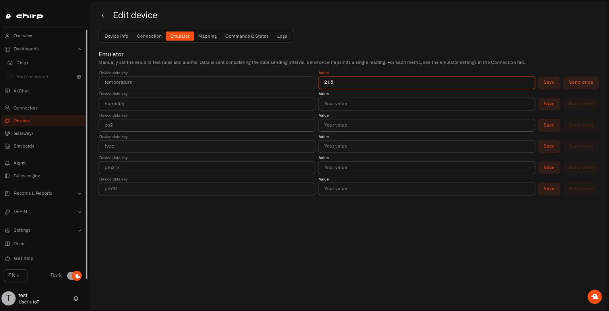
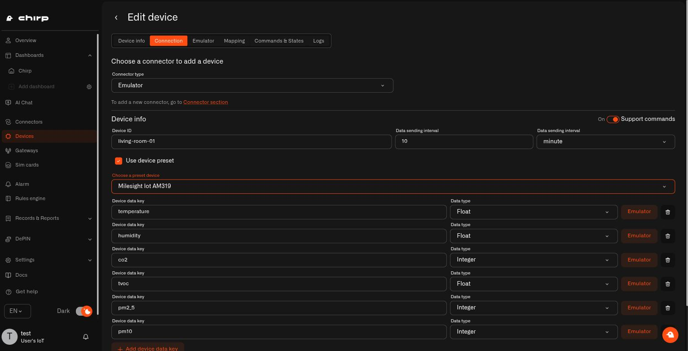
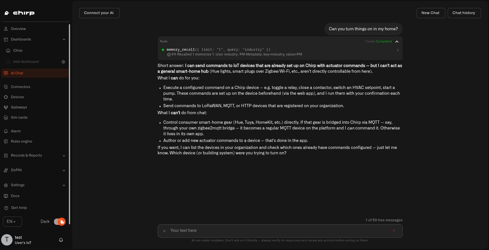
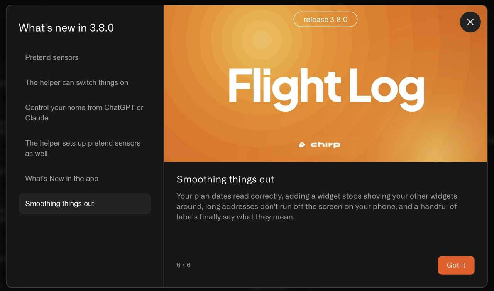
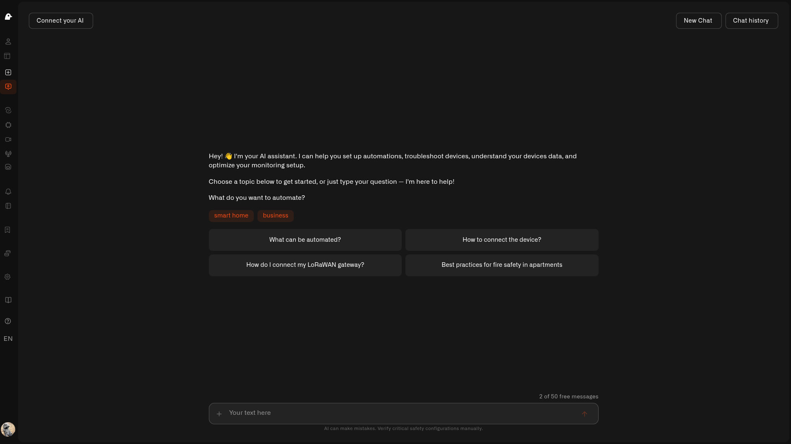
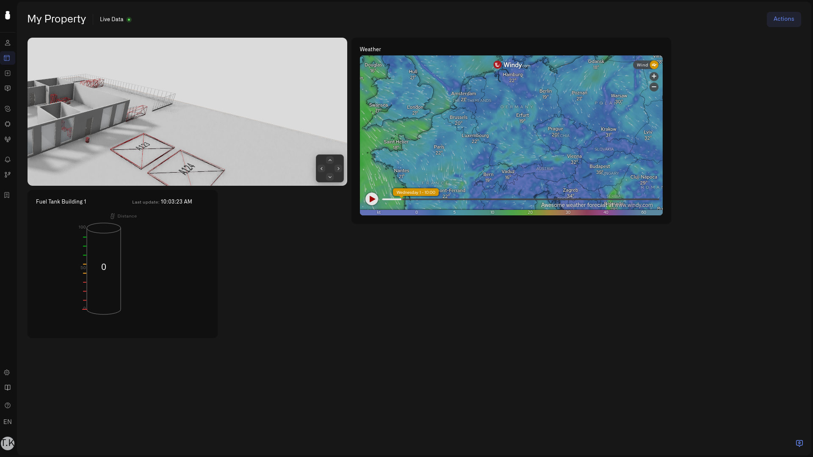
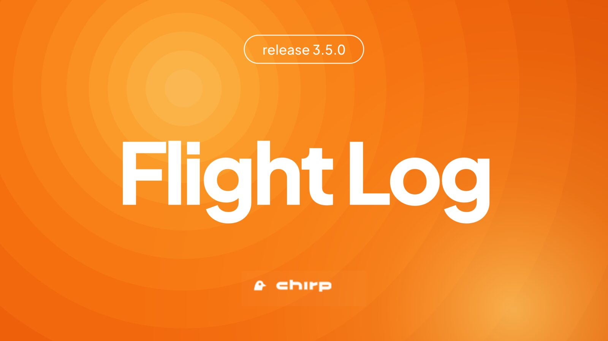
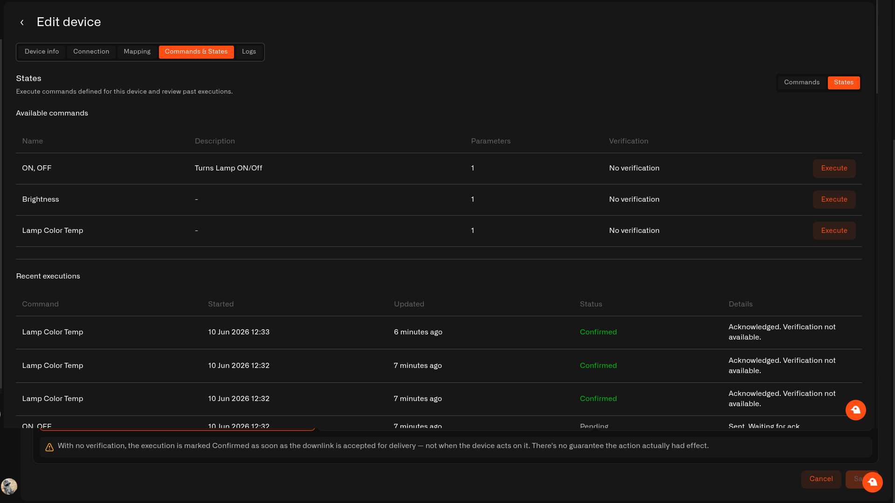
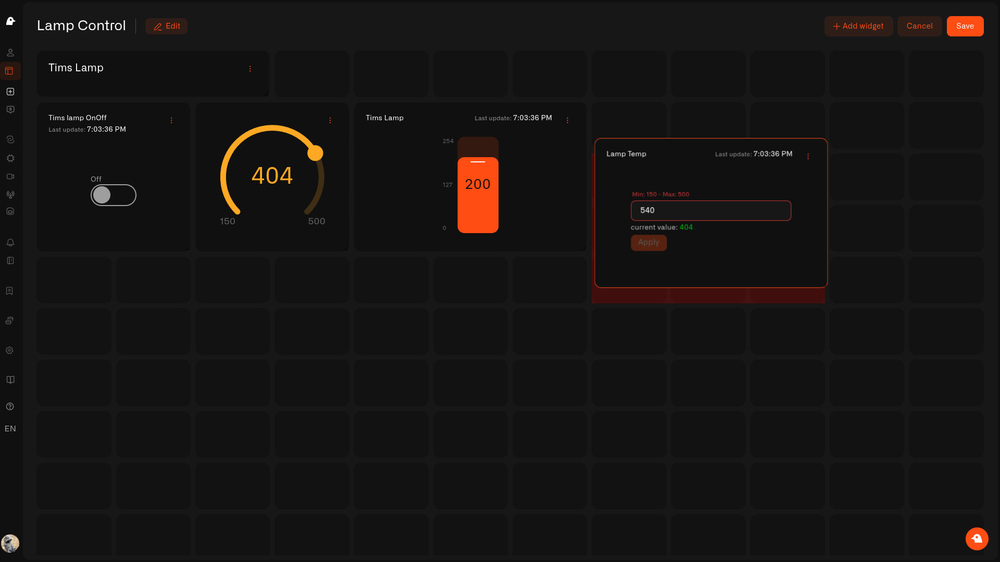
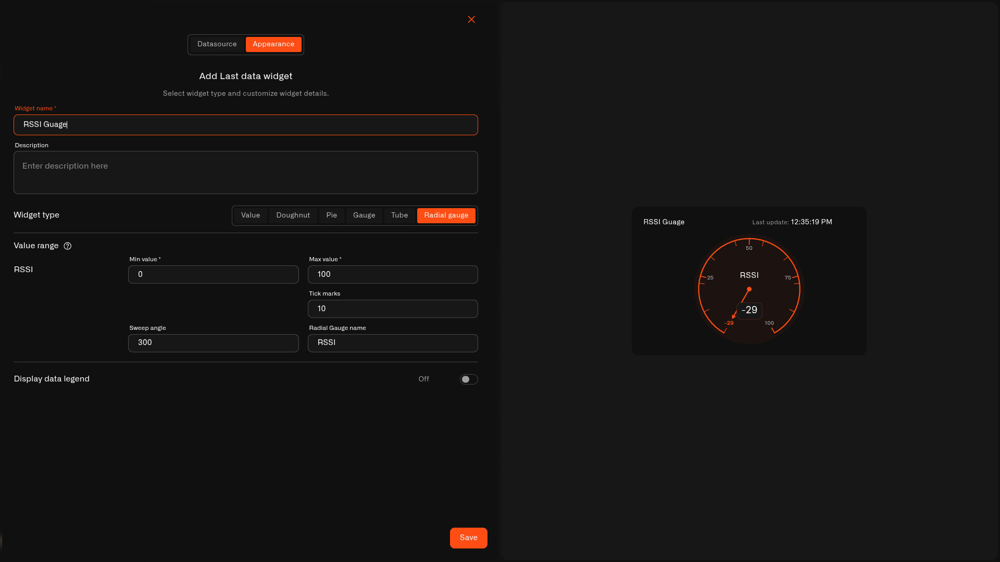

# Changelog

<details>

<summary>Flight Log. Release 3.8.0</summary>

<figure><figcaption></figcaption></figure>

Three big ones in 3.8.0. **First, you don't have to wait for the parcel** — **pretend sensors** let you build your dashboards and your alerts today, test that they really go off, and swap in the real sensor when it lands. **Second, the bit people have asked for since the helper arrived**: say *"turn on the lamp"* and it **turns on the lamp**. Your helper works the house now, it doesn't just watch it. **And third — the one we're most excited about — connect ChatGPT or Claude and they can switch things on too.** The AI app you already use, controlling your actual home, asking you first every time. There's also a **What's New** note in the app so you stop missing things like this. [app.chirpwireless.io](https://app.chirpwireless.io)

***

#### What's in This Release

* **Pretend sensors** — Set up your home before the hardware arrives. Make up readings, watch your alerts fire, then point the same device at the real sensor when it turns up and keep everything.
* **The helper can switch things on** — *"Turn on the lamp"* now turns on the lamp. Ask it to flip a relay or change how often a sensor reports, and it does — showing you what it's about to do, asking first, then telling you whether the device got it.
* **Control your home from ChatGPT or Claude** — Connect the AI app you already use and it can switch things in your house too, with the same confirmation before anything happens.
* **The helper sets up pretend sensors as well** — Ask for one and it builds it, sends a test reading, and switches it to the real sensor later.
* **What's New in the app** — A note that tells you what changed, so a release doesn't quietly pass you by.
* **Smoothing things out** — Your plan dates read correctly, adding a widget stops shoving your other widgets around, long addresses don't run off the screen on your phone, and a handful of labels finally say what they mean.

***

**Set your home up before the sensors get here**

Ordering a sensor used to mean a few days of nothing. You could not lay out a dashboard because there was nothing to put on it, and you certainly could not check your alert worked.

Now you can add a **pretend sensor**: pick the model you have ordered and it will make up believable readings all by itself, on whatever schedule you choose. Your dashboard fills in, your automations run, and your alerts go off — all before the box arrives.

The best part is testing an alert honestly. You want to know the damp alert really lands on your phone at 2am? You do not need to leave a tap running. Park the humidity at 85%, or fire a single reading, and watch what happens.

<figure><figcaption></figcaption></figure>

Then Thursday comes, the sensor arrives, and you open the same device and switch it from pretend to real. The dashboard, the alerts, who gets told — all still there. It takes five minutes instead of an evening.

<figure><figcaption></figcaption></figure>

[→ Pretend sensors](../connectors/emulator-connector.md)

***

**"Turn on the lamp" — and it turns on the lamp**

Your helper could already answer anything about your home and set up automations for you. What it could not do was actually *do* anything, which is a strange thing to explain to someone standing in their kitchen.

That changes here, and it's the biggest thing we've shipped for the helper yet. Ask what a device can do and it tells you; ask it to do one of those things and it does it. Switch a lamp, flip a relay, change how often a sensor reports — by asking.

It stays careful about it, which matters when something physical is about to happen in your house. It only does things your device is already set up to do — it does not invent new ones — and it works with the sensors connected to Chirp rather than gear that lives in someone else's app. (Bridge a Zigbee plug in over MQTT and it becomes an ordinary Chirp device the helper can switch.) It shows you what it is about to do and waits for you to say yes. And because a message to a sensor takes a moment and a sleeping device can miss one, it checks afterwards and tells you if it did not land, rather than just saying "done".

<figure><figcaption></figcaption></figure>

[→ Ask it to turn things on](../ai-assistant/let-ai-set-it-up.md)

***

**Control your home from ChatGPT or Claude**

And it isn't only the helper inside Chirp. Connect the AI app you already use — **ChatGPT**, **Claude**, or anything else that speaks MCP — sign in with your usual Chirp account, and it can switch things in your house too.

Same rules apply: only the things your devices are already set up to do, the same confirmation before anything happens, and the same check afterwards that the device actually got the message. The difference is where you are standing when you ask.

<figure><figcaption></figcaption></figure>

[→ Your own AI app](../api/mcp-server.md)

***

**What's New in the app**

Small things ship all the time and most of them go unnoticed. There is now a **What's New** panel in the app that walks you through what changed, one card at a time — so a release like this one does not pass you by.

<figure><figcaption></figcaption></figure>

***

**Smoothing things out**

Your subscription now shows the right dates for the current period. Adding a widget no longer nudges the widgets you had already arranged. On a phone, a long address no longer runs off the edge and hides the delete button. The label box on an alert threshold is wide enough to actually read what you typed, and the tooltip on sensor mapping now says what it means. Plus the usual round of quieter fixes underneath.

<figure><figcaption></figcaption></figure>

</details>

<details>

<summary>Flight Log. Release 3.7.0</summary>

<figure><figcaption></figcaption></figure>

3.7.0 is about letting your home out of the browser tab. A dashboard can now become a **link** — password-protected, yours to switch off — so the tablet in the hallway shows the house at a glance, and the person watering your plants next week can check on things without you handing over your account. When a new sensor goes quiet, the **Connection** tab finally *tells you why*, in words, with the next thing to try. Your sensors' setup codes get a proper **vault** instead of a drawer full of stickers. You can point your own AI app straight at your home. And adding a sensor no longer means squinting at 32 characters on the back of it — just **scan the code**. [app.chirpwireless.io](https://app.chirpwireless.io)

***

#### What's in This Release

* **Share your dashboard** — Turn any dashboard into a password-protected link. Pick **View** so people can look, or **Control** so they can actually switch things on. Revoke it whenever you like.
* **Connection diagnostics** — Your sensor's Connection tab now says whether data is arriving, what happens to it, and exactly what to check when nothing shows up.
* **Key Vault** — An encrypted spot for your sensors' EUI and AppKey codes, so you can find them again years later without the sticker.
* **MCP server** — Connect the AI app you already use — Claude Code, Claude Desktop, ChatGPT, Codex — to your home and ask it about your sensors.
* **Scan a QR code** — Point your phone or laptop camera at the sensor instead of typing a long code by hand.
* **Copy and move widgets** — Duplicate a widget you've already set up, or move it to a different dashboard.
* **Smoothing things out** — Layout, mobile, and navigation fixes across dashboards, sensors, and the activity log.

***

**Share your dashboard — a link you can hand out, and take back**

Until now, a dashboard was something only you and the people in your home could open. That's fine until you want the old tablet in the kitchen showing the house, or your neighbor is feeding the cat for a week, or your parents just want to see that the holiday home hasn't frozen.

Open a dashboard, tap its menu, and choose **Share dashboard**. Set a password, hit **Generate link**, and you have an address that opens the dashboard full screen — no Chirp account needed at the other end. Choose **View** and they can look but not touch. Choose **Control** and they can genuinely switch your devices on and off — so pick that one deliberately, and only for people you'd hand a key to.

The nice part is the off switch. **Change password** when the audience changes, **Regenerate link** to kill the old address, or **Revoke** to end it completely — the moment you do, the link stops working for everyone who has it.

[→ Sharing Your Dashboard](../dashboards/sharing-your-dashboard.md)

***

**Connection diagnostics — why isn't my sensor showing anything?**

It's the most deflating moment in a smart home: the sensor is on the wall, the batteries are in, you saved everything correctly — and the screen just says nothing. Until now you were left guessing whether it was the sensor, the range, the key you typed, or simply patience.

The **Connection** tab now answers it. At the top, a **reception status** in plain words: *Receiving & storing*, *Waiting for first data*, *Sending data — set up mapping to keep it*, or *Hasn't reported — device looks offline*. Below that, an **event feed** shows what happened to each message that came in, and a legend explains what every status actually means — including that **Skipped** is usually normal, not a fault.

Best of all, each unhappy state comes with a short **what to check** list — is it powered, is it in range of your gateway, does the AppKey match — and a button that takes you to the fix when the fix is in Chirp.

There's one answer in there that used to be impossible to find. A LoRaWAN sensor can only belong to one network at a time, so a second-hand find, a sensor that came with the house, or one that used to be on another app is still joined to *that* network — and adding it to Chirp won't change its mind. It'll sit on *Waiting for first data* forever while everything you can check looks right. Reset it, and it asks to join again.

[→ Connection Diagnostics](../devices/connection-diagnostics.md)

***

**Key Vault — stop keeping your keys on paper**

Every LoRaWAN sensor arrives with two codes on a tiny sticker: a DevEUI and an AppKey. You use them once, during setup, and then the sticker goes in a drawer, or the box goes in the recycling. Two years later the sensor needs re-pairing after a flat battery, and now you're on a ladder with a torch trying to read a sun-bleached label. A few sensors will hand the code back if you wire something to them; most won't, and either way it's nobody's idea of a Saturday.

**Key Vault** is an encrypted notebook in your home for exactly those pairs — one you don't have to go up a ladder to read. Save them straight from the sensor form with **Add to Vault** as you set a sensor up, or add them by hand later. Search by any part of a code to find one. It lives under the new **Records & Reports** section in the sidebar, next to your activity log, and who can open it is up to you.

[→ Key Vault](../reports/key-vault.md)

***

**Bring your own AI app**

Chirp already has a helper built in. Now you can also connect the AI app you use elsewhere — Claude Code, Claude Desktop, ChatGPT, Codex, or anything else that speaks MCP. Point it at your home's MCP address, sign in with your normal Chirp account in the browser — nothing to copy, no keys to paste — and you can ask it things like *which sensors have gone quiet?* or have it add a new sensor for you, right from your desktop. It only ever sees what your account can see. MCP is a shared standard, so as more apps adopt it, they'll work here too.

[→ MCP Server](../api/mcp-server.md) · [→ Your Home AI Helper](../ai-assistant/README.md)

***

**Two small things that save real annoyance**

Adding a sensor used to mean copying a 32-character code off a label without a single typo. Now there's **Scan QR code** — point your phone or laptop camera at the sensor and it fills itself in. And if you've spent time getting a widget looking just right, you can now **Duplicate** it for your other identical sensors, or **Move to dashboard** to send it somewhere it fits better.

[→ Adding Sensors](../devices/adding-sensors.md) · [→ Adding Widgets](../dashboards/adding-widgets/README.md)

***

**Smoothing things out**

This release also tidies up a handful of rough edges: dashboards now resize properly on a big monitor instead of scrambling their layout, adding a sensor works properly on a phone, a sensor's location can be changed or cleared rather than set once and stuck, the date picker on the activity log sits where you'd expect, and the gateway photo form now matches every other form in Chirp.

</details>

<details>

<summary>Flight Log. Release 3.6.0</summary>

<figure><figcaption></figcaption></figure>

3.6.0 is the one where Chirp goes **AI-first**. Your AI Helper grows up: ask it in plain English and it builds the automation, sets up the sensor, or creates the alert for you — no menus, no fiddly logic, always checking with you first. And your automations learn to *act*, not just warn: a new step lets a rule flip a switch on its own, so "if the basement gets damp, turn on the dehumidifier" happens by itself. This is **AIoT** — real intelligence built into your home. [app.chirpwireless.io](https://app.chirpwireless.io)

***

#### What's in This Release

* **An AI Helper that does the setup** — Ask it to add a sensor, build an automation, or set up an alert, and it does it for you — writing the logic, trying it out, and switching it on, always checking before anything permanent.
* **Automations that act on their own** — A new step lets an automation send a device a command by itself — turn on the dehumidifier, shut off the water, nudge the thermostat — the moment something happens.
* **Connect commands over the API** — The device-control calls are now part of the API, with new **Commands** permissions for your API keys.
* **iFrame widget** — Pin a live web page — a weather map, live traffic, the family calendar — right onto your dashboard, next to your sensors.
* **Tidier logs** — Your sensor's log now groups readings by the minute, and a little status dot in the header shows whether it's sending data right now.
* **Portuguese** — Chirp now speaks Portuguese.
* **Smoothing things out** — A handful of sign-in and app fixes to make everyday use steadier.

***

**Your home, now hands-on**

<figure><figcaption></figcaption></figure>

This is the big one. Years ago Chirp was one of the first to let you simply *ask* about your home's data — then we went quiet for a while, not because we'd stopped, but because we were building the engine underneath properly instead of rushing it out. 3.6.0 is the result: a Helper that genuinely does the work. Find it under **AI Chat** and just talk to it.

It answers from your real home — *"was the back door opened last night?"* — and it rolls up its sleeves: tell it "warn me if the nursery gets too warm" and it builds the automation, tries it, and turns it on; ask it to add your new leak sensor and it walks the whole thing through. Before anything big or permanent it stops and asks you to confirm, and once it's done it double-checks its own work.

And it's only going to get better — the clever part is all in place now, and the Helper gets sharper the more it's used. We were proud enough of the engine behind it to share it openly as [Synthetic Brew](https://github.com/syntheticinc/syntheticbrew), for anyone curious how it all works.

[→ Your Home AI Helper](../ai-assistant/README.md)

***

**Automations that act, not just alert**

Up to now an automation could *tell* you something was up; now it can *do* something about it. A new step lets an automation send a device one of its commands all by itself, the moment your conditions are met. The basement creeps past 70% humidity and the dehumidifier comes on without you lifting a finger. A leak sensor gets wet and the water shuts off on its own — then you get the alert, so you know it happened. Pick the device and the command, set each value as a fixed number or a little formula based on the reading, and your home starts looking after itself.

[→ When an Automation Runs a Command](../rules-engine/reference/automation-runs-a-command.md) · [→ Controlling Your Devices](../devices/commands/README.md)

***

**Connect commands over the API**

The calls that control a device are now part of the API, so your own scripts and tools can switch things on and off, not just read data. New **Commands** permissions on your API keys let you hand a tool exactly that and nothing more.

[→ REST API](../api/public-rest-api.md) · [→ API Keys](../settings/api-keys.md)

***

**A web page, right on your dashboard**

<figure><figcaption></figcaption></figure>

Some of the things you check every day aren't sensors at all — the weather, the traffic before the school run, the shared calendar, a parcel on its way. The new **iFrame** widget puts those web pages straight onto your dashboard, so they sit next to your temperature and door sensors instead of in yet another browser tab. Pick **iFrame** in the widget picker, paste the embed link the service gives you under *Share → Embed* — just the `https://` address, not the whole `<iframe>` code — give it a name, and the page appears live and keeps updating on its own. You can only embed sites from a friendly, checked list of services — shown grouped in the picker — so your home screen stays tidy and safe; if the one you want isn't there, just ask for it from the same panel.

[→ iFrame Widget](../dashboards/adding-widgets/iframe-widget.md)

***

**Tidier logs**

Your sensor's Logs tab now bundles readings by the minute, so a busy minute stays neat instead of scrolling on and on. And a small status dot in the header tells you, at a glance, whether the sensor is sending data right now.

[→ Sensor Details](../devices/sensor-details.md)

***

**Smoothing things out**

This release also irons out a handful of everyday wrinkles: getting signed in lands you in the right place more reliably, your alarm list refreshes when you switch homes, plan limits no longer get in the way of tidying up your devices and automations, and a few smaller bugs around adding devices and setting up commands are fixed.

</details>

<details>

<summary>Flight Log. Release 3.5.0</summary>

<figure><figcaption></figcaption></figure>

This is the big one. Up to now Chirp has been brilliant at *listening* to your home — and 3.5.0 teaches it to **act**. For the first time Chirp can **talk back to your devices**, not just hear them: flip a smart plug, dim a lamp, warm up its color, nudge the thermostat — right from the app, with a whole set of new **Control widgets** to do it. A Text widget, a round-dial Radial Gauge, and a try-before-it-runs automation tester round it out. [app.chirpwireless.io](https://app.chirpwireless.io)

***

#### What's in This Release

* **Control widgets — six kinds** — A **switch, a button, three styles of slider (simple, round dial, and upright), and a type-in box** — each one tied to a device and showing its real state, so the control sits right next to the readings you check.
* **Control your devices** — Behind those controls: turn things on and off, dim lights, change color temperature, and send settings to any device that can take a command, over Zigbee/MQTT or LoRaWAN — with the action saved to a tidy history.
* **Text widget** — Headings and notes to tidy up and label a busy dashboard.
* **Radial Gauge** — A new round-dial display for the Last Data widget, like the gauges on a car dashboard.
* **Try your automations step by step** — Walk an automation through a pretend sensor reading, one step at a time, to see exactly what it'll do before it goes live.
* **Simpler upgrades** — One **Upgrade Plan** tap takes you straight to checkout, with no extra "are you sure?" steps.

***

**Chirp can talk back to your devices now**

<figure><figcaption></figcaption></figure>

This is the headline of 3.5.0, and it changes what Chirp feels like to live with. For years Chirp listened: readings came in, and if you wanted to *do* something you reached for the maker's own app or a fiddly home-server setup. Not anymore. Every device now has a **Commands & States** tab where you set up the things it can do — "Turn on", "Set brightness", "Warm white" — and then run them with a tap.

**Set it up once, tap it forever.** You describe the action in friendly terms and Chirp handles the technical bits underneath, whether the device speaks Zigbee/MQTT or LoRaWAN. Things like a brightness level are kept sensible so you can't send a silly value, Chirp can check the device actually did what you asked (not just that the message went out), and every action lands in a tidy history so you can see what happened and when. Works with smart-home devices on MQTT and with always-listening (Class C) LoRaWAN devices — and once a device has even one command, you can drop a control for it onto a dashboard.

[→ Controlling Your Devices](../devices/commands/README.md)

***

**Control widgets — a switch for everything, right on your dashboard**

<figure><figcaption></figcaption></figure>

Here's where controlling your home gets lovely. The Control widget isn't a single tile — it's **six kinds of control**, so the thing on your dashboard actually looks like what it does. Each one ties to a device and shows its real state, and if the device is offline it quietly greys out instead of pretending.

| Control | Lovely for | What happens |
| --- | --- | --- |
| [Switch](../dashboards/adding-widgets/control-widget/switch.md) | A simple on/off you flip back and forth | Turns the device on or off as you toggle |
| [Button](../dashboards/adding-widgets/control-widget/button.md) | A one-tap action (run, restart, open) | Fires once each time you tap |
| [Simple Slider](../dashboards/adding-widgets/control-widget/slider-simple.md) | Sliding to a level, like brightness | Sends the value as you slide |
| [Circular Slider](../dashboards/adding-widgets/control-widget/slider-circular.md) | A round dial, like a knob | Sends the value as you turn it |
| [Vertical Slider](../dashboards/adding-widgets/control-widget/slider-vertical.md) | An upright slider you raise and lower | Sends the value as you slide |
| [Input](../dashboards/adding-widgets/control-widget/input.md) | Typing an exact number | Sends it when you tap **Apply** |

[→ Control widget overview](../dashboards/adding-widgets/control-widget.md)

***

**Text and Radial Gauge widgets**

<figure><figcaption></figcaption></figure>

Two more tiles to make a dashboard your own. The **Text widget** drops in headings and little notes, so a crowded board turns into tidy, labeled corners — "Upstairs", "Garden", "Security" — instead of one big wall of numbers. And the **Radial Gauge** gives the Last Data widget a round dial with a needle and colored zones, lovely for a headline reading you glance at all the time, like a water-tank level or a battery.

[→ Text widget](../dashboards/adding-widgets/text-widget.md) · [→ Radial Gauge display](../dashboards/adding-widgets/last-data-widget/radial-gauge.md)

***

**See what an automation will do before it runs**

Setting up an automation is a lot more relaxing when you can try it first. The visual editor now lets you step through an automation one piece at a time: give it a pretend sensor reading and watch it work, pausing where you like, seeing the values change, and checking the logic does what you meant. A little toolbar runs the session — step in, step over, run, run past your pauses, or stop — so there are no surprises when it goes live.

[→ Debugging Automations](../rules-engine/reference/debugging-automations.md)

***

**Simpler plan upgrades**

Upgrading is now one step: pick a plan, tap **Upgrade Plan**, and you go straight to secure checkout — no extra confirmation screens along the way.

[→ Subscription](../account/subscription.md)

</details>

<details>

<summary>Flight Log. Releases 3.2.0, 3.3.0, 3.4.0</summary>

<figure><figcaption></figcaption></figure>

Chirp 3.4.0 is the release we couldn't wait to ship. The **Digital Building Twin** lands at its center: a live IoT digital twin of your home and property, built right inside Chirp. Wire any sensor in your Chirp setup to any object on a 3D model of your place — the front door, the driveway gate or boom barrier, the garage, the parking spot out front, a smart trash bin on collection day, the kitchen smoke detector, the bathtub, a water tank in the cellar — and the scene lights up live as readings come in. House, garden, garage, driveway, and multiple floors all sit in one model. Draw it from scratch in 2D and 3D, or trace its outline onto an aerial map and anchor it to its real GPS spot. The release also brings two new single-value displays for the Last Data widget — Tube and Gauge. 3.2.0 and 3.3.0 shipped along the way as quick maintenance updates; their notes are bundled in here too. [app.chirpwireless.io](https://app.chirpwireless.io)

***

#### What's in This Release

* **Digital Building Twin** — Wire any sensor in your Chirp setup to any object on a live 3D model of your home and property — the front door, the driveway gate or boom barrier, the garage door, the parking spot, a smart trash bin, the kitchen smoke detector, the bathtub, a basement leak sensor — and the model recolors live as readings come in. House, garden, garage, driveway, and multiple floors in one model. Draw in 2D and 3D, or trace from an aerial map and anchor to GPS; 60+ ready-to-place 3D objects, indoors and out.
* **Tube Widget** — A new Last Data widget look that shows a single reading as a filled vertical tube — a level you can read at a glance, for anything that rises and falls
* **Gauge Widget** — A horizontal track gauge for any single reading — temperature, humidity, battery, signal strength — with color bands you set yourself
* **Connectors menu access fix** — Household members who don't have access to Connectors no longer see the entry in the menu
* **Overview shows what's going on right now** — The Overview page now surfaces active alerts and links straight to the Alarm app
* **Quieter, more reliable data path** — Background reliability work on how Chirp ingests sensor data; the platform now recovers cleanly when our infrastructure rolls a restart

***

**Digital Building Twin**

<figure><figcaption></figcaption></figure>

With the Digital Building Twin, your home and the property around it become a live, sensor-aware 3D model right inside Chirp. Wire any sensor in your Chirp setup to any object on the scene — house, apartment, garage, garden, driveway, parking spot, even the boom-barrier gate at a shared driveway — and the model lights up as readings come in. Open a dashboard, add the Digital Building Twin widget, switch to edit mode, and you're drawing — no separate app, no CAD program needed.

**Wire any sensor to any object**

This is what makes the Digital Building Twin more than a 3D model viewer. Anything you place on the scene — the couch, the front door, the driveway gate, a boom barrier at the entrance to a shared parking court, the garage door, the parking spot, a smart trash bin out by the curb, the kitchen smoke detector, the bathtub, a basement leak sensor, a water tank in the cellar — can be wired to a sensor in your Chirp setup. Open the Sensors panel, pick the device, pick the metric, then click the object the sensor watches. That's it.

You can bind more than one sensor to one object (the kitchen counter could carry a temperature reading AND a motion sensor's occupancy state), and the same sensor can light up several objects at once (a hallway PIR sensor could color both the hallway floor AND a "downstairs" label).

**Color rules driven by live readings**

Every binding gets a set of **color rules** — the same kind you already use on charts and number widgets:

* **Number ranges** — color when the reading falls in a range (e.g. 18–22°C green for "comfortable", 22–26°C amber for "warm", 26°C+ red; or 0–60% green, 60–85% amber, 85+% red on a trash-bin fill sensor)
* **Match a word** — color when the value equals a specific text (e.g. `occupied` red, `vacant` green for a parking sensor; `up` green, `down` red on a driveway boom barrier)
* **True / false** — color for boolean readings (e.g. front door open red, closed green)

Rules run in order; the first match wins. Set a default color for when nothing matches. The model recolors as readings stream in — at one glance you can see which rooms are too warm, where a door's open, whether the parking spot is taken, whether the trash bin needs to go out, whether the basement is still dry.

**Drop pins with live values**

Sensors can also be **pinned** to a specific point in the scene — a drop pin that shows the current reading right next to where the sensor sits in real life. Toggle pins off for a clean view of the model; toggle them on when you want the numbers.

**Build your home two ways**

Two ways to start a Digital Building Twin, and they work together:

* **Draw it yourself in 2D or 3D** — Place walls, doors, windows, and fences from scratch. The editor shows a flat 2D top-down view AND a 3D walk-through of the same model — start by sketching the floor plan from above, then jump into 3D to check it from a person's eye level. Undo and redo work the way you'd expect.
* **Trace it from a map** — Open the map-trace dialog and draw the outline of your home directly onto an aerial photograph. Chirp builds the walls automatically and anchors your house to its real GPS coordinates.

A model can carry **multiple floors** — ground floor, first floor, basement, attic — switched via the floor selector. One model covers the whole property, indoors and out.

**60+ ready-to-place objects, indoors and out**

Chirp ships with a built-in library of more than 60 3D objects. The outdoor and perimeter pieces are the ones a homeowner reaches for first — parking spots, gates and barriers (handy if you've got a boom-barrier driveway or a swing gate), trash and recycling bins, outdoor AC units, cars — and the interior catalog makes per-room bindings expressive: smoke detectors, AC units, water heaters, water pumps, ceiling lamps, beds, sofas, kitchen and bathroom fixtures, plants.

Full catalog at a glance:

* **Furniture** — sofas, armchairs, dining and office chairs, coffee tables, dining tables, office desks, beds (single, double, bunk), bookshelves, dressers, closets, wall shelves, plants, carpets, trash bins
* **Kitchen** — stove, fridge, counter, microwave
* **Bathroom** — toilet, bathtub, sinks, faucets
* **Appliance** — ceiling, floor, and table lamps, TVs, computers, washing machines, AC units, smoke detectors, water boilers, water heaters, pumps and softeners
* **Outdoor** — trees, bushes, patio umbrellas, **parking spots**, cars, outdoor AC units, gates, barriers, trash and recycling bins

Each one is a properly-scaled 3D model. Many snap to walls or ceilings automatically. Drag from the strip at the bottom, drop into your floor plan, and adjust.

**Anchor your home to the real world**

Your home can be placed on the real-world map and anchored to GPS coordinates — trace its outline on an aerial map and the model carries that real-world position. Individual points inside the model can also be tagged with their own lat/lng manually. Together, these anchors give your home a real-world spatial base that Chirp can build location-aware features on later.

**What this is great for at home**

A few of the everyday checks a Digital Building Twin makes feel obvious:

* **Did anyone leave the front door open?** A door-state sensor wired to the front-door model — red if it's open, green if it's closed.
* **Is the driveway clear?** Parking-spot occupancy sensor wired to the parking-spot model; boom-barrier or gate state wired to the barrier model so you can see both at once.
* **Does the trash bin need to go out?** Fill-level sensor wired to the bin — amber when it's filling, red when it's collection-day ready.
* **Are all the smoke detectors quiet?** Smoke-detector sensors wired to the detector models so the whole house lights up the instant one trips.
* **Is the basement still dry?** Leak sensor wired to the basement floor — red if there's water.
* **How warm is the bedroom right now?** Temperature sensor wired to the room — the room reads green when it's comfortable.

The model shows you what's happening; the rules engine handles automations that should fire from the same sensor data.

**Where to find it**

Add a Digital Building Twin to any dashboard from the standard Add Widget menu, then open the widget's editor to draw, populate, and wire. Like every other Chirp widget, it lives in your folder hierarchy, can be shared with the household, and resizes on the grid.

[→ Digital Building Twin](../dashboards/adding-widgets/digital-building-twin/README.md)

***

**Tube Widget**

A new way to display a single reading on your dashboard: a vertical filled tube. Set a range, pick colors for each section, and watch the level rise and fall as the reading changes.

Things this is great for at home:

* Rainwater tank level
* Heating oil or propane tank
* Pool or hot tub water level
* Pet water dispenser
* Aquarium or fish-tank water level
* Any DIY sensor that reports a 0–100 value

The Tube is a new look for the Last Data widget you already know — same setup, same conditional colors, same legend options.

[→ Last Data Widget](../dashboards/adding-widgets/last-data-widget.md)

***

**Gauge Widget**

A clean, easy-to-read gauge for any reading you want at a glance — a horizontal track with a marker that slides to the live value. Set the min and max, color the bands the way you want, and the marker moves with the sensor.

Things this is great for at home:

* Living-room temperature with a comfortable green zone
* Outdoor humidity with a warning band when it climbs too high
* Battery level on a tracker or pet collar
* Wi-Fi signal strength of a remote sensor
* Energy plug wattage with a "wasteful" red zone
* Solar panel current output

Like the Tube, the Gauge is a new look for the Last Data widget — pick it from the same place you'd pick a number, doughnut, or pie chart.

[→ Last Data Widget](../dashboards/adding-widgets/last-data-widget.md)

***

**Connectors Menu Access Fix**

If you've shared your home with a family member or roommate who doesn't have access to Connectors, the **Connectors** menu item used to still show up in their sidebar — even though they couldn't actually do anything with it. That's now fixed: the menu entry only appears for household members who have permission to use it.

[→ Household Members](../account/users-and-permissions.md)

***

**Overview Shows What's Going On Right Now**

The Overview page is your front door into Chirp. With this update, it now also tells you whether your home has any active alerts — at a glance, without leaving the page. Active alerts appear in a dedicated panel, and one click takes you straight into the Alarm app to deal with them.

If your dashboard reports a critical issue while you're on Overview, you'll see it immediately instead of having to navigate to find out.

[→ Check and Clear Alerts](../alarm/check-and-clear-alerts.md)

***

**Quieter, More Reliable Data Path**

A bit of behind-the-scenes work that most homes will never directly notice, but which makes the platform more resilient:

* **Cleaner startup behavior** — If a key part of Chirp's data pipeline isn't ready when the platform boots, it now flags the problem clearly instead of carrying on in a half-broken state. The result: fewer mysterious "your sensor is not reporting" moments while everything spins up.
* **Smoother rolling restarts** — When Chirp's hosting infrastructure rolls a restart of its messaging layer (something we do regularly to ship updates), the data path reconnects cleanly without leaving any stale sessions behind. Your sensors keep flowing into the dashboard without extra hiccups.

You don't have to do anything — these improvements are already live.

</details>

<details>

<summary>Flight Log. Release 3.1.0</summary>

<figure><figcaption></figcaption></figure>

Chirp 3.1.0 is the platform's largest connectivity expansion to date. MQTT support means a much wider range of MQTT-capable sensors, bridges, and home hardware can now connect to Chirp directly — opening access to thousands of device models across hundreds of manufacturers. This release also introduces live tracker maps with route history, scoped API keys for home automation integrations, a refreshed subscription structure, and sharper alert controls. [app.chirpwireless.io](https://app.chirpwireless.io)

***

#### What's in This Release

* **MQTT Connector** — Cloud MQTT and External MQTT open Chirp to a much wider range of MQTT-capable devices: thousands of supported models across hundreds of manufacturers
* **Map Widget** — Live tracker position on a dashboard map, plus one selected transmitted metric and historical route playback
* **API Keys** — Scoped access keys for home automation scripts, local tools, and trusted integrations — with create, rotate, and revoke lifecycle
* **Subscription Plans** — Refreshed tiers — Free, Light, Pro, Max — with a Business path for larger deployments
* **Alert Improvements** — Required Notify recipients in escalation steps, clearer one-time notification behavior by severity, and last-trigger timestamps in the alert inbox

***

**MQTT Connector**

<figure><figcaption></figcaption></figure>

MQTT is one of the most widely used protocols in the world of home sensors, hubs, and connected hardware. With Cloud MQTT and External MQTT now available in Chirp, the platform can connect to a much wider range of devices than before — from ESP32 DIY projects to Tasmota devices to popular automation bridges. For Zigbee devices, Zigbee2MQTT can act as the bridge that publishes their readings into Chirp — opening access to thousands of supported Zigbee device models from hundreds of manufacturers.

The Chirp-compatible device ecosystem grew significantly with 3.1.0.

**Two ways to connect**

**Cloud MQTT** is the simpler path for most home setups. Chirp provides a ready-to-use broker endpoint with a username, password, and topic prefix. Paste the credentials into your device or bridge settings, then register the device in Chirp and map its payload keys so readings become platform metrics. No broker to install or maintain. For Zigbee2MQTT running on a Raspberry Pi or home server, Cloud MQTT is the recommended approach — configure Zigbee2MQTT to publish outward to the Chirp-hosted endpoint.

**External MQTT** connects Chirp to an MQTT broker you already operate that is reachable from the internet. Useful when you run your own cloud-hosted broker or want Chirp to join an existing MQTT setup.

**What you can connect**

* **Zigbee2MQTT bridges** — temperature and humidity sensors, motion detectors, smart plugs, door and window sensors, leak detectors, energy monitors, and many more from Aqara, IKEA, Sonoff, Philips Hue, Tuya, and other brands. Compatibility depends on Zigbee2MQTT's device support, your coordinator adapter, and the specific device model — check the [Zigbee2MQTT supported devices list](https://www.zigbee2mqtt.io/supported-devices/) before purchasing.
* **ESP32 and ESP8266 projects** — any DIY sensor or microcontroller build that publishes over MQTT
* **Tasmota-flashed smart plugs, switches, and energy monitors**
* **Environmental sensors** — soil moisture, CO2, air quality, and other hardware with MQTT firmware
* **Any device a developer or integrator builds with MQTT support**

Per-device topic routing and payload mapping work the same way for every device type — the same metric pipeline that handles LoRaWAN devices applies to MQTT devices without modification.

[→ MQTT Connector](../connectors/mqtt-connector.md)

***

**Map Widget**

<figure><figcaption></figcaption></figure>

<figure><figcaption></figcaption></figure>

Did you know that Chirp goes beyond your house walls? Connect a car tracker, motorcycle tracker, or any GPS device and the Map widget shows you exactly where it is — live on your dashboard. Choose one metric the tracker is transmitting, like vehicle speed, and that reading appears right alongside the map marker. Want to see where the car went today? Historical route playback lets you replay the full route.

Any tracker device registered in Chirp can appear on the map. The widget fits into the same dashboard layout as everything else — resize it, organize it in folders, share it with your household.

[→ Choosing Widgets](../dashboards/choosing-widgets.md)

***

**API Keys**

Scripts, local home automation tools, and trusted integrations can now access your Chirp data with scoped API keys instead of sharing your account credentials. Each key carries exactly the permissions you choose — read-only access to sensor data, or write access to specific resources, or any combination. One key per tool means revoking one integration doesn't touch anything else.

The full key is shown exactly once at creation — copy it to a password manager immediately. After the dialog closes, only the key prefix remains visible in the table. If a key is lost or compromised, rotate it in one click and the old key stops working instantly.

Every key ever issued stays visible in the API Keys table with its status — Active, Rotated, or Revoked — so you have a complete record of what has access, what has been cycled, and what has been permanently cut off.

[→ API Keys](../settings/api-keys.md)

***

**Subscription Plans**

Chirp 3.1.0 aligns the subscription tier structure. Current plans:

| Plan | Monthly Price |
|------|--------------|
| Free | — |
| Light | €7.99 |
| Pro | €12.99 |
| Max | €19.99 |
| Business | → Switch to Kilo IoT Server |

The **Business** card in Chirp includes a **Switch to Kilo** option for setups that have grown beyond a single home — multiple locations, managing sensors for others, or commercial installations. Kilo IoT Server is a separate platform built for that scale.

[→ Subscription](../account/subscription.md)

***

**Alert Improvements**

Three targeted changes to how home alerts work:

**Required recipients** — Escalation steps now require at least one Notify recipient before an alert rule can be saved. This prevents silent chains that trigger with no one to receive them.

**One-time notification clarity** — One-time notification behavior is now described clearly per severity level, so you know exactly what to expect when an alert fires once versus repeating.

**Last trigger in the inbox** — The alert inbox now shows when each alert last triggered, making it easy to see which alerts have been active recently and which have been quiet.

[→ Set Up a Home Alert](../alarm/set-up-a-home-alert.md)

***

**What to read next**

* [MQTT Connector](../connectors/mqtt-connector.md) — Connect your devices and bridges
* [Choosing Widgets](../dashboards/choosing-widgets.md) — Add a Map widget to your dashboard
* [API Keys](../settings/api-keys.md) — Set up scoped access for scripts and integrations
* [Subscription](../account/subscription.md) — Review your current plan
* [Set Up a Home Alert](../alarm/set-up-a-home-alert.md) — Configure alerts with the latest improvements

</details>

<details>

<summary>Flight Log. Release 3.0.0</summary>

<figure><figcaption></figcaption></figure>

## Fight Log CHIRP 3.0.0

CHIRP 3.0.0 is a fundamental platform rework. We rebuilt the entire connectivity layer with a new Connector architecture, overhauled device management around a Digital Twin model with visual data normalization that lets you connect any device instantly, shipped a visual BPMN-based rules engine with version control and production-grade deployment, introduced a multi-channel alarm system with mobile push notifications for Android and iOS, delivered fully configurable dashboard widgets with context-aware conditional formatting, and added organization-level access control powered by ABAC with full audit logging. This release also completes our migration from Sui JSON-RPC to gRPC and GraphQL across all blockchain services.

***

### Major Changes

* **Connector Architecture** — Protocol-agnostic connectivity framework with LoRaWAN and Tracker connectors
* **Digital Twin Device Management** — New device model with visual data normalization, sensor templates, and device photos
* **Visual Rules Engine** — BPMN-based automation with CEL expressions, version control, and one-click deployment
* **Alarm Management System** — Five severity levels, escalation policies, and mobile push notifications for Android and iOS
* **Fully Configurable Dashboards** — Context-aware widgets with conditional formatting, plus a new Image Widget
* **Organizations and Access Control** — Multi-tenant isolation with ABAC permissions and audit trail
* **Sui Blockchain Migration** — All services migrated from JSON-RPC to gRPC and GraphQL

#### Connector Architecture — Extensible Device Connectivity

The way devices connect to CHIRP has been completely rebuilt. Instead of protocol-specific device registration flows, CHIRP 3.0.0 introduces a Connector architecture — a protocol-agnostic framework that standardizes how any device type connects to the platform.

**How It Works**

Every device connection now follows a consistent model: **Connector** (defines the protocol type) → **Connection** (a configured instance for your organization) → **Device** (registered through the connection). This separation means the platform can support new protocols by adding new connector types — without rebuilding core infrastructure.

**Connector Types at Launch**

* **LoRaWAN (LNS)** — The platform includes a fully integrated LoRaWAN Network Server. No external LNS to deploy or maintain. Gateway registration, device joins, uplinks, downlinks, and message deduplication are handled automatically.
* **Tracker** — Designed for OBD2/CAN vehicle trackers used in fleet and asset monitoring. Preconfigured support for over 2,000 vehicle tracker models. Enter your device details and receive a unique endpoint URL for data ingestion.

Each connection is scoped to your organization and managed through a unified interface.

**Why This Matters**

Previously, adding support for a new device protocol required changes across the core platform. With the Connector architecture, new protocols become new connector types — a database record and an optional UI component. This makes CHIRP fundamentally more scalable and ready for future protocol support without platform-wide changes.

***

#### Digital Twin Device Management

Every device registered on CHIRP now becomes a Digital Twin — a living digital representation that goes far beyond a simple data row. The Digital Twin holds the device's identity, sensor configuration, telemetry history, photos, and connection binding in one unified model. Because the physical device binding is optional, this architecture also opens the door for device emulators — model your entire setup with emulated devices first, then replace them one by one with real hardware without losing any configuration or history.

**The New Device Experience**

Device management now uses a guided dialog with four tabs:

1. **Device Info** — Name your device and upload photos for visual identification during site visits or facility walkthroughs.
2. **Connection** — Bind the device to a connector. Select your LoRaWAN or Tracker connection and enter protocol-specific credentials (EUI, application key, etc.).
3. **Metrics** — Define what data the device reports. Select from sensor templates, then map raw connector data fields to normalized metrics. Different manufacturers, different raw output formats — but after mapping, every device speaks the same data language across the entire platform.
4. **Logs** — View the device's raw event history with date filtering. Every data point the device has ever sent is accessible for troubleshooting and verification.

**Visual Data Normalization — Connect Any Device Instantly**

This is one of the most impactful changes in CHIRP 3.0.0. Previously, adding a new device type required contacting CHIRP support — and working with prototype devices or hardware still in development was not possible at all. Every manufacturer sends data differently: one sensor sends "t" for temperature, another sends "temp1", another sends "Temperature". Without a predefined mapping created manually in the database, the platform simply could not ingest the data.

The platform now shows you the live payload from any connected device — every field it transmits, with real-time values and timestamps. Open the Metrics tab and you see exactly what the device is sending. Map raw fields to normalized sensors through a visual interface, and data flows instantly through the entire platform:

1. Choose a sensor template from your library (for example "Temperature", measured in °C, type FLOAT)
2. Select which raw field maps to that sensor (pick "t" from the dropdown)
3. Done. Data flows automatically through dashboards, rules, alarms, and history queries.

This works with any device — production hardware, early prototypes that do not have standardized codecs, or legacy equipment where manufacturers send proprietary codes instead of human-readable field names. If the device sends data, you can see the payload and map it.

The normalization system works in layers: Normalized Keys define the semantic concept ("Temperature"). Sensor Templates add units and data types. Sensors are instances attached to a device. Sensor Mappings connect each sensor to a raw connector key. Define your measurement vocabulary once, then map any device — regardless of manufacturer — to the same standardized parameters. Different field names, same normalized data everywhere in the platform.

**Key Capabilities**

* Sensor templates with normalized keys and units — define your measurement vocabulary once, reuse it across all devices
* Visual field mapping — see the raw device payload and map fields directly, no support tickets needed
* Physical device binding and unbinding — swap hardware without losing device history or configuration
* Device photos via a dedicated media service — upload images for identification and documentation
* User metadata — add custom properties to devices for your own categorization and filtering
* Favorite devices — star the devices you check most often

***

#### Visual Rules Engine

CHIRP 3.0.0 ships a completely new automation engine built on BPMN (Business Process Model and Notation) — the same standard used by enterprise workflow engines. Design automation flows visually, write conditions in a real expression language, and deploy with confidence — knowing you can roll back any change instantly.

**Design Automation Visually**

Rules are designed on a visual BPMN canvas where you drag and drop nodes to build automation flows. Start events trigger the rule when sensor data arrives. Exclusive gateways route the flow based on conditions. Script tasks evaluate expressions and transform data. Enrichment nodes pull in data from other devices for cross-device logic. Set Alarm nodes trigger notifications through the alarm system. Boundary error events catch failures and route them to alternative flows.

**Write Real Conditions with CEL**

Conditions use CEL (Common Expression Language) — a fast, safe expression language originally designed by Google. Instead of simple threshold comparisons, you can write expressions like:

```
device.temperature > 30 && device.humidity > 80
device.battery_level < 10
device.door_status == "open" && time.now.hour >= 22
```

CEL gives you the power of a real language with the safety of a sandbox — no file access, no infinite loops, no side effects. Learn more at [cel.dev](https://cel.dev).

**Collaborate Without Conflicts**

When you open a rule for editing, the platform locks it to prevent conflicts. Other team members see who holds the lock. If you step away and the session times out, your changes are automatically saved before the lock releases. Organization owners can force-unlock a rule if needed — and even forced unlocks preserve all unsaved work.

**Never Lose Work**

Every change is automatically saved — periodically in the background, when you close the editor, and when your session times out. You can also save manually at any time. A real-time status indicator shows whether your latest changes are saved, saving, or encountered an error.

**Version History and Rollback**

Every save creates a new version in the rule's history. You can name versions for easy reference, compare any two versions, and restore a previous version with one click. Restoring doesn't delete anything — the current version moves to history, and the restored version becomes active.

**Build, Validate, and Deploy**

Before a rule goes live, it goes through a build step that validates the entire flow — checking for structural errors, invalid expressions, and missing connections. If validation passes, the rule is compiled into a deployable artifact. Deploy with one click, stop instantly if something goes wrong, and roll back to any previous build.

**Trash and Recovery**

Deleted rules move to trash with a configurable retention period. Restore them at any time before cleanup runs. Nothing is permanently lost by accident.

***

#### Alarm Management System

Stay on top of what matters with a centralized alarm system that monitors, notifies, and escalates — across email, SMS, and push notifications on your phone.

**Mobile Apps for Android and iOS**

CHIRP now has mobile apps for both Android and iPhone. Receive push notifications directly on your phone when an alarm triggers — you do not need to be at your desk to know something went wrong.

**Alarm Inbox**

All triggered alarms appear in one centralized inbox, organized by severity. Active alarms rise to the top. Click any alarm to jump directly to the rule that triggered it. Mark alarms as resolved to clear them.

**Alarm Rules**

Create alarm definitions with five severity levels — Critical, High, Medium, Low, and Info. Each level controls escalation behavior and notification urgency. Configure escalation policies with multi-step chains: define who gets notified, through which channel, and how long to wait before escalating to the next step.

**Multi-Channel Notifications**

* **Email** — Receive alarm details in your inbox
* **SMS** — Get text alerts for time-sensitive events
* **Push** — Notifications delivered directly to your Android or iOS device

Each channel requires verification before activation — click a link for email, enter a code for SMS. Configure notification intervals to control how often repeated alerts arrive for the same issue, preventing notification fatigue.

**Schedule Windows and Quiet Hours**

Set weekly notification schedules with timezone support. Suppress non-critical alerts during off-hours. When the schedule resumes, catch up on any missed notifications automatically.

***

#### Fully Configurable Dashboards and Widgets

Dashboards in CHIRP 3.0.0 are built exactly the way you need them. Organize dashboards into folders — by building, zone, department, or any structure that fits your workflow. Every widget is fully configurable: choose your data sources, define how data is displayed, and set conditional formatting that makes sense for YOUR context.

**The Big Shift: Context-Aware Visualization**

Widgets are no longer predefined. You configure every widget to show the data you care about, the way you need to see it. The same temperature sensor can appear on two different widgets with completely different meanings:

* On a "Room Comfort" widget: 20°C shows as green (comfortable)
* On a "Cold Storage" widget: 20°C shows as red (critical — the fridge is too warm)

You define conditional colors per sensor on each widget — number ranges, exact string values, or boolean states. Conditions are priority-ordered: the first matching condition determines the color. Custom units, icons, and labels complete the picture.

**Image Widget (New)**

Upload a floor plan image, then place sensor pins at exact positions on the map. See live data from every sensor overlaid directly on your facility layout. Color-coded pins change in real time based on your conditional formatting rules — walk into the monitoring room and instantly see which zones are normal and which need attention.

The Image Widget supports multiple floors or layers — switch between building levels to monitor your entire facility from a single widget.

**Last Data Widget**

View the most recent values from any device using numeric displays, doughnut charts, or pie charts. Configure multiple devices and metrics within a single widget. Conditional color-coding highlights values that need attention.

**Chart Widget**

Analyze historical data with line or bar charts. Add configurable thresholds — colored bands that highlight when data enters warning or critical ranges. Support for multiple data sources and flexible time ranges makes trend analysis straightforward.

***

#### Organizations, Access Control, and Audit Trail

CHIRP 3.0.0 introduces a complete organization model with Attribute-Based Access Control (ABAC) that isolates data, devices, rules, and billing across teams.

**Organizations**

Every new user gets a personal organization automatically on registration. Create additional organizations for different teams, clients, or projects. Each organization has its own devices, connectors, dashboards, rules, alarms, and subscription — completely isolated from other organizations.

**Attribute-Based Access Control (ABAC)**

Instead of traditional role-based access (RBAC) where you are limited to predefined roles like Admin, Editor, or Viewer, CHIRP uses ABAC — permissions are evaluated dynamically based on multiple attributes: organization membership, page-level access, resource ownership, and user context. This means you can grant a contractor edit access to one specific dashboard without giving them access to anything else. No role explosion, no workarounds — just precise, granular control.

Invite users to your organization and assign exactly what each team member can see and modify at the page and resource level.

Configure organization settings including name, corporate email, and branding. Switch between organizations seamlessly if you belong to more than one.

**Audit Trail**

Every significant membership action within your organization is logged: invitations sent, users joined, permissions changed, users removed. The audit trail is searchable, filterable by actor and event type, and accessible only to users with explicit Audit Trail permissions. Full transparency for compliance and operational oversight.

**Subscription and Billing**

* Free tier available — connect up to 2 devices without entering a credit card
* Subscription limits enforced in the UI — clear visibility into what your plan includes
* Plan-based version history retention for rules
* Stripe integration for payment management

***

#### Sui Blockchain Infrastructure Migration

CHIRP has completed a full migration of all blockchain-facing services from Sui JSON-RPC to gRPC and GraphQL — ahead of Sui Network's planned JSON-RPC deprecation.

**Migrated Services**

* **Fountain Assistant** — Token distribution and faucet service
* **Chirp Assistant** — Blockchain interaction helper
* **Data Extractor** — Blockchain data retrieval service
* **Controller** — Network coordination service
* **Validator** — Transaction validation service
* **Core Chirp Library** — Shared blockchain functionality

The migration delivers lower latency, better scalability, richer query semantics, and a stack that fits Sui's object model far better than JSON-RPC. All services have been thoroughly tested and are running in production — ensuring zero downtime when Sui's legacy JSON-RPC endpoints are retired.

</details>
