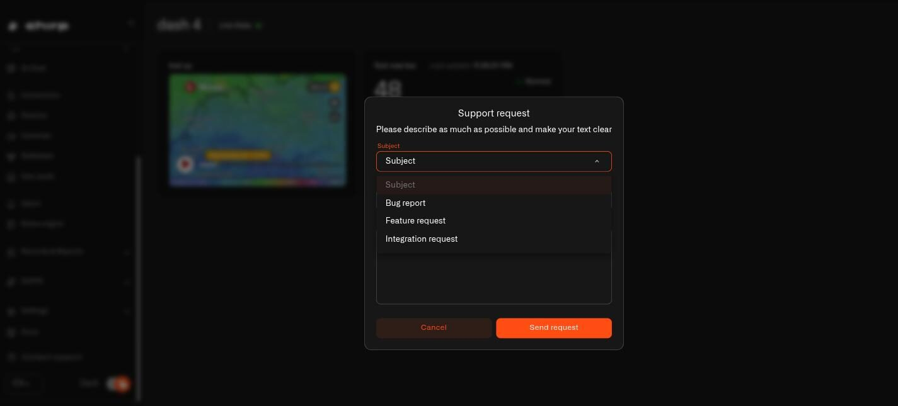

# Get Help

Spotted a bug, wishing Chirp did something it does not, or want it to work with a device it does not yet support? The Chirp support team is ready to help. A quick contact form is built right into the interface and sends your message straight to **support [at] chirpwireless.io**.

<figure><figcaption></figcaption></figure>

## Filling Out the Form

- **Subject** (required) -- pick one of three from the dropdown: **Bug report**, **Feature request** or **Integration request**. It tells the team what sort of message they are about to read.
- **Email address** (required) -- this is pre-filled with the email on your account. Change it if you would rather get the reply somewhere else.
- **Description** (required) -- tell the team what is going on. The more detail you include, the faster they can jump in. The form reminds you: *"Please describe as much as possible and make your text clear."*

### Picking the right subject

- **Bug report** — something is not working the way it should. The single most useful thing you can write is what you did, what happened, and what you expected to happen instead.
- **Feature request** — Chirp cannot do something you wish it could. Tell them what you are trying to achieve rather than the button you think you need; quite often there is already a way to do it.
- **Integration request** — you have a sensor, hub or service you would like Chirp to work with. Give the exact make and model, otherwise the team is guessing.

## Sending and Closing

Click **Send request** to fire off your message. When it goes through, you will see *"Request has been successfully sent"* and the form closes on its own. If something goes wrong, an error notification pops up so you can give it another try.

Click **Cancel** to close the form without sending anything.
