# RAK 7268 V2

## Step 1

Log in to your dashboard at [https://app.chirpwireless.io](https://app.chirpwireless.io).

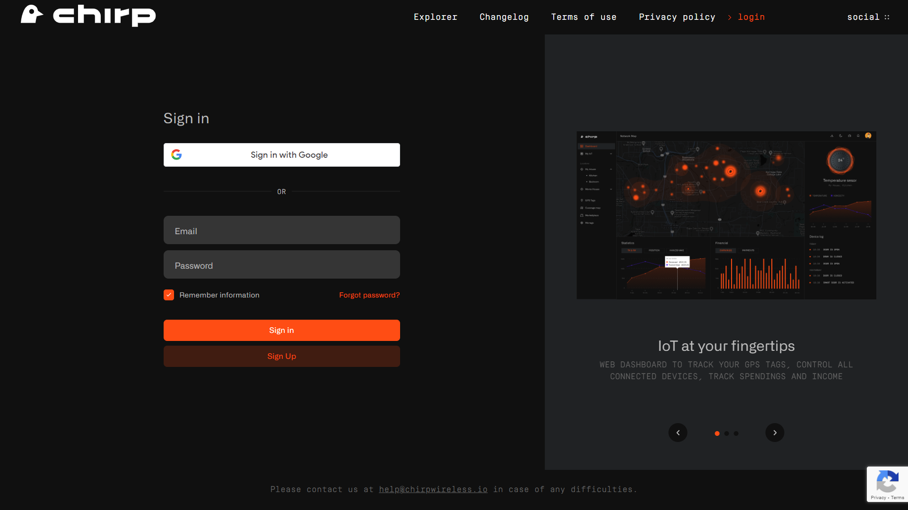

## Step 2

Once logged in, click on "Gateways" in your dashboard. Select "Add gateway" in the upper right, click on "3rd Party Gateway".

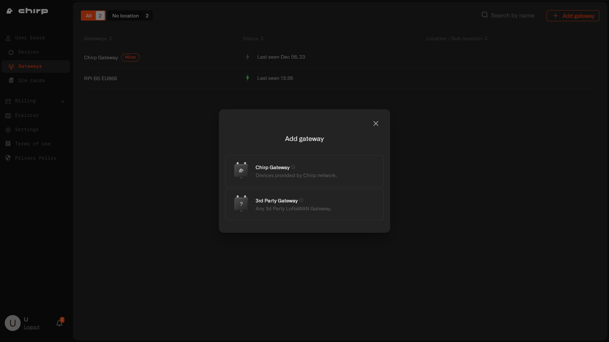

## Step 3

Enter the Gateway Name, select your country's LoRaWAN frequency band and input the Gateway EUI (located on the back of the gateway). Click Next.

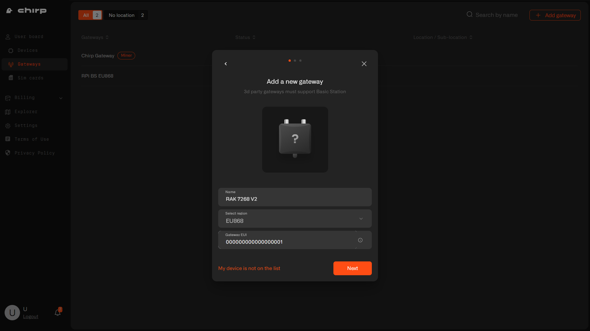

## Step 4

After adding the gateway, you'll receive a confirmation message. Copy and save the LNS Address, download and extract the certificates from the provided Zip file. Click Next.

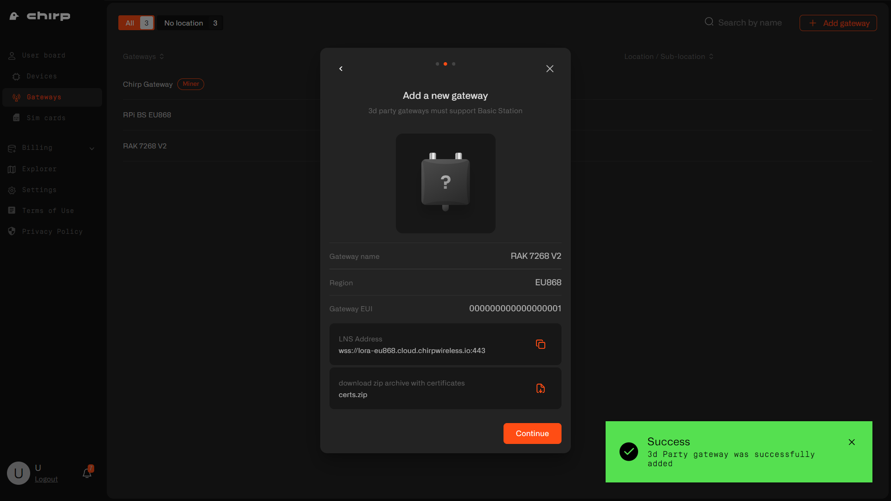

## Step 5

Now your gateway is successfully added to Chirp platform. Click Continue.

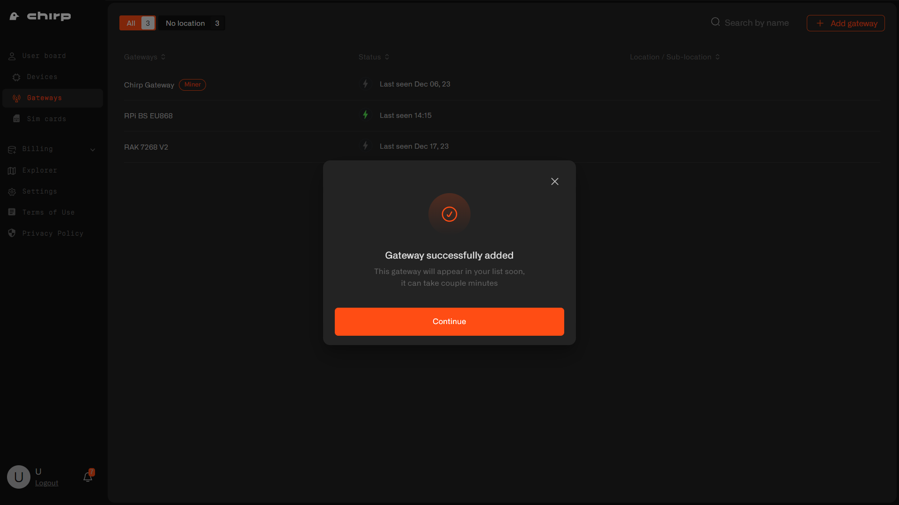

If you didn't save the certificates or LNS address, please, navigate to gateway's Settings tab.

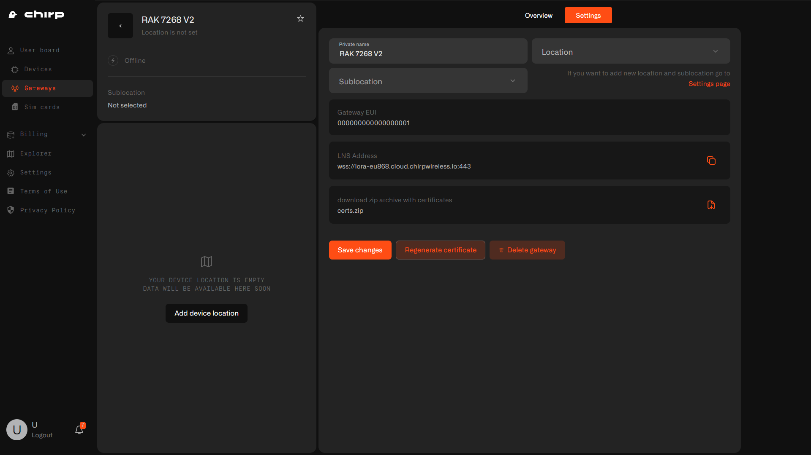

## Step 6

Plug in your RAK gateway to an electrical outlet and connect via an ethernet cable.

## Step 7

Once connected, navigate to `192.168.230.1` in your browser. Username is `admin` and you will be prompted to create a password. Select your country and frequency band.

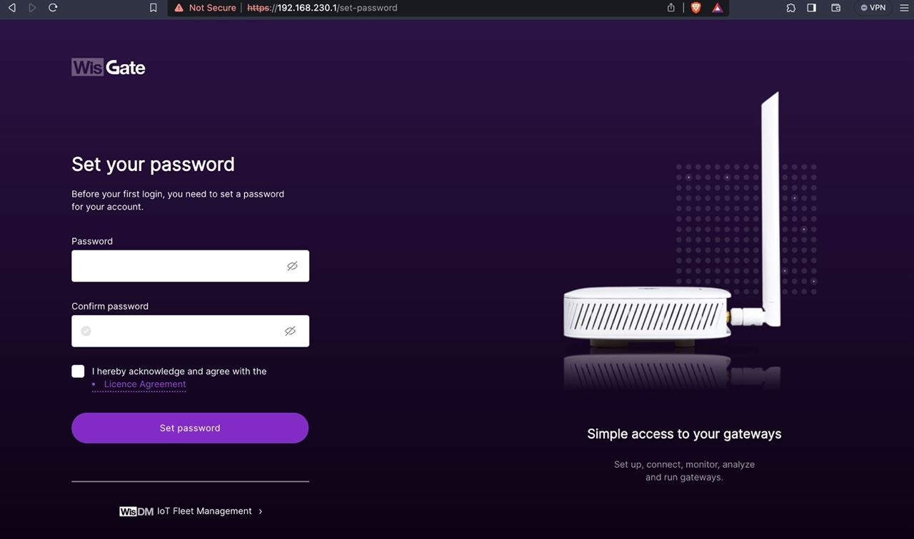

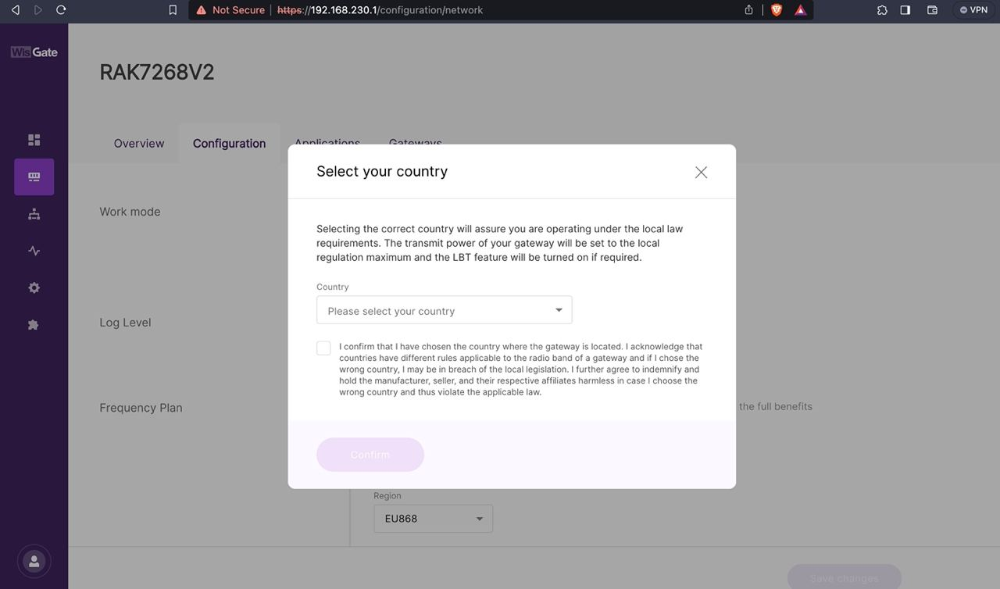

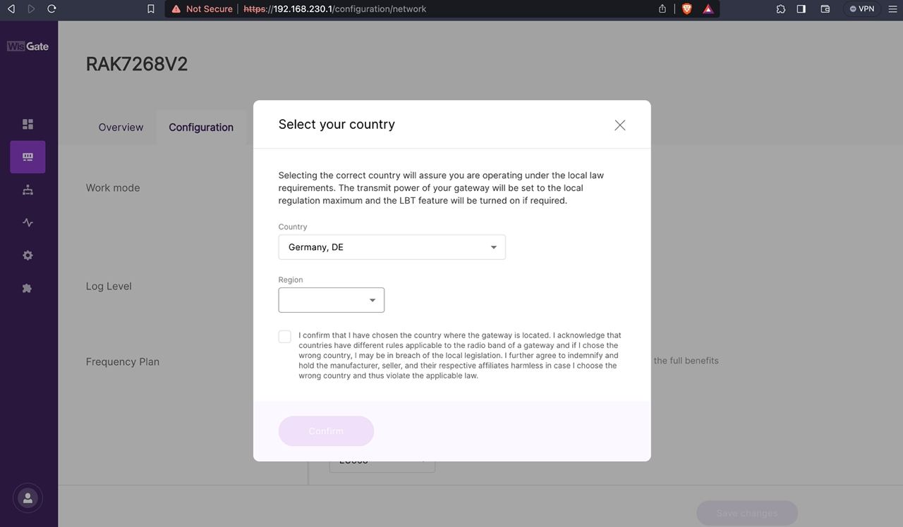

## Step 8

Click on the configuration tab and select LoRa Basics Station.

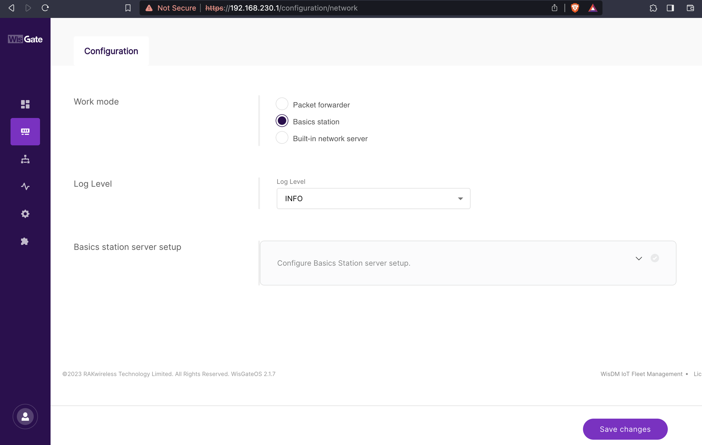

## Step 9

Scroll down and enter the LNS Address that you have copied during gateway registration on Chirp's dashboard

For example: `wss://lora-eu868.cloud.chirpwireless.io:443`

Upload 3 certificates you have extracted from a Zip file in Step 4

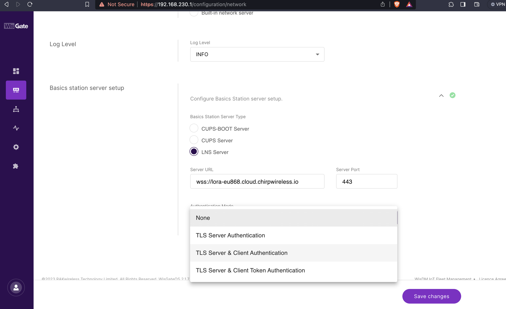

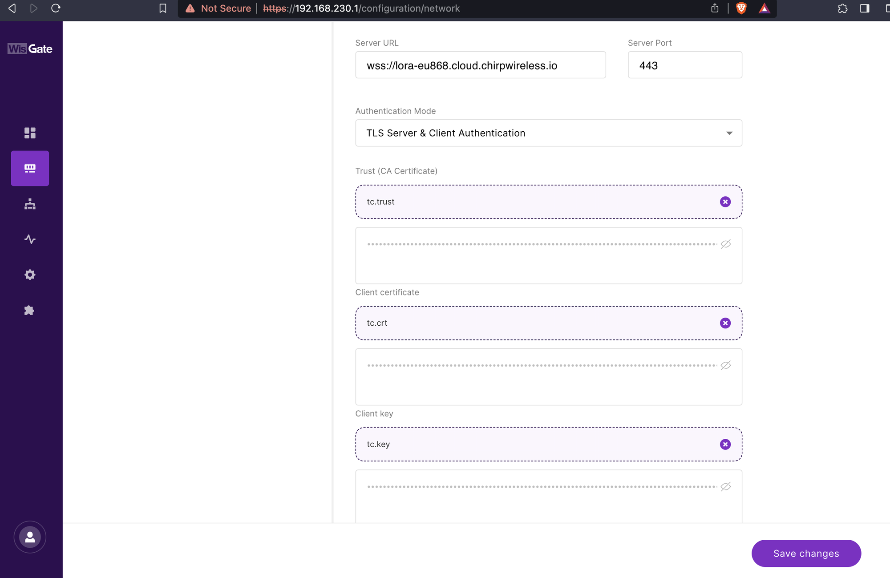

If set up correctly, gateways status on the Chirp's dashboard will show as online.

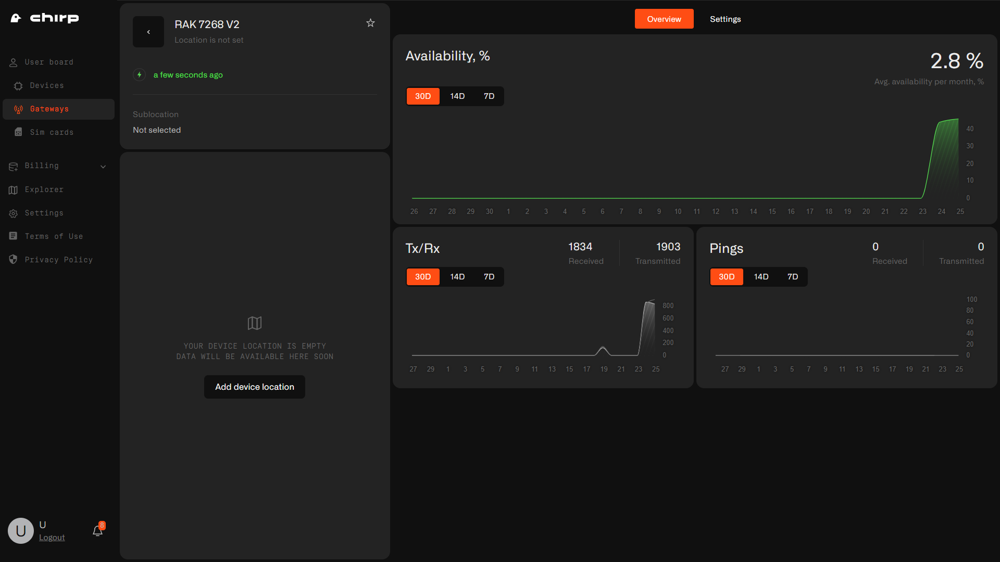

**Congratulations, your IoT devices are now ready to be added and you are ready to automate!**
