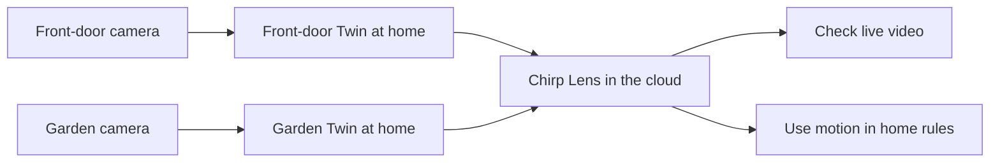

# Cameras

Open **Cameras** in the main navigation to use **Lens**, the camera product within Chirp.

**Lens** is Chirp's cloud camera feature. It lets you check compatible IP cameras and use their motion readings alongside the sensors and automations that help you look after your home.

You may already have a camera at the front door and a different brand in the garage. If they provide supported RTSP streams, you can keep those cameras and connect them to Chirp. Your residential setup can span several properties: a main house, a holiday home by the coast, and an apartment. Connect compatible cameras at each property without replacing them all with one manufacturer’s equipment.

<figure><figcaption>
Two camera brands together in Chirp Lens, shown in Preview mode.
</figcaption></figure>

## Meet your camera's Twin

**Twin** takes its name from *digital twin*: it represents one camera on a computer at the property. It runs as a Docker container and connects that camera to Lens. Lens is the cloud side; Twin stays at your premises.

There is **one Twin container for each camera**. Two cameras need two Twins. Twenty cameras need twenty. A suitable computer can run more than one container, but each needs its own configuration and enough host resources.

RTSP is the camera's video-streaming connection. You will need its address and login details. ONVIF can help discover and control supported cameras. Check the camera's own settings or manual for those features.

## Watch the part that matters

A camera facing the front steps may also see people passing on the pavement. In Twin, draw a motion area around the doorway. Movement there can change the camera's motion reading, while activity outside the area does not trigger that detection.

An older camera does not need its own AI feature for this. Twin performs the selected-area motion detection, and a Chirp rule can use the result to raise a household alert. It detects movement rather than recognizing who is at the door.

## From live checks to a useful home setup

Use Lens to check the entrance or garden, then combine camera motion with the platform's rule and alarm workflows. Configure an alert for the times it is useful, rather than treating every movement as a reason to notify everyone.

Cameras belong to your selected organization. Manage household access through Chirp instead of sharing a single platform password. The local Twin login remains separate.

## Save your favorite camera view

A [videowall](videowalls.md) puts selected home cameras in a layout you can save. Give each property its own wall, then create more focused views for outdoor areas, a floor, or the garage. Within one organization, this lets you move between properties and the smaller areas you want to check.

## Get connected

Start with [Installing Twin](installing-twin.md), using the official [Twin Docker image](https://hub.docker.com/r/chirpiot/lens-twin). Then [connect a camera](connecting-a-camera.md) and [watch live video](watching-live-video.md).

Once the view works, set up [Motion Zones](motion-zones.md), [Camera Rules and Alerts](camera-rules-and-alerts.md), or optional [Local Recordings](local-recordings.md).

For ongoing administration, see [Managing Cameras](managing-cameras.md). To connect an account-backed camera or HomeKit accessory, see [Provider Camera Sources](connecting-cloud-camera-sources.md).
