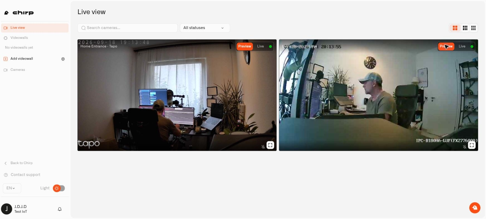
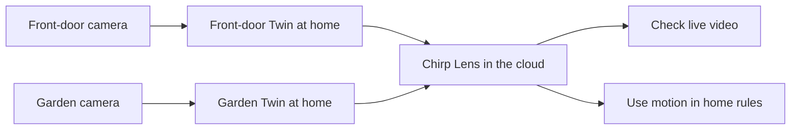

# Cameras

Open **Cameras** in the main navigation to use **Lens**, the camera product within Chirp.

**Lens** is Chirp's cloud camera feature. It lets you check compatible IP cameras and use their motion readings alongside the sensors and automations that help you look after your home.

You may already have a camera at the front door and a different brand in the garage. If they provide supported RTSP streams, you can keep those cameras and connect them to Chirp. Your residential setup can span several properties: a main house, a holiday home by the coast, and an apartment. Connect compatible cameras at each property without replacing them all with one manufacturer’s equipment.

<figure><figcaption>
Two camera brands together in Chirp Lens, shown in Preview mode.
</figcaption></figure>

## Meet your camera's Twin

**Twin** is the program you install on a computer at the property. It is the digital twin of one physical camera: it connects to that camera's video on your home network and links the camera to Lens. It runs as a Docker container. Lens is the cloud side; Twin stays at your premises.

There is **one Twin container for each camera**. Two cameras need two Twins. Twenty cameras need twenty. A suitable computer can run more than one container, but each needs its own configuration and enough host resources.

```mermaid
flowchart LR
  A[Front-door camera] --> B[Front-door Twin at home]
  C[Garden camera] --> D[Garden Twin at home]
  B --> E[Chirp Lens in the cloud]
  D --> E
  E --> F[Check live video]
  E --> G[Use motion in home rules]
```

RTSP is the camera's video-streaming connection. You will need its address and login details. ONVIF can help discover and control supported cameras. Check the camera's own settings or manual for those features.

## How can Lens make an older camera smart?

Some home cameras come with smart features built in, which means a small computer inside each camera running its maker's software. Lens does not need any of that. The camera only has to send its video as an RTSP stream, which most IP cameras can do, including older ones.

The processing happens off the camera. Twin, on a computer in your home, watches the stream, detects motion in the areas you draw and can keep local recordings. Chirp shows the live video and lets the camera's motion reading start rules, just like a reading from any of your other sensors.

That means you can:

- keep the cameras you already own, whatever the brand
- get motion alerts from an older camera that has no smart features of its own
- pick up Twin and Chirp updates without buying new cameras

For example, you have a camera above the back door and a door sensor on the same door. When the camera sees movement at the doorway, a rule checks the door sensor and sends an alert to your phone if the door is open.

## Who in your household can see the cameras?

Instead of sharing one camera-app password, each household member signs in with their own Chirp account. You choose for each person whether they can **Edit**, **View** or have **No access** to Cameras (see [Users and Permissions](../account/users-and-permissions.md)). If someone moves out, you remove their access in Chirp without changing anything on the cameras. The local Twin login stays separate.

## Where is Lens going?

We are adding more AI to Lens. It runs off the camera, where there is room for larger models and smarter logic than a chip inside a single camera can hold. Because of that, the cameras you already own, even older ones, get new features through software updates instead of being replaced. Today, Lens detects motion in the areas you draw; it does not recognize people or objects.

## Watch the part that matters

A camera facing the front steps may also see people passing on the pavement. In Twin, draw a motion area around the doorway. Movement there can change the camera's motion reading, while activity outside the area does not trigger that detection.

An older camera does not need its own AI feature for this. Twin performs the selected-area motion detection, and a Chirp rule can use the result to raise a household alert. It detects movement rather than recognizing who is at the door.

## From live checks to a useful home setup

Use Lens to check the entrance or garden, then combine camera motion with the platform's rule and alarm workflows. Configure an alert for the times it is useful, rather than treating every movement as a reason to notify everyone.

## Save your favorite camera view

A [videowall](videowalls.md) puts selected home cameras in a layout you can save. Give each property its own wall, then create more focused views for outdoor areas, a floor, or the garage. Within one organization, this lets you move between properties and the smaller areas you want to check.

## Get connected

Start with [Installing Twin](installing-twin.md), using the official [Twin Docker image](https://hub.docker.com/r/chirpiot/lens-twin). Then [connect a camera](connecting-a-camera.md) and [watch live video](watching-live-video.md).

Once the view works, set up [Motion Zones](motion-zones.md), [Camera Rules and Alerts](camera-rules-and-alerts.md), or optional [Local Recordings](local-recordings.md).

For ongoing administration, see [Managing Cameras](managing-cameras.md). To connect an account-backed camera or HomeKit accessory, see [Provider Camera Sources](connecting-cloud-camera-sources.md).
