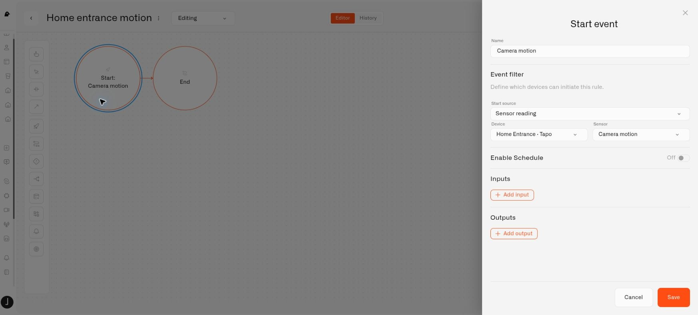

# Camera Rules and Alerts

A camera's motion reading can start a Chirp rule, just like a reading from a home sensor. The rule decides what to do, while an alarm definition determines the message and notification behavior.

For example, after [drawing an area around your front door](motion-zones.md), you can make movement there raise an `Activity at the door` alarm. Check that the camera is connected and that your account can manage rules and alarms.

## Prepare the message

Open **Alarm** and create an alarm definition for the notification. Choose a clear message, the intended recipients and channels, and suitable scheduling and suppression settings. See [Set Up a Home Alert](../alarm/set-up-a-home-alert.md) for the full setup.

## Connect motion to the alarm

1. Create a rule in **Rules engine**.
2. In **Start**, choose **Sensor reading** as the **Start source**. Select your camera under **Device** and **Camera motion** under **Sensor**.
3. Add an **Exclusive Gateway**, which lets the rule choose a route based on the reading.
4. Give the motion route the condition `vars.value == true`.
5. Connect that route to **Set Alarm** and select your alarm definition.
6. Finish that route with **End**. Make a default route to End for readings that do not indicate motion.
7. Save the rule, build it, and deploy it when it is ready.

The motion value is `true` when movement is detected. A `false` value can indicate no motion, but is also sent when a camera goes offline. Use **Camera status** to distinguish a quiet scene from a disconnected camera. The gateway keeps a false reading from running the alarm action.

<figure><figcaption>
Use the camera’s motion reading as the rule’s starting event, then add the condition and alarm action.
</figcaption></figure>

## Test before relying on it

Start with the rule debugger and mock or skip external actions while checking your logic. Then test real movement inside and outside the area. Turn on delivery to your intended recipients after the behavior is correct.

This example raises an alarm; it does not clear that alarm automatically when movement stops. Configure clear behavior separately if you need it. Also, dismissing an incident does not change the camera reading: movement that still meets your rule's conditions can raise another alarm, depending on suppression and trigger settings.

For more control over when a condition qualifies, see [Trigger Timing](../rules-engine/going-deeper/triggers/trigger-timing.md).

## Monitor the connection as well

To notice a disconnected home camera, add another rule using **Start → Sensor reading** and select that camera's **Camera status** sensor. Its value is text. The condition `vars.value == "offline"` can lead to an alarm asking you to check the connection. Try both disconnection and recovery before turning on notifications.

Choose camera sensors through **Sensor reading**. The camera can report the same value again, so a reading is not necessarily a new movement or a change of connection state. Use the rule's timing controls and alarm suppression to avoid repeated household notifications. Include a clear action in the recovery branch if you want the rule to clear its alarm; a false motion value or an online status alone will not resolve the incident.
