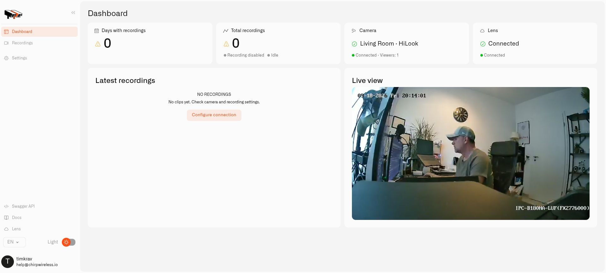

# Connecting a Camera

Before a camera appears in Chirp, its Twin needs to reach the camera and pair with Lens. Work through the local connection first so that you can distinguish a camera problem from a cloud connection problem.

Have [Twin running](installing-twin.md), your camera's connection details ready, and permission to manage cameras in the selected Chirp organization.

Need the video address? [RTSP Camera URLs](rtsp-camera-urls.md) gives common patterns, including the Tapo and HiLook cameras used in our examples.

## Let Twin reach the camera

1. Sign in to Twin and open **Settings → Camera Connector**.
2. Put your camera's RTSP address in **Main stream URL**, with the camera's local login included. Use **Test main stream** to check the connection.
3. For a lighter preview and motion-detection feed, put the camera's substream address in **Low-resolution stream URL**. You can leave it empty to use the main picture for both.
4. Select **Save** and check the picture on Twin's dashboard.

For a compatible motorized camera, also fill in **ONVIF address**, **ONVIF username**, and **ONVIF password**. Use **Test ONVIF** and the **Save** button in that section. The **Scan** button under **Discover ONVIF cameras** helps locate supported cameras nearby. ONVIF provides camera controls such as movement and presets; the RTSP address provides video.

Give the camera a recognizable name such as `Front door`.

Copy the **Twin Key** from Twin. This identifies this camera's local installation; each of your other cameras must have its own Twin and key.

## Add it to Chirp

1. Select **Cameras** in the Chirp sidebar.
2. Choose **Add camera** and enter the camera name and **Twin Key**.
3. Create the camera and copy the connection token that Lens provides.
4. Return to Twin and open **Settings → Lens Connector**.
5. Copy **Lens API URL** from the **Pairing token** dialog into Twin and paste the **Connection token** from that same dialog.
6. Save the settings.

The token is a private pairing credential. It is different from your camera password and from the password you use to sign in to Twin. Use the Lens API endpoint for the same environment that issued the token.

<figure><figcaption>
Each camera has its own Twin dashboard and connection state.
</figcaption></figure>

## Check both connection and video

Back in Chirp, wait for the camera's state to become online, then start its live video. Seeing the picture confirms that the camera, Twin, Lens, and browser can complete the viewing path.

For a second camera, repeat the process with its separate Twin. If you need to pair an existing camera again, open its details and choose **Reconnect Twin** rather than adding a duplicate. [Access and Troubleshooting](access-and-troubleshooting.md) covers that recovery.
