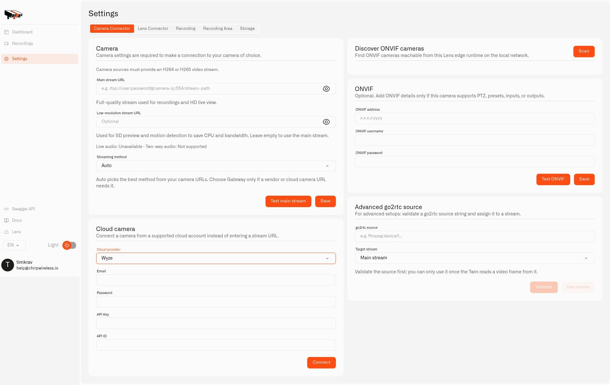

# Provider Camera Sources

A **provider camera source** lets Twin obtain video through a supported camera account or accessory connection. Use it when a home camera uses its manufacturer's account instead of giving you a local RTSP stream. For example, you can keep a supported account-based camera at a holiday home and bring its view into Lens alongside cameras at your main house.

Start with [Twin installed](installing-twin.md) at the camera's property. You will need the camera account's login details, access to any verification messages, and the credentials listed below. One Twin connects one camera. The provider selection does not guarantee that every camera model supplies video, movement controls, or audio; those capabilities depend on the source.

<figure><figcaption>
Choosing Wyze reveals the account and API fields needed before connecting. No provider account has been connected in this setup example.
</figcaption></figure>

## Choose the camera account

Open **Settings → Camera Connector** in the local Twin. In **Cloud camera**, choose the appropriate **Cloud provider**:

| Camera account | Details needed |
|---|---|
| Ring | The account's email and password, plus its two-factor verification code when requested. |
| Wyze | Email, password, **API Key**, and **API ID** from the provider's account tools. Complete code verification if it is requested. |
| Roborock | Account email and region. For a custom region, also enter its URL. Request the login code and use the code sent by email. |
| HomeKit | A compatible accessory reachable on the same local network and its pairing PIN; follow the discovery steps below. |

For an account-based connection, fill in the displayed fields and select **Connect**. If Twin asks for a code, enter it and select **Verify code**. These are the camera provider's credentials; your Twin login and Lens connection token serve different purposes.

When the account connection succeeds, **Available cameras** lists its camera sources. Find the view you want and select **Use as main stream**. If a suitable secondary feed is offered, choose **Use as sub stream** for that feed. Save the camera settings and check video locally before [pairing with Chirp Lens](connecting-a-camera.md).

If a verification code has expired, begin the account connection again to obtain a new one. Keep account passwords and API credentials out of screenshots and shared messages.

## Add a HomeKit camera

HomeKit uses local accessory pairing rather than the email-and-password form:

1. Set **Cloud provider** to **HomeKit**, then select **Discover accessories**.
2. Locate your camera in **Discovered accessories** and choose **Pair**.
3. Supply its **Pairing PIN**, then select **Pair accessory**.
4. In **Available cameras**, apply the paired source with **Use as main stream** and save the settings.
5. Check that Twin can display the camera before continuing to Lens.

Discovery requires a network path between Twin and the accessory. If the camera is missing, check its manufacturer's pairing instructions and local-network requirements.

## Enter an advanced stream source

The **Advanced go2rtc source** panel is intended for people who already have a supported source URI. For a typical home IP camera, start instead with [Connecting a Camera](connecting-a-camera.md) and the [RTSP URL reference](rtsp-camera-urls.md).

To use the advanced panel, paste the URI into **go2rtc source** and set **Target stream** to **Main stream** or **Low-resolution stream**. Select **Validate**. Twin must read a video frame successfully before **Use source** becomes available. Choose **Use source**, then save the camera configuration.

If validation fails, check the source syntax, its account access, and whether Twin can reach it. A source URI can contain a password, so treat it as private.
