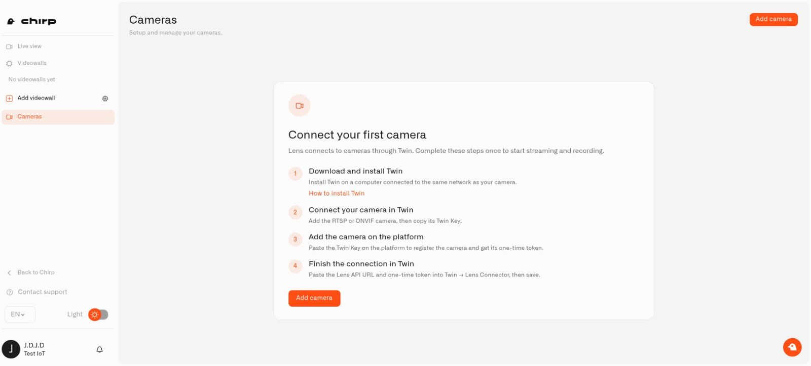
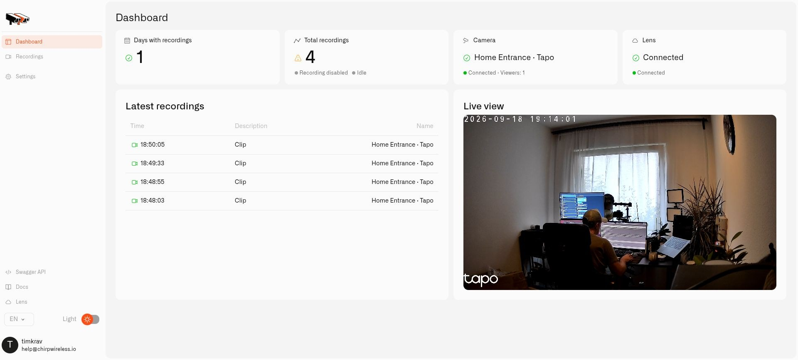

# Installing Twin

Twin is the part of your camera setup that runs at home. It connects one camera to Chirp Lens in the cloud, so the computer running it needs to stay on whenever you want that connection available.

Use one Docker container per camera. For a front-door and garden camera, make two Twins with separate names, ports, and saved settings.

<figure><figcaption><p>Lens guides you from a local Twin installation to a connected camera.</p></figcaption></figure>

<figure><figcaption><p>After setup, Twin shows its local camera picture and connection to Lens.</p></figcaption></figure>

## What you need

- An amd64 or arm64 computer running Docker Engine on Linux, or Docker Desktop with Linux containers on Windows or macOS.
- Local network access from that computer to the camera.
- The camera's RTSP stream address and credentials.
- Internet access for the connection to Lens.
- Persistent disk space if you want to save recordings.

Get the official image from [chirpiot/lens-twin on Docker Hub](https://hub.docker.com/r/chirpiot/lens-twin). Choose a host with enough processing and network capacity for the number and quality of streams you intend to use.

## Run the first camera's Twin

On the Docker computer, this Bash example creates persistent Docker volumes for a front-door camera and asks for the Twin login password:

```bash
read -rsp 'Choose a password for Twin: ' TWIN_PASSWORD
printf '\n'
export TWIN_PASSWORD
docker run -d --name front-door-twin --restart unless-stopped \
  -p 127.0.0.1:8080:80 \
  -e TWIN_USERNAME=admin -e TWIN_PASSWORD \
  -v front-door-config:/home/twin/data/config \
  -v front-door-recordings:/home/twin/data/recordings \
  chirpiot/lens-twin:1.0.1
unset TWIN_PASSWORD
```

Visit `http://127.0.0.1:8080` on the same computer. Sign in as `admin` using the password you chose. That password opens Twin locally; it is not your Chirp account password. A fresh Twin will not start without its required login setup.

This example keeps the administration port local to the computer. If you administer a separate home server, use your secure remote-access method to reach that port rather than exposing it to the internet.

### Which password do I use?

Twin does not ship with a default production password. The command above sets the username to `admin` through `TWIN_USERNAME` and uses the password you typed at the prompt as `TWIN_PASSWORD`.

On your first visit, sign in with those details. The **Set your credentials** screen then asks for **Current password**: enter the same password you supplied when starting the container. Fill in **New password** and **Confirm new password**. Leave **New username (optional)** empty to keep your username, or enter a new one. Select **Save and continue** and sign in again using your new credentials. Your camera's password and your Chirp account password are separate.

If another person installed Twin, ask them for its initial login. There is no universal factory password; use the one supplied when your Twin was installed.

Choose at least eight non-space characters, including uppercase and lowercase letters, a number, and a symbol. You can change your local login later by opening your user menu and choosing **Change password**. After you change the password, use the new one for future visits. The initial environment variables do not replace credentials already saved in the configuration volume.

## Keep each Twin separate

For a garden camera, use a different container name, another host port such as `8081`, and new `garden-config` and `garden-recordings` volumes. Do not copy the first camera's populated configuration: Twin creates a unique **Twin Key** for each installation.

Keep those volumes when restarting or replacing the same container. They preserve its identity, camera settings, and any saved clips. New installations do not record automatically.

Next, [connect the camera and pair Twin with Chirp](connecting-a-camera.md).

## Windows and macOS

Start Docker Desktop and ensure its engine is running before starting Twin. On macOS, use the Bash example above. On Windows, use this PowerShell equivalent:

```powershell
$twinInitialSecret = Read-Host 'Twin administrator password' -AsSecureString
$env:TWIN_PASSWORD = [System.Net.NetworkCredential]::new('', $twinInitialSecret).Password
docker run -d --name front-door-twin --restart unless-stopped `
  -p 127.0.0.1:8080:80 `
  -e TWIN_USERNAME=admin -e TWIN_PASSWORD `
  -v front-door-config:/home/twin/data/config `
  -v front-door-recordings:/home/twin/data/recordings `
  chirpiot/lens-twin:1.0.1
Remove-Item Env:TWIN_PASSWORD
```

Visit the local Twin address and finish the initial sign-in. Keep the host computer awake while you need the cameras: sleep and shutdown disconnect its Twins. Docker also needs access to the camera's local IP address. If Docker Desktop cannot discover the camera automatically, supply its address or RTSP URL yourself.

## Restart and upgrade

For a normal restart, run `docker restart front-door-twin`. For an image upgrade:

1. Back up the Twin's persistent configuration and any recordings you need to keep.
2. Select the intended image version from the official Docker Hub repository and pull it with `docker pull chirpiot/lens-twin:<version>`.
3. Stop and remove only the old container with `docker stop front-door-twin` and `docker rm front-door-twin`.
4. Run the installation command again with the new image tag and the **same** configuration and recording volume names, port, and other installation options.
5. Sign in with the saved local credentials and verify local video and the Lens connection.

Do not remove the volumes during an upgrade. Replacing the container briefly interrupts its camera feed; the retained configuration keeps the camera's identity and pairing.
