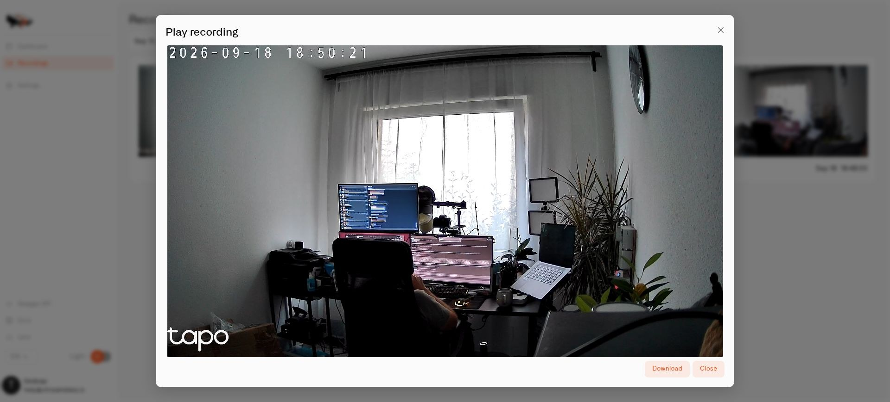

# Local Recordings

Twin can keep camera recordings on the computer at your home. This lets you review a clip after an event instead of needing to watch live at the time. Saving video is off when you first install Twin.

The controls and saved clips in this guide are in **Twin's local interface**. Make sure the recording folder uses persistent storage before you turn recording on.

## Choose what to save

Open **Settings → Recording**, enable recording, and choose **Motion** or continuous recording under **When to record**. Save the settings.

Motion mode records around detected activity. Configure the pre-recording and post-recording periods to include context before and after movement, and use the maximum clip length to control how recordings are divided. [Motion Zones](motion-zones.md) helps you focus detection on a doorway or gate.

Continuous mode saves video without waiting for movement and skips motion processing. Choose **Motion** for camera-motion rules. You can leave recording disabled if you want motion readings without saving clips.

### Clip timing and sensitivity

| Setting | Effect |
|---|---|
| Maximum clip length (seconds) | Caps the length of a saved clip. Continued movement can result in further clips. |
| Record before movement (seconds) | Includes buffered video from before the trigger. The amount available depends on the camera's keyframes and buffer. |
| Keep recording after movement (seconds) | Adds context after the trigger; further movement can extend the clip up to its maximum length. |
| Motion sensitivity | Threshold measured in changed pixels. Lower values detect smaller changes; a value around 150 is the balanced default. |

### Set a recording schedule

In **Recording schedule**, select **Timezone**, enable **Use schedule**, and configure the active intervals for each relevant day. Each day supports two intervals, useful for times when you are away from home. Save the schedule and test both an active and an inactive period. Schedules also restrict motion processing, so use unrestricted operation for the initial motion-rule test.

## Leave space for the rest of the computer

In **Settings → Storage → Automatic cleanup**, enable one or both limits:

- Choose **Limit by total size** and enter **Maximum recordings folder size (MB)** to keep the recording folder within a storage budget. Cleanup removes the oldest clips first when the limit is exceeded.
- Choose **Limit by age**, then set **Delete clips older than (days)** when you want clips removed after a chosen number of days.

Select **Save**. When both limits are enabled, reaching either limit can remove a recording. Download clips you must retain separately before cleanup removes them.

The recording path is inside the container. The Docker volume mounted during [Twin installation](installing-twin.md) is what keeps the files when the container is restarted or replaced.

## Find a saved clip

Open **Recordings**, select the dates you want, and open a clip to play it. Use the download control if you need to keep a copy elsewhere.

Check a test clip to make sure the picture, time, and event context are useful. A motion zone controls the trigger; the recording still contains the camera's full view.

<figure><figcaption>
Open a local clip to review what happened, or use Download to keep a copy.
</figcaption></figure>

## Use an external recording condition

**External recording check** lets an existing system permit or prevent processing—for example, an occupancy system can enable monitoring while a home is unattended. Enter its endpoint in **External check URL** and save. This is an advanced integration; test ordinary recording before enabling it.

The check sends an HTTP POST with `camera_id`, `camera_name`, `site_id`, and `timestamp` to your endpoint. Return HTTP **200** to allow processing. A different response or a failed request prevents processing; the timeout is eight seconds. Twin keeps the result for thirty seconds while refreshing it in the background. Processing starts permitted before any result has arrived, so this check does not provide an immediate privacy switch or a fail-closed safeguard. Test allowing and denying processing against an endpoint you control.
