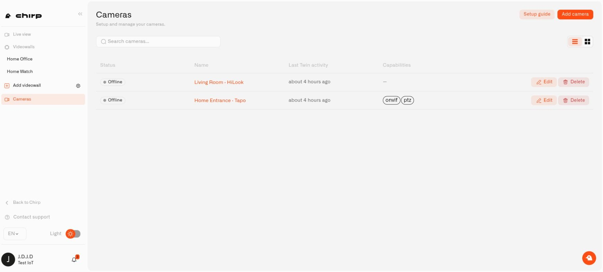

# Managing Cameras

**Cameras** keeps the household's connected camera views in one inventory. Names such as Garden Gate, Upstairs Landing, or Holiday Home Entrance help you find the right view even when the cameras come from different manufacturers. You can also check which Twins have stopped contacting Chirp.

## Find the view you need

Open **Cameras** from Chirp's main menu, then select **Cameras** in the Lens sidebar. Enter part of the camera's name in **Search cameras...** and choose **List view** or **Grid view** for the layout you prefer.

Look at **Status** and **Last Twin activity** before opening a view. A camera may be registered while its Twin is still disconnected. The activity time tells you when Twin contacted the platform; it does not tell you when someone last moved in front of the camera.

Select a camera to open **Camera detail**. Its **Lens connection** panel contains the device identity, camera name, Twin key, and pairing information. If the camera is online but video does not play, check the stream in the local Twin and follow [Access and Troubleshooting](access-and-troubleshooting.md).

<figure><figcaption>
A disconnected camera stays in the list so you can check its details and recover its connection.
</figcaption></figure>

## Give a camera a recognizable name

Choose **Edit camera**, update **Camera name**, and select **Save**. Use the place the camera watches rather than just its model number: for example, Back Door is easier to recognize than a manufacturer's product code. This changes its platform name without replacing or pairing the Twin again.

## Restore the connection to Twin

If the local Twin has lost its pairing, open the camera's **Details** and choose **Reconnect Twin** in **Lens connection**. Confirm that you want a new one-time connection token. Generating it invalidates any earlier token that has not been used.

Copy the **Lens API URL** and new token from the dialog into that camera's local **Lens Connector** settings. Use the values shown in the platform, then complete the steps in [Connecting a Camera](connecting-a-camera.md) before the token's displayed expiry time. An expired token must be replaced with a fresh one.

After saving, check that pairing succeeds and video returns. Preserve the Twin's existing configuration volume when recovering the connection or updating Docker: an empty replacement volume gives it a new identity. Connection tokens are private and should be hidden in any support screenshot.

## Retire a camera

Before removing a camera, review the home rules, dashboard references, and videowalls that depend on it. Choose **Delete**, then review the **Delete camera** confirmation. This removes its connection to the platform.

Removing a panel from a videowall is a smaller change: the camera remains available elsewhere. Deleting the platform camera also leaves its Docker container and any locally stored clips on the host computer. Remove those separately if you are retiring the installation altogether.
