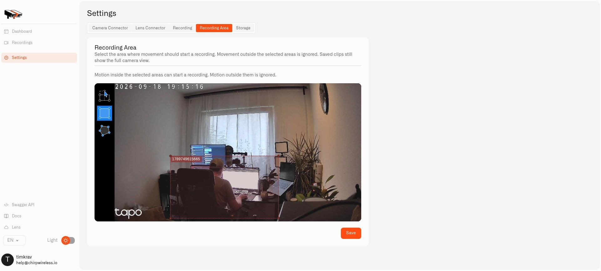

# Motion Zones

A **motion zone** marks the part of a camera picture where movement should count. It helps when you care about someone approaching your door but do not want ordinary movement on the pavement to trigger the same response.

You draw the area in the camera's local Twin. The camera itself does not need a built-in AI detector.

<figure><figcaption>
This demonstration selects part of the room. Choose the area that matters in your own camera view.
</figcaption></figure>

## Mark the doorway

1. Sign in to Twin and open **Settings → Recording**.
2. Set **When to record** to **Motion** so the motion-detection path is active.
3. Begin with time schedules and external conditions disabled while you test.
4. Open **Recording Area**.
5. Use a rectangle for a simple doorway, or a polygon to follow an irregular boundary.
6. Save your changes.

The editor's shortcuts are **R** for rectangle, **O** for polygon, and **M** for moving or deleting an area. Keep the pavement outside the selected shape if you only want to detect activity at the door.

## Try it from both sides of the boundary

Walk inside the area and check the motion reading. Then walk outside it and check again. Adjust the global pixel-change threshold if necessary: a lower threshold makes detection more sensitive.

Sensitivity applies to the detector rather than to each individual shape. If no areas are drawn, the whole picture is used. If several areas are drawn, movement in any of them can count as motion.

Changes in light, shadows, or weather can affect detection too. Revisit the setup after dark and after moving the camera. Motion detection tells you that part of the picture changed; it does not tell you who caused it.

## Decide what motion should do

You can use motion readings in Chirp without saving clips, as long as motion processing remains enabled. If you do want clips, enable [local recording](local-recordings.md) separately. Timetables and external conditions can restrict processing, so add those settings after the basic test works.

Your selected area does not crop live video or saved recordings. Continue with [Camera Rules and Alerts](camera-rules-and-alerts.md) to turn the motion reading into a useful notification.
