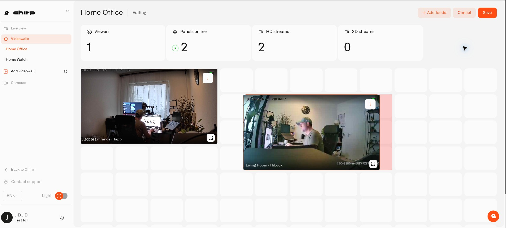
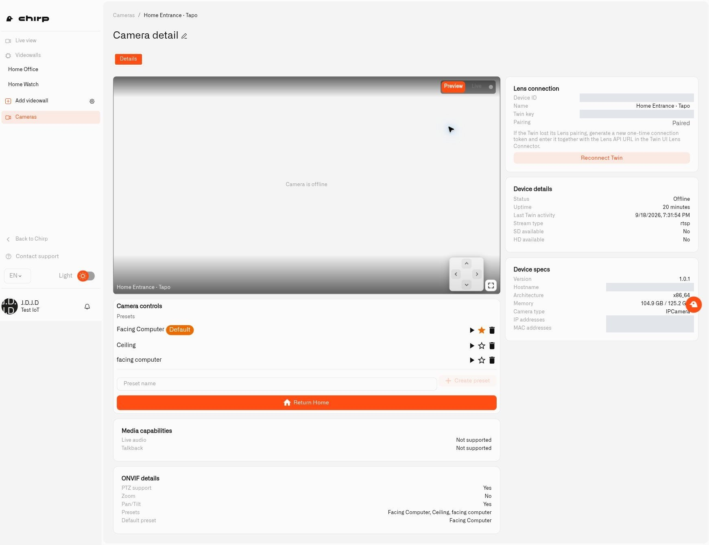

# Videowalls

A **videowall** keeps your chosen cameras together in a layout you can open again. For example, you can watch the front door next to the garden without finding those cameras separately each time. One panel can be larger when that view needs more attention.

Your cameras can be different brands. Each needs its own connected Twin, and the cameras must be available in the Chirp organization you are using. Begin with [Connecting a Camera](connecting-a-camera.md) if you have not added them yet.

## Group cameras by place or purpose

Residential monitoring can cover more than one address. Keep a separate wall for your main house, a holiday property, or an apartment, so you can open the cameras for the right place together. Within a property, you might also save an outdoor wall for the entrance and garden, or a downstairs wall. These groupings work within the organization containing the cameras.

A wall can be as broad as a whole property or as focused as two views of an entrance. Name it for the place or check you have in mind, then arrange the pictures to make that check convenient.

## Make a home camera wall

1. Select **Cameras** in Chirp, then **Add videowall** in the Lens sidebar. You need camera-management permission.
2. Give the wall a **Name**, such as `Around the house`. You can also choose a **Folder** and write a **Description**. Select **Save**.
3. Open the new wall's more menu and select **Edit**.
4. Choose **Add feeds**, then select your home cameras. Search narrows the list, and **Select all** selects the filtered choices. A camera already on the wall is not offered for addition again.
5. Select **Add … Feeds** to bring the cameras into the layout.
6. Move each panel by dragging it. Drag a corner to change its size—for example, make the driveway picture larger than the side-door picture.
7. Select **Save** when you are happy with the arrangement.

You can return to **Edit** whenever you want to change the wall. Remove an unwanted panel with its delete control, or use **Add feeds** for another camera. Select **Cancel** if you want to abandon changes instead of saving them.

<figure><figcaption>
Drag and resize camera panels in Edit mode to create the view you want to keep.
</figcaption></figure>

## Check the house at a glance

Choose the wall in the Lens sidebar to open your saved camera arrangement. **Preview** gives you refreshed still pictures. Switch a panel to **Live** for continuous video and use **Toggle fullscreen** when you want a closer look.

Online-panel and stream counts help you see which views are available. When a panel reports its camera as offline, the preview replaces the earlier snapshot with **Camera is offline**. If you see **No preview available**, check the camera's state before assuming it is disconnected; see [Watching Live Video](watching-live-video.md#when-a-picture-is-missing). The **HD streams** and **SD streams** counters reflect viewing modes; they do not increase the resolution supplied by the camera.

To listen or speak through a supported camera, open that camera's individual view. Use the wall to watch several views together and return supported cameras to their home positions. See [Watching Live Video](watching-live-video.md) for camera controls.

## Put cameras back where they normally look

A motorized **PTZ camera** supports pan, tilt, and zoom. Its **presets** remember useful viewing positions, such as the doorway or a wider view of the room. Mark one as the default to tell Lens where that camera should normally look.

Suppose you turn several cameras to follow movement around the garden or check different parts of a property. Afterwards, they may no longer cover the doors or paths you usually watch. Instead of opening each camera and moving it back by hand, select **Return All to Home** on the videowall. The supported cameras on that wall return to their own home positions together. This is particularly useful when you have cameras around a large house or across several properties.

To choose the usual view for a camera:

1. Open the camera from the **Cameras** list in Lens.
2. Find **Camera controls → Presets**. Use **Go to** beside a saved position to check its view.
3. Choose **Set as default**, the star beside the position you want. A **Default** label identifies your selection.
4. Set the preferred position on your other PTZ cameras as needed.
5. Return to the saved wall, leave Edit mode, and select **Return All to Home**.

<figure><figcaption>
The default preset tells Lens where this camera should normally look.
</figcaption></figure>

A camera might have a preset aimed towards the ceiling and another aimed at the desk or entrance. Choosing a default tells Lens which one you want to return to. If there are several presets and none is selected, Lens leaves that camera in place and reports **multiple presets found, set a default**. Set its default, then try again. When a supported PTZ camera has only one available preset, Lens can use that preset automatically.

Read the result notifications and check the pictures. Fixed cameras cannot turn, cameras without a usable preset are skipped, and an offline camera cannot respond. Only the cameras included in the open wall are targeted. If movement controls are unavailable on a compatible camera, check its ONVIF setup in [Connecting a Camera](connecting-a-camera.md).

## Keep useful views together

You might create one wall for outside cameras and another for indoor areas. Folders, created through the Lens sidebar's videowall management control, help organize those views. Select a folder when you create a wall. Only an empty folder can be deleted.

If you no longer need a layout, choose **Delete videowall** in its more menu. The wall is removed, but its cameras remain in Lens. Deleting a wall or removing a panel does not remove the camera's Twin.

A wall helps you check what is happening now. To let motion at a particular doorway start an automation, continue with [Motion Zones](motion-zones.md) and [Camera Rules and Alerts](camera-rules-and-alerts.md).
