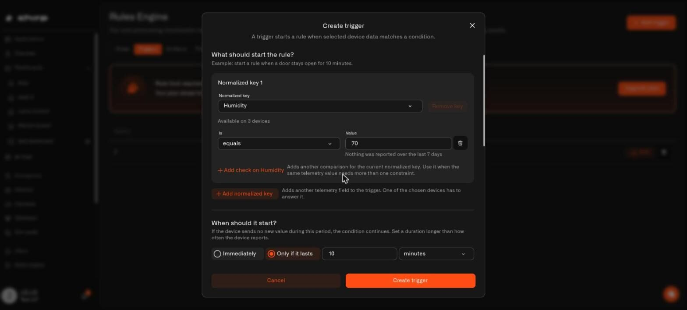
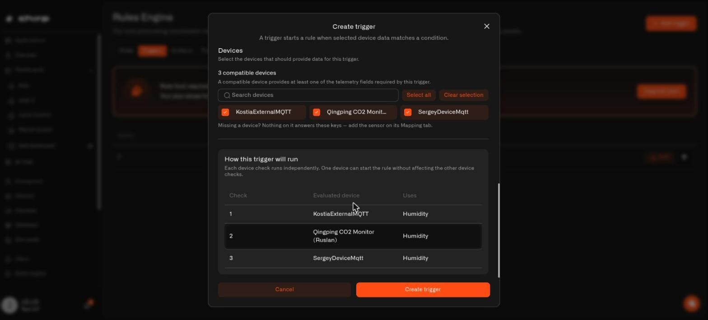

# Triggers

A trigger starts an automation when selected sensor data matches a condition. One trigger can watch up to **500 sensors**, evaluate each sensor independently, and start the same automation for whichever sensor meets the condition.

Before triggers, an automation could be started by only one sensor. If you wanted the same response for nine windows, you needed nine automations. With a trigger, you define the condition once, select all nine window sensors, and connect one automation.

A trigger can act immediately or wait until the condition has remained true for a set time. For example, Chirp can ignore a refrigerator door opened briefly and alert you only if it remains open for 10 minutes.

## Before you start

Decide which sensors need the same response and which reading the trigger will evaluate, such as temperature, humidity, motion, or whether a door is open.

Each watched sensor must provide the reading used as the main condition. If a sensor is missing from the trigger's device list, open that sensor's **Mapping** tab and confirm that its incoming data is mapped to the required metric. See [Data Templates](../../devices/data-templates.md).

You can create the trigger before the automation, but the trigger does not send an alert or control equipment by itself. After saving it, connect it to an automation's Start Event.

## Create a trigger

1. Open **Rules Engine → Triggers**.
2. Click **Add trigger**.
3. Complete the **Create trigger** dialog from top to bottom.

### 1. Name the trigger

Enter a **Name** that describes the situation, such as `Refrigerator door left open` or `Bathroom humidity remains high`. This is the name you will select later when configuring the automation.

### 2. Define what should start the automation

Under **What should start the rule?**, click **Add normalized key** and select the reading to evaluate.

For each reading, set:

- **Is** — the comparison operator. Number readings offer **equals**, **is greater than**, and **is less than**. Text and yes/no readings offer **equals**.
- **Value** — the value to compare with the sensor reading.

Use **Add check on ‹reading›** when one reading needs another comparison. Use **Add normalized key** when the condition also depends on a different reading.

When a condition uses several readings, the additional reading must be available from every watched sensor or from exactly one selected sensor that supplies a shared value for all of them.

For example, each window sensor can provide its own open-or-closed reading while one thermostat provides the shared heating status. Chirp will not save a combination where only some watched sensors provide the additional reading.

### 3. Choose when the trigger starts

Under **When should it start?**, choose one timing mode:

- **Immediately** — start the automation as soon as the condition becomes true. Use this when you need sensor grouping without a delay.
- **Only if it lasts** — start the automation only after the condition has remained true for the duration you enter.

For **Only if it lasts**, select seconds, minutes, hours, or days. New triggers default to 10 minutes. The allowed range is 10 seconds to 30 days.

Set the duration longer than the sensor's reporting interval. If a sensor sends no new value during the wait, the countdown continues; silence does not reset it. A 10-minute duration on a sensor that reports every 15 minutes would still be based on only one reading.

<figure><figcaption></figcaption></figure>

### 4. Configure clear behavior

By default, the trigger clears on the first reading that no longer satisfies the starting condition.

Turn on **Clear by a separate condition** when returning to normal requires a different condition or its own delay. For example, a motion trigger can start after 10 minutes of activity and clear only after the area has remained quiet for five minutes.

### 5. Select sensors

Under **Devices**, select the sensors the trigger should watch. The list becomes available after you select a normalized key and includes only compatible sensors.

Use **Search devices**, **Select all**, **Select all shown**, **Clear selection**, and **Load more devices** to manage the selection. A trigger requires at least one sensor and accepts up to 500. The limit includes watched sensors and any sensor supplying a shared reading.

If an expected sensor is missing, open its **Mapping** tab and map its incoming data to the reading used by the trigger.

### 6. Review and save

**How this trigger will run** shows one row for every independently evaluated sensor. Check that the list contains the sensors you intended and that the **Uses** column shows the correct readings.

<figure><figcaption></figcaption></figure>

Click **Create trigger**. The trigger now watches the selected sensors, but it will not perform an action until an automation uses it.

## Use the trigger in an automation

1. Open the automation that should respond to the trigger.
2. Select the **Start Event** node.
3. Click the pencil beneath the node to open its properties.
4. Set **Start source** to **Trigger condition**.
5. Select the trigger under **Trigger condition**.
6. Save, build, and deploy the automation as usual.

Set **Start source** to **Sensor reading** when an automation should continue to start directly from one sensor. A Start Event uses one source or the other, not both.

The selector currently shows only the first page of triggers. If the trigger you need is not listed, it cannot yet be selected from this field.

## Name the sensor in an alert

A trigger-started automation provides the name of the sensor that met the condition as `vars.device_name`. Include it in the alarm's message so the alert identifies the affected sensor:

```
"Window left open: " + vars.device_name
```

The sensor name is not added automatically.

`vars.value` is not available to a trigger-started automation. A trigger reports that a condition held; it does not pass one reading as the event value. Update any existing expression that expects `vars.value` before changing its Start Event to a trigger.

The other available trigger variables are:

| Variable | Value |
|---|---|
| `vars.sensor_id` | Sensor that supplied the reading |
| `vars.timestamp` | Time the condition was met |

## Combine a trigger with a schedule

**Enable Schedule** on the Start Event also applies to trigger-started automations. The trigger watches and counts continuously; the schedule is checked when the countdown completes and the automation starts.

For a schedule of 22:00–06:00 and a 10-minute trigger:

- a condition that begins at 21:55 and completes at 22:05 can start the automation;
- a condition that completes at 06:05 cannot start the automation.

This lets an event that continues into your scheduled hours still receive a response.

## Change or remove a trigger

Editing a trigger's condition can restart active countdowns. Chirp warns you before saving a change that resets the current trigger state.

Deleting a trigger cannot be undone. It stops monitoring, clears alerts raised by that trigger, and prevents connected automations from starting. Check which automations use the trigger before deleting it.

## Troubleshooting

| Problem | What to check |
|---|---|
| A sensor is missing from the selection | Confirm its data is mapped to the required reading on the sensor's **Mapping** tab. |
| The trigger will not save | Confirm the duration is between 10 seconds and 30 days and review any problem under **How this trigger will run**. |
| The automation starts but an expression fails | Remove uses of `vars.value`; use the trigger variables listed above. |
| The alert does not identify the sensor | Add `vars.device_name` to the alarm message. |
| A countdown restarted after editing | Changes to the condition can reset active countdowns; Chirp warns before saving. |

## See also

- [Trigger Alarms and Actions](../your-first-automation/trigger-alarms-and-actions.md) — choose what the automation does
- [CEL for Home Automations](../reference/cel-for-home-automations.md) — use trigger variables in expressions
- [Safety and Alerting](../examples/safety-and-alerting.md) — adapt complete home-safety examples
